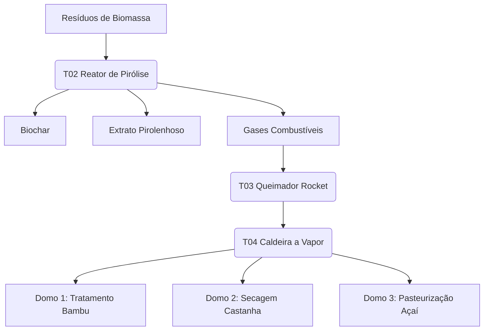

---

## 1. CONTEXTO E JUSTIFICATIVA

### 1.1 Diagnóstico Territorial
Cruzeiro do Sul concentra o maior polo de carpintaria naval artesanal do Alto Juruá, enfrentando escassez de madeiras tradicionais e altos custos logísticos. O Polo Integrado visa converter a biomassa abundante de bambu (*Guadua* spp.) em alternativa estrutural certificada, integrando-a às cadeias de castanha e açaí sob um regime de cascata térmica e economia circular.[^1]

### 1.2 Objetivo
Estabelecer uma unidade de beneficiamento multifuncional (Domo-Fábrica) para:
- Produção de **bambu tratado termicamente** e **painéis laminados** para carpintaria naval.
- Processamento de **castanha-do-Brasil** e **açaí** com padrões sanitários de exportação.
- Geração de **biochar, briquetes e extrato pirolenhoso** via Núcleo Térmico Central (T02–T05).
- Atuar como **Canteiro-Escola** (T01) para formação técnica de mulheres da Amazônia.[^1]

---

## 2. PARTIDO ARQUITETÔNICO E ESTRUTURAL

### 2.1 Complexo Integrado (3 Domos + 1 NT)
O arranjo consiste em três domos geodésicos (D=18 m) interligados a um Núcleo Térmico (NT) central, otimizando a distribuição de vapor e calor residual.
- **Domo 1 (D1):** Bambu Estrutural.
- **Domo 2 (D2):** Castanha-do-Brasil.
- **Domo 3 (D3):** Açaí (Linha Úmida).
- **Núcleo Térmico (NT):** Centro de geração térmica e pirólise.[^1]

### 2.2 Geometria e Sistemas
- **Estrutura:** Domos geodésicos frequência 3V em bambu *Guadua* tratado e conexões **Sistema Takwara** (aço galvanizado/inox).[^2]
- **Platô Suspenso:** Plataforma elevada a +2,00 m, construída em painéis sanduíche **bambu + PU vegetal (MAMONEX® RD70)** e selada com membrana **IMPERVEG® UG 132 A**.[^3][^4]
- **Fundação:** Estacas de bambu tratado conforme NBR 16828-1:2020. Uso de concreto restrito a bases de máquinas e pavimentos térreos técnicos.[^1]

---

## 3. PROGRAMA FUNCIONAL (SÍNTESE)

### 3.1 Domo 1 – Bambu (254 m² platô + 100 m² inferior)
- **Platô:** Recepção, Câmaras de Tratamento (Vapor + Pirolenhoso), Secagem Ventilada, Usinagem, Laminação e Expedição.
- **Inferior:** Corredor técnico, depósito de colmos brutos e área de biochar/briquetes de bambu.

### 3.2 Domo 2 – Castanha (254 m² platô + 90 m² inferior)
- **Platô:** Recepção, Pré-secagem (Ar Quente), Quebra/Seleção, Secagem Final e Embalagem.
- **Inferior:** Recepção de cascas (sistema gravítico) e pré-secagem para alimentação do T02.

### 3.3 Domo 3 – Açaí (254 m² platô + 90 m² inferior)
- **Platô:** Recepção (Área Limpa), Lavagem, Despolpagem, Pasteurização (T05) e Envase.
- **Inferior:** Recepção de caroços e depósito de embalagens.

### 3.4 Núcleo Térmico (120 m²)
- **T02/T03:** Reatores de pirólise e Queimador Rocket (queima de gases não condensáveis).
- **T04:** Caldeira Flamotubular (0 barg) para geração de vapor a 100°C.
- **T05/Condensação:** Sistema de coleta de pirolenhoso e interface de pasteurização.[^1]

---

## 4. FLUXO TÉRMICO E OPERACIONAL



## 4.1 Secador de Aproveitamento Térmico Central (SAT-C)

### 4.1.1 Conceito e Inserção no Conjunto

O Secador de Aproveitamento Térmico Central (SAT-C) é um módulo térmico vertical implantado no eixo geométrico do domo, diretamente conectado ao Núcleo Térmico (NT) e ao lanternim superior.  
Sua função é aproveitar o calor residual dos sistemas T02–T04 para secagem controlada de bambu, biomassa lignocelulósica, castanhas e outros produtos, sem contato direto com gases de combustão, operando por convecção forçada e efeito chaminé.

### 4.1.2 Geometria, Volume e Envoltória

- Forma: volume vertical cilíndrico ou prismático (preferencialmente seção octogonal), inscrito no espaço interno do domo, mantendo afastamentos mínimos de segurança em relação às barras de bambu e à cobertura.  
- Altura: do nível do platô suspenso (+2,00 m) até abaixo do lanternim, respeitando um afastamento mínimo de 0,50 m para manutenção e dissipação térmica.  
- Envoltória: paredes em sistema sanduíche, compatível com o platô:
  - Face externa: painel de bambu laminado estrutural.
  - Núcleo isolante: PU vegetal (MAMONEX® RD70 ou equivalente).
  - Face interna: chapa metálica galvanizada ou aço inoxidável (para interfaces com produtos alimentares), com acabamento liso e lavável.  
- Acessos: portas técnicas em pelo menos dois níveis (base e nível intermediário), permitindo inspeção, limpeza e manutenção.

### 4.1.3 Organização Interna e Prateleiras

O SAT-C é subdividido em níveis de bandejas/prateleiras removíveis, organizados conforme a cadeia produtiva e a temperatura de operação:

- Níveis inferiores: secagem de bambu e biomassa para compósitos, briquetes e pellets (maior carga térmica e massa por bandeja).  
- Níveis intermediários: secagem de biomassa de menor granulometria (serragem, cavacos, cascas) e produtos agrícolas não alimentares.  
- Níveis superiores: secagem de alimentos (castanhas, frutas e similares), com bandejas em materiais de grau alimentar e controle mais fino de temperatura e umidade.

Tipos de prateleiras:

- Bambu/biomassa:
  - Grelhas estruturais em bambu ou aço, com alta permeabilidade ao fluxo de ar ascendente e capacidade para colmos inteiros, meias-canas ou engradados de biomassa.
- Alimentos:
  - Bandejas em aço inox 304 ou polímero de grau alimentar, perfuradas para passagem de ar, em sistema tipo “gaveta” para facilitar carga/descarga e higienização.

### 4.1.4 Circuito de Ar Quente e Efeito Chaminé

O funcionamento térmico do SAT-C está integrado ao NT, conforme o fluxograma a seguir:

```mermaid
graph TD
    subgraph NT[Núcleo Térmico]
        T02[T02 - Reator de Pirólise]
        T03[T03 - Queimador Rocket]
        T04[T04 - Caldeira a Vapor 100°C]
        T05[T05 - Trocadores Pasteurização]
    end

    T02 -->|Biomassa| T03
    T03 -->|Gases Quentes| T04
    T04 -->|Vapor/Ar Quente| SATC_BASE[SAT-C - Entrada Ar Quente]
    T04 -->|Vapor| D1_CAM[Domo 1 - Câmaras Tratamento Bambu]
    T04 -->|Ar Quente| D2_PRESEC[Domo 2 - Pré-secagem Castanha]
    T05 -->|Calor de Processo| D3_PAST[Domo 3 - Pasteurização Açaí]

    SATC_BASE --> SATC_NIVEIS[SAT-C - Níveis de Prateleiras]
    SATC_NIVEIS --> SATC_TOPO[SAT-C - Saída para Lanternim]
    SATC_TOPO --> LANTERNIM[Lanternim do Domo]

    D2_PRESEC --> RESIDUOS[Resíduos (Cascas, Biomassa)]
    D1_CAM --> RESIDUOS
    RESIDUOS --> T02


---

### 4.2 Arranjo Interno dos 3 Domos Acoplado ao SAT-C

#### 4.2.1 Visão Geral

O complexo integrado é composto por três domos geodésicos (D1 – Bambu, D2 – Castanha, D3 – Açaí) e um Núcleo Térmico (NT), articulados em torno do Secador de Aproveitamento Térmico Central (SAT-C), localizado no eixo de D1.  
Cada domo possui platô suspenso para a linha principal de produção e pavimento inferior técnico para fluxos gravíticos de matéria-prima, resíduos e biomassa combustível.

---

###  4.2.2 Domo 1 – Bambu e Biomassa

Área útil de referência: 254 m² (platô) + 100 m² (piso inferior).

#### Platô (+2,00 m) – Cadeia Bambu/Compósitos

- Zona 1 – Recepção e Preparo de Colmos  
  Área destinada à descarga, inspeção e corte dos colmos em comprimentos padrão, com acesso direto às câmaras de tratamento e à área de estocagem temporária.

- Zona 2 – Câmaras de Tratamento (Vapor + Pirolenhoso)  
  Conjunto de câmaras horizontais conectadas ao NT, onde os colmos passam por ciclos de vapor e/ou tratamento com ácido pirolenhoso, preparando o material para secagem e uso estrutural.

- Zona 3 – Interface com SAT-C e Secagem Ventilada  
  Área ao redor do SAT-C, ocupada por racks de bambu e biomassa (serragem, cavacos, finos), alimentados pelo ar quente ascendente que atravessa o secador e se dirige ao lanternim.

- Zona 4 – Usinagem e Laminação  
  Espaço para marcenaria leve, usinagem de peças e laminação/prensagem de painéis de bambu, com exaustão dedicada para pó e conexão logística direta com a zona de secagem.

- Zona 5 – Expedição de Produtos em Bambu  
  Setor tamponado para armazenamento temporário e preparação de cargas de colmos tratados, peças usinadas e painéis laminados.

#### Piso inferior (0,00 m) – Suprimento e Subprodutos

- Depósito de Colmos Brutos e Biomassa  
  Área de armazenamento de bambu bruto e biomassa sólida, com fluxo gravítico para o platô e para o NT, facilitando a alimentação das câmaras e dos reatores.

- Área de Biochar, Briquetes e Pellets  
  Setor de estocagem e, quando aplicável, peletização de finos de bambu e biomassa carbonizada, integrando-se ao ciclo T02/T03 como combustível ou insumo de solo.

---

### 4.2.3 Domo 2 – Castanha e Secagem de Alimentos

Área útil de referência: 254 m² (platô) + 90 m² (piso inferior).

#### Platô (+2,00 m) – Cadeia Castanha/Secagem de Alimentos

- Zona A – Recepção e Pré-limpeza  
  Área de recebimento de castanha-do-Brasil e outros produtos, com triagem grosseira, remoção de impurezas e organização das bateladas.

- Zona B – Pré-secagem com Ar Quente  
  Túnel ou câmaras de pré-secagem alimentadas por ar quente proveniente do NT e/ou do SAT-C, utilizando bandejas, carrinhos ou racks para reduzir o teor de umidade inicial.

- Zona C – Quebra e Seleção  
  Linha de quebra de cascas, separação de amêndoas e seleção por qualidade, com controle de poeira e fluxo organizado entre pré-secagem e secagem final.

- Zona D – Secagem Final e Equalização  
  Câmaras de secagem de precisão, operando em temperaturas moderadas, ajustadas para atingir teores de umidade adequados a padrões sanitários e de exportação.

- Zona E – Embalagem e Expedição de Alimentos Secos  
  Área limpa com seladoras, balanças e estocagem de embalagens, segregada das zonas de maior poeira e dotada de revestimentos sanitários compatíveis com a linha de alimentos.

#### Piso inferior (0,00 m) – Cascas e Biomassa Alimentar

- Recepção de Cascas e Subprodutos  
  Coleta gravítica de cascas e resíduos sólidos provenientes das etapas de quebra e seleção, organizando a alimentação do T02 como biomassa combustível.

- Pré-secagem de Biomassa para Combustível ou Compósitos  
  Área técnica para secagem de cascas e outros subprodutos, preparando-os para pirólise, queima direta ou uso em compósitos e briquetes.

---

### 4.2.4 Domo 3 – Açaí e Linha Úmida com Pasteurização

Área útil de referência: 254 m² (platô) + 90 m² (piso inferior).

#### Platô (+2,00 m) – Cadeia Açaí/Pasteurização

- Zona I – Recepção em Área Limpa  
  Setor de chegada dos frutos de açaí, com barreira sanitária, inspeção e organização das bateladas antes da lavagem.

- Zona II – Lavagem e Despolpagem  
  Área equipada com lavadoras, transportadores e despolpadeiras, piso impermeável e drenado, com controle rigoroso de higiene e fluxo de água.

- Zona III – Pasteurização (T05)  
  Conjunto de trocadores de calor e tanques ligados ao T05, onde a polpa é aquecida em regime controlado para garantir segurança microbiológica e qualidade sensorial.

- Zona IV – Envase e Embalagem  
  Espaço para envasadoras, seladoras, rotulagem e paletização, mantendo segregação em relação à área de lavagem e despolpagem, com ventilação e superfícies compatíveis com normas sanitárias.

- Zona V – Apoio de Área Limpa  
  Pequenos depósitos de embalagens, insumos, EPIs e materiais de higienização dedicados à linha úmida.

#### Piso inferior (0,00 m) – Caroços e Logística

- Recepção e Estocagem de Caroços  
  Área para recebimento gravítico dos caroços pós-despolpagem, organizando o fluxo para uso como biomassa combustível, matéria-prima de compósitos ou insumo agrícola.

- Depósito de Embalagens Secas e Insumos Não Perecíveis  
  Setor seco de estocagem de materiais que suportam armazenamento em temperatura ambiente, separado da umidade da linha superior.

---

### 4.2.5 Integração Funcional Domos – SAT-C – Núcleo Térmico

A integração entre domos, SAT-C e NT segue o princípio de cascata térmica e de aproveitamento integral de biomassa:

- O NT converte biomassa (bambu, cascas, caroços, resíduos) em calor útil, biochar e extrato pirolenhoso.  
- O SAT-C, localizado no Domo 1, recebe ar quente do NT, realiza secagem de bambu, biomassa e, em níveis específicos, produtos alimentares, devolvendo ar úmido ao exterior via lanternim.  
- O Domo 2 utiliza ar quente proveniente do NT e, quando conveniente, do SAT-C, para pré-secagem e secagem final de castanhas e outros alimentos.  
- O Domo 3 aproveita o vapor e o calor do NT nos trocadores de pasteurização, mantendo a linha úmida segregada, porém integrada ao balanço energético geral.

```mermaid
graph LR
    NT[Núcleo Térmico (T02–T05)] -->|Ar Quente/Vapor| D1[Domo 1 - Bambu]
    NT -->|Ar Quente| D2[Domo 2 - Castanha]
    NT -->|Vapor/Calor de Processo| D3[Domo 3 - Açaí]

    D1 -->|Bambu Tratado + Biomassa Seca| EXP_BAMBU[Expedição Bambu/Compósitos]
    D2 -->|Alimentos Secos| EXP_ALIM[Expedição Castanhas/Alimentos]
    D3 -->|Polpa Pasteurizada| EXP_ACAI[Expedição Açaí]

    D1 -->|Biomassa Residual| NT
    D2 -->|Cascas e Resíduos| NT
    D3 -->|Caroços e Fibras| NT

    subgraph D1_Detalhe[Domo 1 - SAT-C]
        SATC[SAT-C] -->|Ar Úmido| LANTERNIM[Lanternim]
    end

### 4.3 Desempenho Térmico e Adequação ao Clima Amazônico

#### 4.3.1 Premissas Climáti cas

O projeto considera um clima quente e úmido, com altas temperaturas médias anuais, umidade relativa frequentemente acima de 80% e forte regime de chuvas.  
Essas condições favorecem o uso de estruturas com grande volume interno, boa ventilação natural e soluções de secagem que combinem calor controlado e eficiente exaustão de umidade.

#### 4.3.2 Estratégias de Ventilação e Exaustão

- Lanternins dimensionados para tiragem permanente  
  Os lanternins dos domos devem ser dimensionados para operar como exaustores passivos contínuos, potencializados pelo efeito chaminé gerado pelo SAT-C e pelas cargas térmicas internas.  
  Recomenda-se prever venezianas reguláveis e, quando necessário, ventiladores de baixo consumo para reforço em períodos de baixa diferença térmica entre interior e exterior.

- Ventilação cruzada em nível de platô  
  Aberturas controladas em cota intermediária, distribuídas ao longo da envoltória dos domos, permitem ventilação cruzada durante fases não críticas do processo (montagem, limpeza, espera), reduzindo desconforto térmico para operadores.

### 4.3.3 Eficiência Energética e Cascata Térmica

- Uso cascata do calor  
  O calor gerado no Núcleo Térmico é utilizado em sequência: primeiro em processos que demandam maior temperatura (tratamento de bambu, pasteurização), depois em secagens que toleram temperaturas mais baixas (pré-secagem de castanhas, biomassa), antes da exaustão final pelo lanternim.  
  Essa estratégia aumenta a eficiência energética global, reduz consumo de combustível e diminui a necessidade de sistemas de aquecimento adicionais.

- Integração biomassa–energia  
  Resíduos de bambu, cascas e caroços são reinseridos como biomassa combustível, fechando um ciclo local de energia e reduzindo a dependência de insumos externos, aspecto especialmente relevante em regiões remotas da Amazônia.

### 4.3.4 Controle de Umidade e Qualidade de Secagem

- Separação entre áreas úmidas e secas  
  A organização interna mantém a linha úmida (açaí) fisicamente separada das áreas de secagem e biomassa, reduzindo riscos de condensação indesejada e de contaminação cruzada.  
  A presença de pavimento inferior técnico ajuda a afastar umidade do solo das áreas de processamento sensíveis.

- Monitoramento contínuo  
  A incorporação de sensores de temperatura e umidade em diferentes pontos dos domos e do SAT-C permite ajustar vazão de ar, tempo de ciclo e carga de produto, compensando variações diárias e sazonais de umidade relativa externa.

#### 4.3.5 Conforto de Operação e Rotinas Sazonais

- Modos de operação “chuva plena” e “estiagem”  
  Recomenda-se definir dois modos operacionais:
  - Modo chuva plena: maior fechamento de aberturas laterais, prioridade para exaustão pelo lanternim e uso intensivo do SAT-C e de dutos de ar quente.  
  - Modo estiagem: ampliação de ventilação cruzada, maior uso de secagem ventilada natural para etapas menos críticas, reduzindo demanda de calor do NT.

- Proteção solar e sombreamento  
  O uso de coberturas translúcidas com controle de ganho solar (difusoras ou com sombreamento parcial) e elementos de sombreamento externos contribui para limitar aquecimentos excessivos, preservando conforto e estabilidade de processo.

#### 4.3.6 Recomendações de Complementação de Projeto

- Detalhar seções construtivas de lanternins, venezianas e tomadas de ar, explicitando: área livre mínima, dispositivos de controle e materiais adequados à alta umidade.  
- Incluir um plano de “modos de operação climática” no manual do Polo, indicando ajustes de ventilação, carga e tempo de secagem por estação.  
- Prever bacias de contenção e drenagem reforçada nas áreas de linha úmida e em torno do NT, para lidar com chuvas intensas e evitar acúmulo de água sob os domos.  
- Incorporar paisagismo funcional (cinturão verde, árvores de sombreamento, pisos drenantes) para reduzir ilhas de calor e escoar água de chuva com mínimo impacto.

#### 4.4 Estado da Arte e Inovação Tecnológica

O arranjo Núcleo Térmico + SAT-C + domos produtivos se inspira em secadores solares indiretos com chaminé, que combinam câmara de aquecimento, câmara de secagem com bandejas e chaminé vertical para gerar fluxo de ar contínuo por convecção natural.  
No Polo Integrado, esse princípio é adaptado ao contexto amazônico com uso de calor proveniente de reatores de pirólise e caldeira a vapor, múltiplos níveis de prateleiras e integração simultânea de três cadeias produtivas (bambu, castanha e açaí).

Do ponto de vista de inovação, o sistema se destaca por:
- integrar, em um único complexo, geração térmica a partir de biomassa, secagem em chaminé central, tratamento de bambu e processamento de alimentos sob lógica de cascata térmica e economia circular;  
- combinar casca estrutural geodésica em bambu com um núcleo técnico de secagem e pasteurização, mantendo ventilação natural e conforto operacional em clima quente e úmido;  
- ser concebido desde a origem para monitoramento de desempenho térmico e de emissões, alinhando secagem sustentável, recuperação de calor e contabilização de carbono em um mesmo arranjo arquitetônico-industrial.


### 5. REQUISITOS DE HIGIENE E MATERIAIS
- **Áreas Alimentares:** Revestimento total em PU vegetal (IMPERVEG®) nas superfícies e aço inox 304 nas bancadas de contato direto.
- **Não Veneno:** Substituição completa de sais de boro por tratamento térmico e ácido pirolenhoso.
- **MRV:** Monitoramento em tempo real via SGMAS Plotter v7.1 para futura certificação de créditos de carbono (VERRA VM0044).[^1]

---

### 6. REFERÊNCIAS BIBLIOGRÁFICAS

DWIVEDI, V. K. et al. Performance study of a solar chimney dryer for preservation of agricultural products. *Journal of Food Processing and Preservation*, v. 39, n. 6, p. 1–9, 2015. [web:53]

FIRFIRIS, V.; KAFFE, S. A prototype passive solar drying system: exploitation of the solar chimney effect for the drying of potato and other agricultural products. *Renewable Energy*, v. 127, p. 100–112, 2018. [web:43]

HABTAY, S.; BUZÁS, J. Heat transfer analysis in the chimney of the indirect solar dryer. *International Journal of Thermodynamics*, v. 22, n. 3, p. 143–151, 2019. [web:45]

KHIDIR, A. M. Manufacturing and evaluating of indirect solar dryers. *Energy Procedia*, v. 57, p. 2076–2085, 2014. [web:57]

MARTYNENKO, A.; VIEIRA, M. M. Sustainability of drying technologies: system analysis. *Drying Technology*, v. 37, n. 4, p. 485–499, 2019. [web:59]

OLIVEIRA, G. H. H. et al. Optimization of hot air drying technology for bamboo shoots by response surface methodology. *Food Science and Technology (Campinas)*, v. 43, p. 1–8, 2023. [web:60]

OKIETEK, T. et al. Heat recovery from a wastewater treatment process: case study. *Energies*, v. 15, n. 3, p. 1–18, 2022. [web:58]

SINGH, R. et al. Review of solar dryers for agricultural products in Asia and Africa. *Renewable and Sustainable Energy Reviews*, v. 70, p. 1–17, 2017. [web:54]

TUMPKIN, J. et al. Recent advances in sustainable drying of agricultural produce. *Applied Energy*, v. 233–234, p. 211–232, 2019. [web:51]

**Coordenação Técnica:** Núcleo Institucional – Fabio Resck
**Aprovação:** Coordenação Geral Mulheres que Tecem a Floresta (UnB)
**Data: 23 Março de 2026

---
**Consórcio UnB/UFRR/UFAC — Engenharia de Soberania e Governança de Dados**
