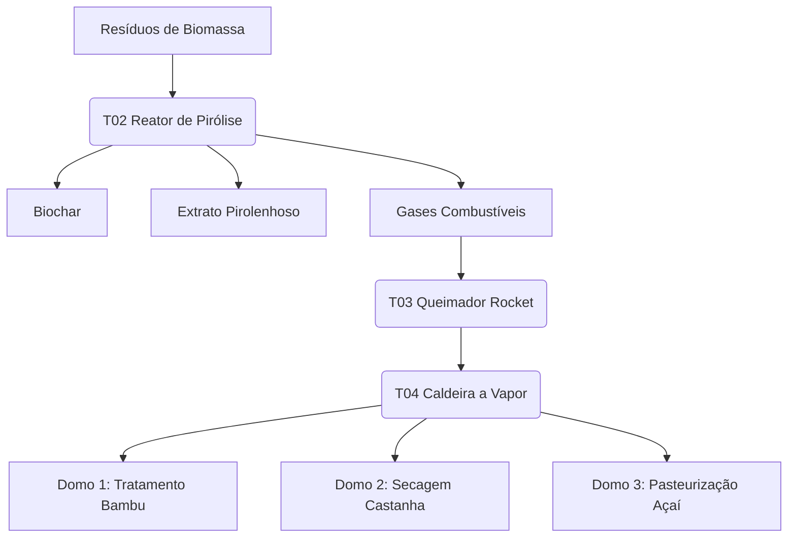

# TAK-MD-011: Memorial Descritivo – Polo Integrado Domo-Fábrica (Cruzeiro do Sul)

**Projeto:** Polo Integrado de Beneficiamento – Bambu, Castanha e Açaí
**Localização:** Cruzeiro do Sul/AC – Bairro Miritizal (Polo Naval Artesanal)
**Cliente:** Projeto Mulheres Que Tecem a Floresta – Consórcio UnB/UFAC/UFRR
**Coordenação Técnica:** Núcleo Takwara – Fabio Resck
**Versão:** 1.0 – Higiene 1.0 (Março 2026)
**Diretriz:** Engenharia Regenerativa (Não Veneno · Não Cimento · Não Voláteis)

---

## 1. CONTEXTO E JUSTIFICATIVA

### 1.1 Diagnóstico Territorial
Cruzeiro do Sul concentra o maior polo de carpintaria naval artesanal do Alto Juruá, enfrentando escassez de madeiras tradicionais e altos custos logísticos. O Polo Integrado visa converter a biomassa abundante de bambu (*Guadua* spp.) em alternativa estrutural certificada, integrando-a às cadeias de castanha e açaí sob um regime de cascata térmica e economia circular.[^1]

### 1.2 Objetivo
Estabelecer uma unidade de beneficiamento multifuncional (Domo-Fábrica) para:
- Produção de **bambu tratado termicamente** e **painéis laminados** para carpintaria naval.
- Processamento de **castanha-do-Brasil** e **açaí** com padrões sanitários de exportação.
- Geração de **biochar, briquetes e extrato pirolenhoso** via Núcleo Térmico Central (T02–T05).
- Atuar como **Canteiro-Escola** (T01) para formação técnica de mulheres da Amazônia.[^1]

---

## 2. PARTIDO ARQUITETÔNICO E ESTRUTURAL

### 2.1 Complexo Integrado (3 Domos + 1 NT)
O arranjo consiste em três domos geodésicos (D=18 m) interligados a um Núcleo Térmico (NT) central, otimizando a distribuição de vapor e calor residual.
- **Domo 1 (D1):** Bambu Estrutural.
- **Domo 2 (D2):** Castanha-do-Brasil.
- **Domo 3 (D3):** Açaí (Linha Úmida).
- **Núcleo Térmico (NT):** Centro de geração térmica e pirólise.[^1]

### 2.2 Geometria e Sistemas
- **Estrutura:** Domos geodésicos frequência 3V em bambu *Guadua* tratado e conexões **Sistema Takwara** (aço galvanizado/inox).[^2]
- **Platô Suspenso:** Plataforma elevada a +2,00 m, construída em painéis sanduíche **bambu + PU vegetal (MAMONEX® RD70)** e selada com membrana **IMPERVEG® UG 132 A**.[^3][^4]
- **Fundação:** Estacas de bambu tratado conforme NBR 16828-1:2020. Uso de concreto restrito a bases de máquinas e pavimentos térreos técnicos.[^1]

---

## 3. PROGRAMA FUNCIONAL (SÍNTESE)

### 3.1 Domo 1 – Bambu (254 m² platô + 100 m² inferior)
- **Platô:** Recepção, Câmaras de Tratamento (Vapor + Pirolenhoso), Secagem Ventilada, Usinagem, Laminação e Expedição.
- **Inferior:** Corredor técnico, depósito de colmos brutos e área de biochar/briquetes de bambu.

### 3.2 Domo 2 – Castanha (254 m² platô + 90 m² inferior)
- **Platô:** Recepção, Pré-secagem (Ar Quente), Quebra/Seleção, Secagem Final e Embalagem.
- **Inferior:** Recepção de cascas (sistema gravítico) e pré-secagem para alimentação do T02.

### 3.3 Domo 3 – Açaí (254 m² platô + 90 m² inferior)
- **Platô:** Recepção (Área Limpa), Lavagem, Despolpagem, Pasteurização (T05) e Envase.
- **Inferior:** Recepção de caroços e depósito de embalagens.

### 3.4 Núcleo Térmico (120 m²)
- **T02/T03:** Reatores de pirólise e Queimador Rocket (queima de gases não condensáveis).
- **T04:** Caldeira Flamotubular (0 barg) para geração de vapor a 100°C.
- **T05/Condensação:** Sistema de coleta de pirolenhoso e interface de pasteurização.[^1]

---

## 4. FLUXO TÉRMICO E OPERACIONAL

---

## 5. REQUISITOS DE HIGIENE E MATERIAIS
- **Áreas Alimentares:** Revestimento total em PU vegetal (IMPERVEG®) nas superfícies e aço inox 304 nas bancadas de contato direto.
- **Não Veneno:** Substituição completa de sais de boro por tratamento térmico e ácido pirolenhoso.
- **MRV:** Monitoramento em tempo real via SGMAS Plotter v7.1 para futura certificação de créditos de carbono (VERRA VM0044).[^1]

---

**Coordenação Técnica:** Núcleo Takwara – Fabio Resck
**Aprovação:** Coordenação Geral WTF (UnB)
**Data:** Março de 2026
**Referência:** [GOV01_RES_EXECUTIVO_WTF.md](../../../../01_GOVERNANCA/GOV01_RES_EXECUTIVO_WTF.md)
**Alinhamento Estratégico:** [TAK-MEM-013_ALINHAMENTO-ESTRATEGICO-BNDES.md](../../../../01_GOVERNANCA/TAK-MEM-013_ALINHAMENTO-ESTRATEGICO-BNDES.md)

[^1]: [GOV01_RES_EXECUTIVO_WTF.md](../../../../01_GOVERNANCA/GOV01_RES_EXECUTIVO_WTF.md)
[^2]: [a1.4-Conexoes-Geodesicos.md](../../../../04_PESQUISA_ANDAMENTO/ACERVO_DIGITAL_WTF/01_RAW_TRANSCRIPTS/01_CIENTIFICO/TECNOLOGIA/a1.4-Conexoes-Geodesicos.md)
[^3]: [WTF_RES_ft_mamonex_rd70pdf.md](../../../../04_PESQUISA_ANDAMENTO/ACERVO_DIGITAL_WTF/02_TECHNICAL_REVIEWS/01_CIENTIFICO/TECNOLOGIA/WTF_RES_ft_mamonex_rd70pdf.md)
[^4]: [WTF_RES_MARIANA-LOPES_UFMG_IMPERVEG.md](../../../../04_PESQUISA_ANDAMENTO/ACERVO_DIGITAL_WTF/02_TECHNICAL_REVIEWS/01_CIENTIFICO/TECNOLOGIA/WTF_RES_MARIANA-LOPES_UFMG_IMPERVEG.md)
