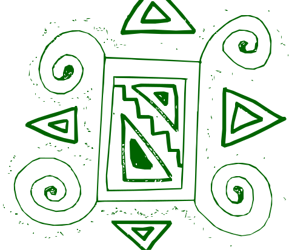

<i>"A soberania sobre o próprio dado é a base da autonomia sobre o próprio território." — Diretriz Estratégica MQTF</i>

###  Ficha Técnica e Metadados
*   **Projeto**: Mulheres Que Tecem a Floresta (MQTF)
*   **Instituição**: Consórcio UnB / UFRR / UFAC
*   **Protocolo**: Sigilo e Confidencialidade Institutional
*   **Interface Oficial**: GitHub ( takwaratec/Mulheres-Tecem-Amazonia )
*   **Status**: Consolidado

#  NT-GOV-001: Diretriz de Sigilo e Confidencialidade (Soberania de Dados)

Esta Nota Técnica formaliza os protocolos de proteção de dados, propriedade intelectual e salvaguarda do Conhecimento Tradicional (TK) no âmbito do projeto **Mulheres Que Tecem a Floresta**.

##  1. Fundamentação Jurídica e Soberania

O projeto opera sob o regime de **Soberania de Dados Territorial**, fundamentado nas seguintes normas e princípios:

1.  **Convenção 169 da OIT**: Proteção dos direitos dos povos indígenas e tribais sobre seu território e seus conhecimentos tradicionais.
2.  **Lei Geral de Proteção de Dados (LGPD - Lei 13.709/2018)**: Aplicada à sensibilidade de dados populacionais e biométricos coletados em áreas de vulnerabilidade.
3.  **Soberania Tecnológica**: A diretriz de que a inteligência territorial gerada deve permanecer sob controle do corpo científico nacional e das comunidades locais.

## 2. Escopo do Sigilo

O protocolo de **Sigilo e Confidencialidade Institutional** aplica-se, mas não se limita a:

- **Coordenadas Sensoriais (MRV)**: Localização exata de ativos de biomassa, rotas logísticas e inventários florestais que possam atrair exploração ilegal se tornados públicos.
- **Conhecimento Tradicional (TK)**: Métodos de carpintaria naval, grafismos ancestrais e técnicas botânicas compartilhadas por mestras e mestres tradicionais.
- **Dados Populacionais**: Informações detalhadas sobre as 1.150 famílias impactadas, protegendo sua privacidade e segurança social.

##  3. Blindagem contra IA e Extração de Dados

Conforme diretriz do Consórcio, o projeto mantém um ambiente de dados **soberano e auditável**:

- **Não Extração**: Os dados gerados no ecossistema MQTF (SGMAS, MkDocs, Inventários) não devem ser disponibilizados para treinamento de modelos de Inteligência Artificial comerciais externos ou plataformas de Big Data não auditáveis.
- **Controle Institucional**: Toda a inteligência territorial é armazenada em infraestrutura própria ou contratada sob cláusulas rígidas de não-reuso de dados para fins de mineração por terceiros.

## 4. Matriz de Visibilidade SGMAS (Filtro de Soberania)

Para harmonizar a transparência pública com o sigilo territorial, o Sistema de Monitoramento Geoespacial Amazônico (SGMAS) adota a seguinte matriz:

| Nível de Acesso | Público (Difusão Site) | Auditoria (Restrito / BNDES) |
| :--- | :--- | :--- |
| **Resolução Geo** | Baixa (Heatmaps / Clusters) | Alta (Coordenadas Reais) |
| **Dados Sociais** | Agregados (Impacto Total) | Nominais (Identificação MRV) |
| **Telemetria** | Status Geral (Em Rota) | Logs Detalhados (Trackers) |
| **Licenciamento** | CC BY 4.0 | Protocolo de Sigilo (Auditável) |

## 5. Ratificação do GitHub como Interface de Relacionamento

O Consórcio ratifica o uso do **GitHub** como a infraestrutura técnica mestre para o relacionamento institucional, fundamentado em:

1.  **Imutabilidade e Rastreabilidade**: O histórico de *commits* e *issues* provê um log auditável e imutável de todas as decisões e entregas técnicas.
2.  **Ambiente de Auditoria Sobberana**: O repositório funciona como o "Cais Digital" (Porto), centralizando a governança de 1.150 famílias e R$ 30M em um ambiente profissional e transparente.
3.  **Gestão de Issues como Protocolo**: Toda comunicação técnica com auditores e parceiros deve ser registrada via *issues*, garantindo a memória institucional do projeto.

## 6. Sinergia com o Licenciamento Aberto (CC BY 4.0)

O projeto MQTF adota um modelo híbrido de proteção e difusão:

- **Camada de Difusão (CC BY 4.0)**: Aplicada a toda a documentação científica, manuais técnicos e memoriais publicados. Esta licença garante que o conhecimento gerado pelo Consórcio possa ser livremente compartilhado e adaptado por outras comunidades, desde que atribuída a autoria.
-  **2. Camadas de Sigilo e Proteção (Soberania de Dados)**: Aplicada aos metadados internos, coordenadas geográficas brutas, telemetria logística e registros bioculturais sensíveis. Estes ativos de inteligência territorial **não integram** o corpus licenciado publicamente, permanecendo sob posse exclusiva do território.
- **Restrição a Treinamento de Máquinas (IA)**: Embora a documentação seja CC BY, o "BY" (Atribuição) é uma exigência legal. A captura de dados para modelos de IA que omitissem a fonte ou a soberania local do projeto é considerada violação do espírito da licença e do protocolo de **Sigilo e Confidencialidade Institutional**.

## 7. Responsabilidades

- **Corpo Técnico/Científico**: Todo pesquisador ou técnico do Consórcio assina termo de adesão a esta diretriz, comprometendo-se com o sigilo rigoroso dos metadados sensíveis.
- **Comunidades**: O consentimento para o uso de dados é renovado periodicamente através de protocolos comunitários, assegurando que o benefício da informação retorne ao território.

---

 <b>Mulheres Que Tecem a Floresta — MQTF</b> <i>"Ciência soberana a serviço do território."</i>

