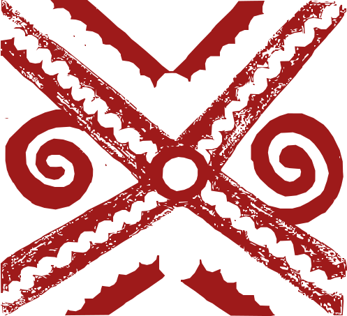
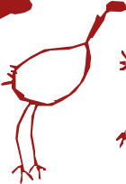

<i>"O povo é o único soberano." — João Ubaldo Ribeiro</i>

###  Ficha Técnica e Metadados
**Projeto**: Mulheres Que Tecem a Floresta (MQTF)
**Instituição**: Consórcio UnB / UFRR / UFAC
**Referência**: WTF_PROJETO_INTEGRADO.md
**Status**: Status Em Revisão
**Autor**: Consórcio UnB / UFRR / UFAC
**Data**: 28 de Março de 2026

#  MEMORANDO TÉCNICO E DE GOVERNANÇA: PROJETO MULHERES QUE TECEM A FLORESTA

**Consórcio UnB/UFRR/UFAC para Bioeconomia Feminina na Amazônia Legal**

**Duração:** 48 meses | **Orçamento BNDES Solicitado:** R$ 30.000.000 | **Investimento Aplicado (CAPEX/OPEX):** R$ 25.000.000 (Líquido) | **Contrapartida não financeira:** R$ 4.000.000 | **Valor Total do Projeto:** R$ 34.000.000

---

##  1. IDENTIFICAÇÃO DO PROJETO

###  1.1. Dados Cadastrais

| Campo | Informação |
| ----- | ----- |
| **Nome do Projeto** | Mulheres Que Tecem a Floresta – Consórcio para Bioeconomia Feminina na Amazônia Legal |
| **Proponente** | Consórcio Interinstitucional UnB/UFRR/UFAC |
| **Instituição Líder** | Universidade de Brasília – UnB |
| **Coordenação Geral** | Prof. Dra. Tânia Cruz (UnB) |
| **CNPJ Proponente** | [UnB CNPJ] |
| **Fonte de Recursos Solicitada** | BNDES – Fundo Amazônia / Fundo Clima |
| **Linha de Financiamento** | Bioeconomia, Desenvolvimento Territorial, Protagonismo Feminino |
| **Região de Atuação** | Amazônia Legal (foco: Acre, Roraima e áreas de influência) |
| **Público-alvo Direto** | **1.050 famílias**, com protagonismo de mulheres em cooperativas/associações |
| **Prazo de Execução** | 48 meses a partir da assinatura do convênio |

---

##  2. CONTEXTO E JUSTIFICATIVA

###  2.1. Diagnóstico
A Amazônia Legal concentra expressiva biodiversidade e conhecimentos tradicionais, mas enfrenta desafios estruturais:

 **Baixo valor agregado nas cadeias extrativistas:** Castanha, açaí, artesanato e outros produtos são comercializados majoritariamente in natura, com captura de valor concentrada em intermediários urbanos. 

 **Infraestrutura precária:** Ausência de agroindústrias comunitárias, logística deficiente, alto "custo amazônico" que encarece equipamentos e construção civil. 

 **Desigualdade de gênero:** Mulheres realizam trabalho invisibilizado nas cadeias produtivas, com pouco acesso a formação técnica, crédito e protagonismo decisório. 

 **Pressão sobre florestas:** Expansão de desmatamento e queimadas em áreas de vulnerabilidade, com manejo inadequado de recursos florestais como bambu (*Guadua spp.*). 

 **Dependência energética:** Comunidades isoladas dependem de diesel e GLP, com custos elevados e alta pegada de carbono.

###  2.2. Oportunidade
O projeto aproveita tecnologias maduras e de domínio público em **construção sustentável com bambu**, **bioenergia descentralizada** e **agroindústria comunitária**, combinando:

 Filosofia e engenharia de construção em bambu, publicadas e validadas, que reduzem pegada de carbono, aumentam conforto térmico e resiliência climática.

 Micro-biorrefinarias modulares para pirólise de biomassa (briquetes, biochar, extrato pirolenhoso), com aplicação em energia, saneamento e créditos de carbono.

 Cadeias de artesanato, castanha e açaí como âncoras de geração de renda para mulheres, com potencial de triplicar receita via beneficiamento e marca coletiva.

 Modelo de **canteiro-escola** que forma mulheres em regime de imersão, com bolsas e transferência prática de tecnologia, reduzindo dependência de assistência externa.

###  2.3. Alinhamento Estratégico
O projeto alinha-se integralmente a:

 **Plano de Ação para Prevenção e Controle do Desmatamento na Amazônia Legal (PPCDAm):** Manejo sustentável de florestas de bambu, bioeconomia de floresta em pé.

 **Nova Indústria Brasil:** Fortalecimento de cadeias produtivas regionais, industrialização com tecnologia nacional, cooperativismo.

 **Coopera+ Amazônia (BNDES/Sebrae):** Foco em cooperativas de mulheres, castanha, açaí, babaçu, formação de Agentes Locais de Inovação (ALICoop).

 **Fundo Amazônia – Eixos de Bioeconomia e Infraestrutura Comunitária:** Apoio a sistemas produtivos sustentáveis, capacitação, monitoramento geoespacial (MRV).

---

##  3. OBJETIVOS

###  3.1. Objetivo Geral
Promover o empoderamento econômico de mulheres amazônidas por meio da estruturação de **polos comunitários de bioeconomia**, ancorados em formação técnica intensiva, infraestrutura de baixa pegada de carbono em bambu, e agroindústrias de castanha, açaí e artesanato, com governança cooperativa e autonomia produtiva.

###  3.2. Objetivos Específicos

 **Implantar Canteiro-Escola em Rio Branco** como núcleo permanente de formation, prototipagem e fabricação de tecnologias em bambu, bioenergia e agroindústria (**T01-T09**).

 **Formar 100 mulheres** entre os meses 6 e 42 do projeto, em técnicas de construção sustentável, operação de micro-biorrefinarias, beneficiamento agroindustrial e gestão cooperativa, com foco na autonomia produtiva.

 **Aparelhar 5 polos comunitários**, com destaque para o **Polo Cruzeiro do Sul**, integrando o **Domo-Fábrica T11 (3x1)** à cadeia de **Mestres Navais** e à **Balsa-Catamarã de Bambu T10**, iniciando uma rede de produção naval soberana.

 **Implementar Saneamento Ecológico** nos polos, utilizando unidades de **Banheiro Seco Modular (T12 - BSM)** e **Banheiro Ecológico Ribeirinho (BER)**.

 **Garantir autonomia logística** com veículos 4x4 (micro-ônibus e caminhão) e transporte fluvial (T10) para insumos e produtos.

 **Estabelecer sistema de MRV** (Monitoramento, Relato e Verificação) geoespacial para manejo de bambu e rastreabilidade da produção.

---

##  4. ESTRATÉGIA METODOLÓGICA

###  4.0. Fase Zero: Anamnese e Domo Voador — Dispositivo de Pré-Estruturação Territorial
O avanço territorial baseia-se na metodologia de **Tecnologia com Vínculo Social**, dividida em três atos:

 **1. Anamnese Inicial (Corpo a Corpo):** Realizada pelos gestores e professoras, consiste no diagnóstico humano e técnico in situ. Escuta profunda e mapeamento de gargalos logísticos em cada localidade.

 **2. Dispositivo Domo Voador:** Unidade itinerante para permanência de 5 a 10 dias. Não é apenas técnica, mas um **nó de articulação política e afetiva** para sensibilizar e criar o desejo de participação na Plataforma Mulheres que Tecem a Floresta.

 **3. Fechamento de Acordos de Cooperação:** Assinatura formal de cartas de intenção e acordos com prefeituras e associações, selando o capital social pré-financiamento antes da chegada do Canteiro-Escola Hub.

###  4.1. Modelo de Canteiro-Escola e Logística Formativa
O núcleo em Rio Branco funciona como **escola-fábrica**, combinando:

 **Imersão prática:** Turmas de 15–20 mulheres permanecem no canteiro por 8–12 semanas (com meta de 100 formadas entre os meses 6 e 42), participando da construção real de módulos térmicos, domos geodésicos e processamento agroindustrial.

 **Bolsas de aprendizado:** Educandas recebem bolsa de R$ 1.000–1.400/mês, alimentação, alojamento e transporte. 

 **Transferência de tecnologia:** Após formação, as turmas retornam às comunidades **com os equipamentos** fabricados no núcleo, montando o polo local com acompanhamento de Agentes Locais de Inovação. 

 **Replicabilidade:** O mesmo núcleo produz módulos para múltiplos ciclos (este projeto + futuras expansões), amortizando CAPEX e consolidando know-how.

**Vantagens:**

 Redução de custos de assistência técnica externa. 

 Formação de quadros locais capazes de manter e ampliar infraestrutura. 

 Criação de "massa crítica" de mulheres capacitadas, fortalecendo redes de cooperação.

###  4.2. Cadeia de Valor Integrada
Cada polo opera 3 eixos produtivos integrados:

####  4.2.1. Artesanato
 Oficinas equipadas com ferramentas, teares, máquinas de costura industrial. 

 Design colaborativo, marca coletiva, embalagem e acesso a e-commerce. 

 Integração do bambu como elemento estrutural e estético (cestas, luminárias, móveis, painéis).

####  4.2.2. Castanha e Açaí
 Agroindústrias compactas para quebra, classificação, torrefação, embalagem a vácuo (castanha). 

 Despolpadeiras, pasteurizadores, câmaras frias (açaí). 

 Aproveitamento de resíduos: cascas e caroços alimentam micro-biorrefinaria para briquetes e biochar.

####  4.2.3. Bambu, Bioenergia e Saneamento
 Manejo de bambuzais nativos (*Guadua spp.*) para fins estruturais e energéticos.

 **Saneamento Ecológico:** Instalação de **Banheiros Secos Modulares (T12 - BSM)** e **Banheiro Ecológico Ribeirinho (BER)** como protótipos de habitação de interesse social.

 Pirólise lenta de biomassa gerando briquetes, biochar e extrato pirolenhoso.

 **Cadeia Naval Soberana:** Integração do **Domo-Fábrica T11** com a tradição dos **Mestres Navais** de Cruzeiro do Sul para produção de **Balsas/Catamarãs-Fábrica (T10)**, ampliando o alcance logístico e produtivo na calha do Rio Juruá.

 Domos geodésicos de secagem (T11) integrados ao Núcleo Térmico Central.

---

##  5. RESULTADOS ESPERADOS E INDICADORES

###  5.1. Produtos (Entregas Físicas)

| Produto | Meta 48 meses |
| ----- | ----- |
| Canteiro-Escola instalado e operando em Rio Branco | 1 unidade (TRL 7–8) |
| Polos comunitários aparelhados e operacionais | 5 unidades |
| Mulheres formadas e certificadas | 100 |
| Agentes Locais de Inovação capacitados | 8–10 |
| Veículos 4x4 em operação (logística formativa e produtiva) | 3 (2 micro-ônibus + 1 caminhão) |
| Sistema de MRV (SMGA) implantado e operando | 1 plataforma online |

###  5.2. Resultados Operacionais (Produção e Renda)

| Indicador | Meta Anual (Ano 4) |
| ----- | ----- |
| Castanha beneficiada (t/ano) | 150 |
| Açaí processado – polpa (t/ano) | **250** (50t por polo/hub) |
| Artesanato (peças/ano) | 3.000 |
| Briquetes produzidos (t/ano) | 600 |
| Biochar (t/ano) | 300 |
| Renda média incremental por família (R$/ano) | +12.000 |
| Famílias beneficiadas diretamente | **1.050** |
| Empregos diretos gerados | 120 |

---

##  6. PLANO DE MONITORAMENTO, RELATO E VERIFICAÇÃO (MRV)

###  6.1. Sistema de Monitoramento Geoespacial Amazônico (SMGA)
**Objetivo:** Rastrear manejo de bambu, desmatamento evitado, uso do solo e impactos climáticos em tempo quase real.

 **Imagens de satélite:** Sentinel-2 (10 m), Landsat (30 m), GEDI (estrutura florestal). 

 **Processamento:** Google Earth Engine, QGIS, algoritmos de detecção de mudanças. 

 **Dashboard público:** Dados acessíveis online para transparência e prestação de contas.

###  6.2. Monitoramento Socioeconômico

 **Linha de base (Mês 0):** Caracterização de famílias, renda, produção, infraestrutura. 

 **Avaliação intermediária (Mês 24):** Ajustes de rota com base em indicadores parciais. 

 **Avaliação final (Mês 48):** Relatório de impacto com análise custo-benefício, retorno social e ambiental.

---

##  7. SUSTENTABILIDADE E ESCALABILIDADE PÓS-48 MESES

###  7.1. Sustentabilidade Financeira
Após 48 meses, o projeto opera com:

 **Receitas operacionais dos polos:** Venda de castanha beneficiada, açaí processado, artesanato, briquetes, biochar. 

 **Cursos pagos no canteiro-escola:** Formação para empresas, órgãos públicos, outras cooperativas, universidades. 

 **Créditos de carbono:** Comercialização de remoções certificadas (biochar, manejo florestal). 

 **Consultoria técnica:** O núcleo presta serviços de engenharia, design e P&D para terceiros.

---

 <b>Mulheres Que Tecem a Floresta — MQTF</b> <i>"Soberania não se pede, se exerce."</i>
