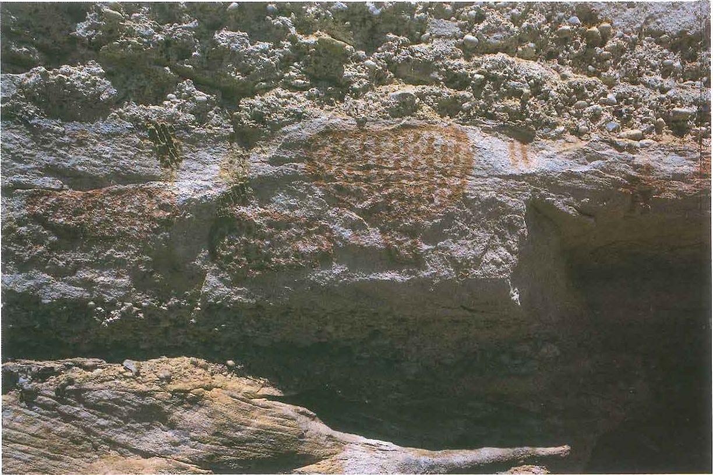
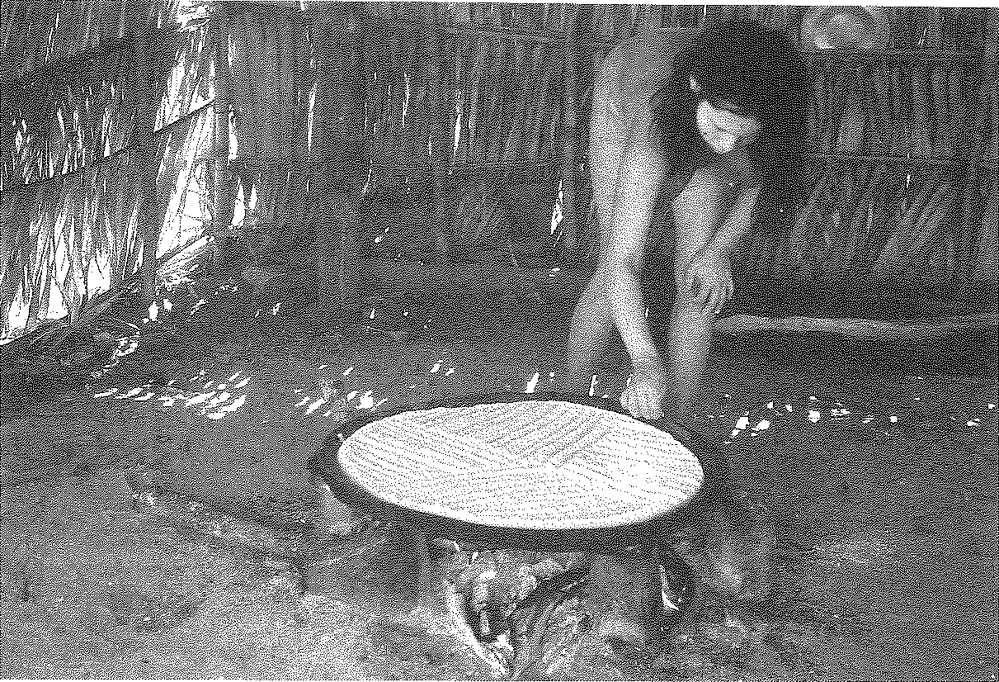

<i>"Arte sem ética não é arte." — Ariano Suassuna</i>

###  Ficha Técnica e Metadados
**Projeto**: Mulheres Que Tecem a Floresta (MQTF)
**Instituição**: Consórcio UnB / UFRR / UFAC
**Referência**: WTF-DIAG-001_Patrimonio_Imaterial_Grafismo.md
**Status**: Status Em Revisão
**Autor**: Consórcio UnB / UFRR / UFAC
**Data**: 27 de Março de 2026

#  WTF-DIAG-001: Patrimônio Imaterial – Grafismos e Identidade Indígena

Este documento sistematiza a análise do patrimônio imaterial focado nos sistemas gráficos das etnias Huni Kuĩ e Kaiowá, explorando a relação entre estética, proteção espiritual e preservação da memória coletiva na Amazônia Ocidental e regiões fronteiriças.

---

##  1. Introdução: O Grafismo como Tecnologia Social
O grafismo indígena transcende a mera função decorativa, operando como uma **tecnologia de socialização e espiritualidade**. Segundo os estudos de Lux Vidal (1992), o corpo pintado ou o artefato grafado tornam-se suportes de uma "segunda skin" que comunica o status social, a linhagem e a proteção contra entidades metafísicas.

---

##  2. O Sistema Kene (Huni Kuĩ — Acre)
No contexto dos povos Huni Kuĩ (Rio Branco/Acre), o **Kene** é a manifestação máxima da identidade.

 **Origem**: Atribuído à visão do Grande Espírito através da *Yuxibu* (força criadora) e transmitido prioritariamente pelas mulheres e jovens em processos de iniciação.

 **Função**: Proteção contra o "corpo fraco" e conexão com os espíritos da floresta.

 **Suportes**: Pintura corporal (jenipapo/urucum), tecelagem de algodão e cerâmica.

---

##  3. O Sistema Jegua (Kaiowá/Guarani — MS/Fronteira)
Embora geograficamente distinto, o **Jegua** compartilha a premissa da proteção espiritual. Rossandra Cabreira (2014) destaca que os grafismos Kaiowá são linguagens que "falam" com a natureza, representando a resistência de um povo diante do confinamento territorial e da pressão externa.

---

##  4. Tabela Comparativa de Sistemas Gráficos

| Atributo | Kene (Huni Kuĩ) | Jegua (Kaiowá/Guarani) |
| :--- | :--- | :--- |
| **Principal Etnia** | Huni Kuĩ (Kashinawá) | Kaiowá e Guarani |
| **Região Foco** | Amazônia Ocidental (Acre) | Centro-Oeste / Fronteiras |
| **Elemento Visual** | Geometrias complexas | Simetria radial, estrelas |
| **Significado Central** | Proteção da alma (*Yuxin*) | Caminho para a Terra Sem Males |
| **Protagonismo** | Mulheres (Tecelagem) | Lideranças espirituais (*Paĩ*) |

---

##  5. Sublimação de Culturas e Resistência
A "sublimação" aqui não é o desaparecimento, mas a transposição do sagrado para o contemporâneo. O uso desses grafismos em têxteis para a bioeconomia garante:

 **Soberania Econômica**: Valor agregado ao artesanato com selo de autenticidade IPHAN.

 **Memória Ativa**: Transmissão intergeracional do conhecimento visual.

 **Resiliência Política**: O grafismo como marca de ocupação e dignidade territorial.

---

##  6. Documentação Visual: Pranchas de Análise (Acervo Lux Vidal)

###  Prancha 1: Petróglifos e Marcas Ancestrais

*Fig 1. Evidência de marcas territoriais e arqueológicas (p. 14).*

###  Prancha 2: O Fazer Manual e Social

*Fig 2. Cartilha pedagógica Henfil/Warhol para transmissão de técnicas manuais (p. 52).*

---

##  7. Integração Iconográfica (Vetores SVG)

| Grafismo | Fonte / Página | Aplicação Têxtil Sugerida |
| :--- | :--- | :--- |
| { .svg-color-primary } | Lux Vidal, p. 72 | Barras de saias e remates |
| { .svg-color-accent } | IPHAN, p. 44 | Bordados centrais em almofadas |

---

##  8. Bibliografia Consolidada

 **VIDAL**, Lux (Org.). *Grafismo Indígena: estudos de antropologia estética*. São Paulo: Nobel/Edusp/Fapesp, 1992.

 **IPHAN**. *Dossiê de Registro dos Grafismos Kene Huni Kuĩ*. Rio Branco: Iphan no Acre, 2012.

 **CABREIRA**, Rossandra. *O Grafismo Kaiowá e Guarani: identidade e resistência*. Dourados: UFGD, 2014.

---

 <b>Mulheres Que Tecem a Floresta — MQTF</b> <i>"Soberania não se pede, se exerce."</i>
