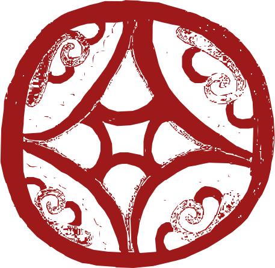

<i>"As invenções são o resultado de um trabalho teimoso." — Santos Dumont</i>

### &nbsp; Ficha Técnica e Metadados
*   **Projeto**: Mulheres Que Tecem a Floresta (MQTF)
*   **Instituição**: Consórcio UnB / UFRR / UFAC
*   **Referência**: 00_RESUMO_EXECUTIVO.md
*   **Status**: Em Revisão

#  Resumo Executivo: Projeto Mulheres Que Tecem a Floresta (v1.0 Mulheres que Tecem a Floresta)

**Consórcio:** UnB / UFAC / UFRR | **Fonte:** BNDES (Fundo Amazônia/Clima) | **Coord. Geral:** Prof. Dra. Tânia Cruz

---

##  1. Visão Geral
O projeto **Mulheres Que Tecem a Floresta** é uma iniciativa sistêmica de bioeconomia regenerativa voltada ao empoderamento de mulheres amazônidas e à restauração da saúde pública ambiental. A estratégia baseia-se na **Bio-Soberania Nacional**, transformamos passivos ambientais em ativos produtivos através de polos comunitários autônomos.

##  2. Pilares Tecnológicos (Hub Canteiro-Escola)
A integração tecnológica do projeto ocorre em três frentes complementares de soberania:

 **Biorrefinaria e Bioconstrução (T01-T09)**: Desenvolvimento de máquinas (pirólise/prensas) e estruturas em **Bambu Guadua** sob o protocolo de Engenharia Regenerativa (Não Veneno, Não Cimento).
 **Logística Circular e Navegação (T10)**: Operação da **Balsa Catamarã**, uma biofábrica flutuante de baixo calado para beneficiamento itinerante de açaí e produtos da sociobiodiversidade.
 **Saneamento Soberano (T12 - BSM)**: Implementação de Banheiros Secos Modulares para erradicação de doenças hídricas e restauração de ecossistemas em áreas de várzea.

##  3. Eixos de Liderança e Governança
 **Bioeconomia (Sonia Marise)**: Industrialização descentralizada do açaí e castanha.
 **Artesanato e Saberes (Georgia Ferko)**: Design colaborativo e valorização do patrimônio imaterial.
 **Engenharia e Inovação (Fabio Resck)**: Autonomia termoenergética e infraestrutura em biocompósitos.
 **Governança e Sustentabilidade (Tânia Cruz)**: Compliance BNDES e gestão descentralizada.

##  4. Impacto Esperado
Alinhado ao **PPCDAm** e à **Nova Indústria Brasil**, o projeto mitiga o desmatamento, gera renda digna e posiciona a Amazônia Sul-Ocidental como polo global de tecnologias sociais, garantindo a perenidade do sistema através da apropriação tecnológica feminina.

---

 <b>Mulheres Que Tecem a Floresta — MQTF</b> <i>"Soberania não se pede, se exerce."</i>
