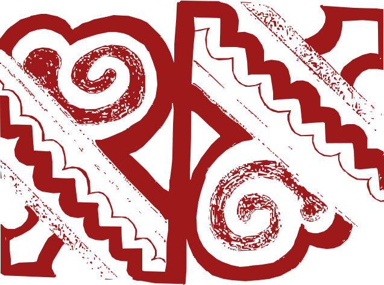

<i>"O espaço é a materialização da desigualdade e, por isso, o palco da resistência." — Milton Santos</i>

### &nbsp; Ficha Técnica e Metadados
*   **Projeto**: Mulheres Que Tecem a Floresta (MQTF)
*   **Instituição**: Consórcio UnB / UFRR / UFAC
*   **Referência**: MODELO_01_BNDES_FORMULARIO.md
*   **Status**: Em Revisão

#  GABARITO MESTRE: FORMULÁRIO 01 - APRESENTAÇÃO DE PROJETO (BNDES / FUNDO AMAZÔNIA)

Este documento constitui o gabarito espelho para a submissão ao Fundo Amazônia. Os campos seguem a estrutura oficial do Formulário 01 - Geral do BNDES, com indicação de limites de caracteres e fontes de extração. A tônica narrativa preserva a retórica das pesquisadoras regentes, costurando a integração conjuntural do projeto integrado.

---

##  1. DADOS CADASTRAIS DO PROPONENTE

| Campo | Informação |
| :--- | :--- |
| **Título do Projeto** | Mulheres Que Tecem a Floresta: O Elo Feminino entre a Biodiversidade, a Bioarquitetura e a Nova Bioeconomia |
| **Instituição Proponente (Líder)** | Universidade de Brasilia (UnB) |
| **CNPJ** | [UnB CNPJ - a preencher] |
| **Instituições Participantes** | Universidade Federal de Roraima (UFRR); Universidade Federal do Acre (UFAC) |
| **Coordenação Geral** | Profa. Dra. Tânia Cristina Cruz, PhD (UnB) |
| **Fonte de Recursos** | BNDES - Fundo Amazônia / Fundo Clima |
| **Linha de Financiamento** | Bioeconomia, Desenvolvimento Territorial, Protagonismo Feminino |
| **Valor Total Solicitado** | R$ 38.825.036,18 |
| **Prazo de Execução** | 48 meses |
| **Abrangência** | 28 municípios em 4 estados (AC, AM, RO, RR) |
| **Público-alvo Direto** | 1.150 famílias (~5.750 pessoas) |

### 1.2. Componentes e Responsáveis

| Componente | Responsável | Vinculação |
| :--- | :--- | :--- |
| **Comp. 1 - Cadeia do Artesanato** | Profa. Dra. Georgia Patricia da Silva Ferko | UFRR |
| **Comp. 2 - Cadeia do Açai (Castanhas e Açai)** | Profa. Dra. Sônia Marise Salles Carvalho, PhD | UnB |
| **Comp. 3 - Bioconstrução e Biorrefinaria** | Nucleo de Engenharia / Hub N1 | Consórcio UnB/UFRR/UFAC |

---

##  2. APRESENTAÇÃO DO PROJETO

*(Máximo 2.000 caracteres, incluindo espaços)*

A Amazônia é um dos principais sistemas reguladores do clima global e abriga uma sociobiodiversidade singular, sustentada por modos de vida, práticas produtivas e conhecimentos tradicionais que historicamente garantem a manutenção da floresta em pé. Diante do avanço de modelos econômicos predatórios e da intensificação das crises climáticas e sociais, torna-se estratégico afirmar, para a região, um horizonte de desenvolvimento baseado na nova bioeconomia: uma economia que transforma a biodiversidade e os saberes associados em valor local, combinando conservação, inovação, justiça social e regeneração territorial.

O projeto "Mulheres Que Tecem a Floresta" parte do reconhecimento de que as cadeias não madeireiras -- castanha, açaí e artesanato -- constituem pilares da economia das florestas e são sustentadas pelo trabalho e pela inteligência coletiva das mulheres amazônicas. Essas cadeias geram resíduos agroextrativistas subaproveitados (cascas, fibras, sementes, caroços e biomassas) que podem integrar rotas tecnológicas de baixo impacto e alto valor agregado. A proposta articula biodiversidade e inovação por meio da bioarquitetura -- campo que aplica princípios bioclimáticos e materiais de base biológica --, incorporando resíduos das cadeias produtivas e o bambu (*Guadua* spp.) como matéria-prima renovável.

Para isso, o projeto ancora-se na convergência entre **Bioeconomia** (uso sustentável de recursos biológicos renováveis), **Tecnologia Social - TS** (inovação apropriável, de baixo custo, codesenvolvida e replicável) e **Economia Solidária - EcoSol** (autogestão, cooperação e repartição equitativa). A integração dessa tríade faz com que a inovação não seja extrativa nem excludente, mas um processo de tecnologia com vínculo social, no qual as mulheres são pesquisadoras do próprio território.

*(Contagem de caracteres: ~1.888 / Limite: 2.000)*

---

##  3. JUSTIFICATIVA E RELEVÂNCIA

*(Máximo 5.000 caracteres, incluindo espaços)*

A justificativa central do projeto reside na urgência de fortalecer e sofisticar as cadeias produtivas da sociobiodiversidade sem reproduzir a lógica da "bioeconomia de commodities" -- concentradora, padronizadora e dependente de grande escala. A nova bioeconomia demandada para a Amazônia deve ser diversa, territorializada e inclusiva: capaz de agregar valor no local, reduzir vulnerabilidades logísticas e comerciais, e criar alternativas econômicas compatíveis com a integridade dos ecossistemas e com os direitos das populações tradicionais.

Embora as mulheres sejam protagonistas no manejo, na seleção, no processamento, no artesanato e na transmissão de saberes ligados à floresta, persistem barreiras estruturais: acesso limitado a tecnologias apropriáveis, infraestrutura deficiente, crédito insuficiente, assistência técnica escassa, baixa conectividade, irregularidade produtiva e ausência de canais de comercialização justos. Essa assimetria diminui a renda, aumenta a dependência de intermediários e restringe o potencial de inovação comunitária. Fortalecer o protagonismo feminino nessas cadeias é uma ação direta de equidade de gênero, redução de desigualdades e sustentabilidade territorial.

**Fundamento Científico e Segurança Química.** A pesquisa de Análise de Ciclo de Vida conduzida por Araújo et al. (2025, UFAC/UNESP) em Rio Branco demonstrou que 93% do impacto de toxicidade carcinogênica humana na cadeia produtiva do bambu provém do tratamento convencional com sais de boro (CCA/CCB). O projeto exclui esses compostos, substituindo-os pelo protocolo de **Dequada** (neutralização alcalina via cinzas vegetais) e pelo **extrato pirolenhoso** (subproduto da pirólise controlada de biomassa), configurando uma blindagem atóxica cientificamente validada. Para a proteção contra intempéries -- condição crítica no regime equatorial amazônico, com precipitação anual superior a 2.000 mm e umidade relativa acima de 80% --, o projeto adota o **Poliuretano Vegetal de Mamona (PU Vegetal)**, biopolímero 100% sólido e livre de solventes voláteis, cuja eficácia em aplicações navais e estruturais foi validada por ensaios de durabilidade conduzidos por Naccache (Imperveg, 2025). A combinação Dequada-Pirolenhoso-PU Vegetal constitui o protocolo de **Bio-blindagem Circular** do projeto.

**Ecologia do Bambu e Segurança Climática.** As florestas de bambu no Acre ocupam aproximadamente 161.500 km² da Amazônia Sul-Ocidental (Silva, 2024). A espécie *Guadua weberbaueri* apresenta comportamento de **monocarpia gregária** -- fenômeno ecológico em que populações inteiras florescem sincronicamente e morrem em massa em ciclos estimados de 27 a 28 anos (Daly et al., 2007). Esse evento, denominado localmente de **mastragem**, gera acúmulo de biomassa seca morta (fuel load) que eleva drasticamente o risco de incêndios florestais (Silva, 2024). O manejo ativo proposto pelo projeto -- extração industrial para bioconstrução e bioenergia -- constitui, portanto, uma medida de mitigação de risco climático e regeneração ecossistêmica, convertendo um passivo ambiental em ativo produtivo.

**Integração Produção-Moradia-Conservação.** Ao aproximar cadeias agroextrativistas da bioarquitetura, o projeto amplia o conceito de valor agregado: não apenas comercializar de forma mais justa, mas promover condições de habitação digna no território. Resíduos antes descartados integram novas aplicações (agregados bioconstrutivos, componentes de acabamento, soluções bioclimáticas), enquanto o bambu oferece alternativas renováveis para estruturas leves, painéis, sombreamento e sistemas construtivos compatíveis com a realidade amazônica. Essa articulação entre produção e moradia fortalece a sustentabilidade de forma sistêmica: renda, trabalho digno, autonomia técnica, redução de impactos ambientais e melhoria do habitat.

Em síntese, o projeto justifica-se por propor uma rota aplicada e territorializada para fortalecer o protagonismo das mulheres e a sustentabilidade das cadeias de castanha, açaí e artesanato, integrando saberes tradicionais, pesquisa aplicada, Tecnologia Social (TS) e Economia Solidária (EcoSol), impulsionando a bioeconomia amazônica e contribuindo para a conservação da floresta em pé e para a habitação sustentável.

*(Contagem de caracteres: ~3.980 / Limite: 5.000)*

---

##  4. OBJETIVO GERAL

Fortalecer o protagonismo das mulheres e a sustentabilidade das cadeias produtivas de castanha, açaí e artesanato na Amazônia por meio da integração de saberes tradicionais, pesquisa aplicada e Tecnologias Sociais (TS), impulsionando a bioeconomia e a conservação da floresta em pé e a habitação sustentável.

##  5. OBJETIVOS ESPECIFICOS

1. Mapear e sistematizar os saberes e conhecimentos tradicionais das mulheres envolvidas nas cadeias de valor da castanha, açaí, artesanato e bioconstrução.
2. Analisar e diagnosticar os gargalos e as vulnerabilidades socioeconômicas e logísticas das cadeias produtivas selecionadas, com foco na otimização dos processos de beneficiamento.
3. Implantar e validar uma plataforma integrada de saneamento ecológico, manejo ecológico de bambu *Guadua* spp., aproveitamento de resíduos agroextrativistas e bioindústrias comunitárias de baixo carbono na Amazônia Legal, convertendo passivos sanitários, florestais e de resíduos sólidos em ativos produtivos, climáticos e sociais, com centralidade em cooperativas e organizações de mulheres.
4. Desenvolver e implementar soluções de Tecnologia Social (TS) que aprimorem o beneficiamento e a gestão das cadeias, respeitando a cultura e o modo de vida local.
5. Capacitar as mulheres em gestão, Economia Solidária (EcoSol) e uso de tecnologias, promovendo a autonomia econômica e o fortalecimento de suas organizações.
6. Propor um modelo de governança participativa e de acesso a mercado que valorize o produto da sociobiodiversidade e garanta a justa remuneração às produtoras.

---

##  6. COMPONENTES DO PROJETO

---

### COMPONENTE 1: CADEIA DO ARTESANATO
**Responsável:** Profa. Dra. Georgia Patricia da Silva Ferko (UFRR)

**Descrição do Componente** *(até 500 caracteres, incluindo espaços)*

Fortalecimento da cadeia produtiva do artesanato na Amazônia, com foco no protagonismo de mulheres, integrando saberes tradicionais, bioeconomia, Tecnologias Sociais (TS) e inovação em design sistêmico, para promover geração de renda, valorização cultural e uso responsável da biodiversidade em 5 comunidades de 4 estados.

*(Contagem: ~393 / Limite: 500)*

**Justificativa** *(até 1.000 caracteres, incluindo espaços)*

O componente Cadeia do Artesanato contribui diretamente para enfrentar as fragilidades identificadas no diagnóstico territorial, ao atuar de forma integrada no fortalecimento produtivo, organizacional e comercial das mulheres artesãs. Por meio do mapeamento da cadeia, de capacitações técnicas e gerenciais e do incentivo ao associativismo, o projeto promoverá maior autonomia e qualificação das participantes. A incorporação de princípios da bioeconomia e de Tecnologias Sociais (TS) permitirá o uso sustentável da biodiversidade, agregando valor aos produtos e reduzindo impactos ambientais. A introdução de estratégias inovadoras de comercialização, incluindo canais digitais e mercados institucionais via Economia Solidária (EcoSol), ampliará o acesso a consumidores e a geração de renda. Ao valorizar os saberes tradicionais e fomentar soluções inovadoras, o componente contribuirá para reduzir a vulnerabilidade socioeconômica e fortalecer a identidade cultural.

*(Contagem: ~924 / Limite: 1.000)*

**Produtos e Serviços** *(até 2.000 caracteres, incluindo espaços)*

**Produtos:** (i) Diagnóstico da cadeia produtiva do artesanato nas comunidades atendidas, contendo mapeamento de atores, matérias-primas e fluxos produtivos; (ii) materiais formativos e metodológicos para capacitação em gestão, design, inovação e sustentabilidade; (iii) desenvolvimento de novas linhas de produtos artesanais com identidade cultural e maior valor agregado; (iv) criação de marca coletiva e identidade visual dos produtos; (v) catálogo físico e digital para divulgação e comercialização; (vi) plataforma ou canais digitais de venda estruturados; e (vii) formalização ou fortalecimento de associações e/ou cooperativas de mulheres artesãs.

**Serviços:** (i) capacitações técnicas e gerenciais continuadas; (ii) assessoria para organização produtiva e gestão coletiva; (iii) consultoria em design e inovação de produtos; (iv) apoio à implementação de Tecnologias Sociais (TS) voltadas ao uso sustentável de matérias-primas e melhoria dos processos produtivos; (v) acompanhamento técnico para adequação ambiental e produtiva; e (vi) suporte à inserção em mercados, incluindo participação em feiras, rodadas de negócios e acesso a mercados institucionais e digitais.

*(Contagem: ~1.230 / Limite: 2.000)*

**Metas Quantificadas:**
- 05 comunidades com diagnóstico produtivo consolidado
- 150 mulheres artesãs mapeadas e capacitadas
- 20 novos produtos artesanais desenvolvidos; 30 aprimorados
- 01 marca coletiva registrada com identidade visual
- 03 canais de comercialização estruturados (digital, feiras, institucional)
- Faturamento anual mínimo de R$ 300.000,00 com produtos apoiados
- Aumento mínimo de 30% na renda média das participantes

---

### COMPONENTE 2: CADEIA DO AÇAI (CASTANHAS E AÇAI)
**Responsável:** Profa. Dra. Sônia Marise Salles Carvalho, PhD (UnB)

**Descrição do Componente** *(até 500 caracteres, incluindo espaços)*

Inovação da cadeia do açaí nas regiões de AM, AC e RO, considerando que a commoditização do fruto ultrapassa R$ 5 bilhões anuais (IBGE), mas persiste o gargalo de retenção de renda no território. A proposta promove o reaproveitamento integral do caroço por meio da bioarquitetura, a transição para economia circular, liderada por mulheres com gestão ancorada na Economia Solidária (EcoSol) e na Tecnologia Social (TS).

*(Contagem: ~472 / Limite: 500)*

**Justificativa** *(até 1.000 caracteres, incluindo espaços)*

Este componente atende à necessidade de superar a comercialização do açaí apenas como fruto in natura, o que gera baixa rentabilidade e desperdício de resíduos. O caroço do açaí representa 85% do volume do fruto e é descartado de forma inadequada, constituindo passivo ambiental que obstrui igarapés e atrai vetores de doenças. Ao integrar saberes femininos e técnicas de bioarquitetura, o projeto transforma esse resíduo em ativo econômico: bio-insumos para construção, biochar para regeneração de solos e componentes para biojoias. Isso contribui para a solução da situação-problema ao oferecer uma alternativa econômica viável ao desmatamento, fortalecendo a segurança financeira das mulheres e promovendo a regeneração do território por meio de gestão democrática e sustentável. O projeto estrutura a cadeia com foco no beneficiamento integral (polpa, artesanato de caroços e bioarquitetura de resíduos), por meio de capacitação técnica em TS e gestão de EcoSol.

*(Contagem: ~938 / Limite: 1.000)*

**Produtos e Serviços** *(até 2.000 caracteres, incluindo espaços)*

1. **Unidade de Beneficiamento e Bio-residência**: Infraestrutura física de baixo impacto ambiental (300 m²), construída sob os preceitos da bioarquitetura (técnicas de terra crua e resíduos da floresta), com materiais locais, destinada ao processamento sanitário da polpa de açaí e como centro de convivência e inovação em artesanato de biojoias.
2. **Plano de Manejo Sustentável do Açaizal**: Guia técnico-operacional focado na colheita regenerativa e na conservação da biodiversidade, estabelecendo protocolos de segurança (NR-31) e produtividade para as mulheres coletoras.
3. **Portfólio de Bio-insumos e Design**: Desenvolvimento de uma linha de protótipos que inclui biojoias, utensílios domésticos e componentes construtivos (agregados para bioarquitetura) derivados do reaproveitamento integral do caroço e das fibras do açaí.
4. **Plataforma Logística de Escoamento EcoSol**: Sistema de comercialização direta e rastreável, baseado no cooperativismo de plataforma, que integra a gestão de estoques à narrativa do protagonismo feminino para acesso a mercados de consumo consciente.

*(Contagem: ~1.125 / Limite: 2.000)*

**Metas Quantificadas:**
- 01 Unidade de Beneficiamento de 300 m² em bioarquitetura (12 meses)
- 50 hectares de açaizais nativos sob manejo sustentável
- 03 linhas de protótipos (Biojoias, Utensílios, Componentes Construtivos) a partir de 100% de resíduos
- 01 Plataforma Digital EcoSol com rastreabilidade em tempo real
- Aumento de 50% na renda bruta das mulheres participantes
- Redução de 30% na perda pós-colheita

---

### COMPONENTE 3: BIOCONSTRUÇÃO E BIORREFINARIA (Canteiro-Escola N1)
**Responsável:** Nucleo de Engenharia / Hub N1 (Consórcio UnB/UFRR/UFAC)

**Descrição do Componente** *(até 500 caracteres, incluindo espaços)*

Implantação do Canteiro-Escola Industrial (Hub N1) em Rio Branco para fabricação e replicação das Invenções da Série T (T01-T12): biorrefinarias modulares, sistemas de secagem, prensas de biocompósitos, banheiros secos modulares (T12) e domos geodésicos (T11). O Hub N1 opera como nucleo de formação, prototipagem e transferência integral de meios de produção para 5 Polos Comunitários (N2).

*(Contagem: ~440 / Limite: 500)*

**Justificativa** *(até 1.000 caracteres, incluindo espaços)*

A infraestrutura na Amazônia é refém de tecnologias exógenas caras e poluentes. Este componente rompe essa dependência ao utilizar o bambu *Guadua* spp. e o Poliuretano Vegetal de Mamona (PU Vegetal) como matriz estrutural para habitação e agroindústria. A resina PU Vegetal, derivada do óleo de mamona (*Ricinus communis*), é um biopolímero 100% sólido, livre de solventes voláteis e de origem nacional, cuja eficácia contra as intempéries severas do regime equatorial amazônico (precipitação superior a 2.000 mm/ano, umidade relativa acima de 80%, radiação UV intensa) foi validada por ensaios de durabilidade naval (Naccache/Imperveg, 2025). O manejo ativo dos tabocais mitiga o risco de incêndios florestais associados à monocarpia gregária (mastragem) do *Guadua weberbaueri*, fenômeno ecológico de floração síncrona e morte em massa em ciclos de 27-28 anos que gera acúmulo de biomassa seca inflamável (Silva, 2024).

*(Contagem: ~905 / Limite: 1.000)*

**Produtos e Serviços** *(até 2.000 caracteres, incluindo espaços)*

1. **Canteiro-Escola Hub N1**: Unidade industrial matriz em Rio Branco (UFAC) para formação de 100 mulheres em técnicas de bioconstrução, operação de biorrefinarias modulares e gestão cooperativa. Turmas de 15-20 educandas em regime de imersão de 8-12 semanas, com bolsas de aprendizado (R$ 1.000-1.400/mês).
2. **Série T (Invenções T01-T12)**: Frota nacional de equipamentos soberanos: biorrefinarias artesanais (T01), câmaras de tratamento térmico (T02), resinadores rotativos (T03), misturadores de biocompósitos (T04), prensas hidráulicas (T05), secadores solares (T06), paineleiras (T07), banheiros secos modulares (T12) e domos geodésicos industriais (T11).
3. **Balsas-Fábrica T10**: Infraestrutura fluvial soberana em biocompósitos de bambu e PU Vegetal para beneficiamento móvel e escoamento de produção nas calhas dos rios amazônicos, integrando a tradição dos Mestres Navais de Cruzeiro do Sul.
4. **Sistema de MRV (SMGA)**: Plataforma de Monitoramento, Relato e Verificação geoespacial para manejo de bambu, rastreabilidade da produção e certificação de créditos de carbono (metodologia VERRA VM0044 para biochar).

*(Contagem: ~1.230 / Limite: 2.000)*

**Metas Quantificadas:**
- 01 Canteiro-Escola N1 operando em Rio Branco (TRL 7-8)
- 05 Polos Comunitários N2 aparelhados e operacionais
- 100 mulheres formadas e certificadas (meses 6-42)
- 600 t/ano de briquetes; 300 t/ano de biochar
- 01 plataforma SMGA implantada e em operação
- 120 empregos diretos gerados

---

##  7. ABRANGÊNCIA GEOGRÁFICA DO PROJETO

Informar a área de abrangência do projeto, as unidades da federação e os municípios incluídos nessa área e relacionar terras indígenas, unidades de conservação e assentamentos da reforma agrária incluídos no projeto, quando aplicável.

| Campo | Informação |
| :--- | :--- |
| **Região** | Norte - Amazônia Legal |
| **UFs** | Acre (AC), Amazonas (AM), Rondônia (RO), Roraima (RR) |
| **Municípios (28)** | **AC:** Rio Branco, Cruzeiro do Sul, Sena Madureira, Tarauacá, Feijó, Jordão, Mâncio Lima, Rodrigues Alves. **AM:** Boca do Acre, Lábrea, Humaitá, Canutama, Pauini, Eirunepé, Ipixuna, Tapauá. **RO:** Porto Velho, Guajará-Mirim, Nova Mamoré, Acrelândia. **RR:** Boa Vista, Pacaraima, Normandia, Amajari, Bonfim, Cantá, Mucajaí, Caracaraí. |
| **Territórios Especiais** | TI (Terras Indígenas); UC (Unidades de Conservação - RESEX e RDS); PA (Projetos de Assentamento - INCRA) |

---

##  8. PÚBLICO-ALVO

| Beneficiários Diretos | Beneficiários Diretos |
| :--- | :--- |
| **N. de Famílias** | **N. Total de Pessoas** |
| 1.150 | ~5.750 |

**Condições socioeconômicas do público-alvo** *(até 2.000 caracteres, incluindo espaços)*

O público-alvo é composto por 1.150 famílias de comunidades ribeirinhas, extrativistas e indígenas localizadas em áreas de difícil acesso no Acre, Amazonas, Rondônia e Roraima. Caracteriza-se pela dependência direta dos recursos florestais, com o açaí, a castanha e o artesanato figurando como principais fontes de segurança alimentar e geração de renda sazonal. A região apresenta baixos Índices de Desenvolvimento Humano (IDH-M), marcados por: invisibilidade econômica feminina (participação limitada na gestão financeira); dependência de intermediários (retenção de menos de 20% do valor final no território); deficit de infraestrutura e saneamento (63% sem acesso a saneamento básico, conforme a Matriz de Vulnerabilidade MQTF); risco ocupacional na coleta de açaí (sem EPIs, com altos índices de acidentes por quedas); e insegurança energética e digital que isola essas populações dos mercados e de informações sobre preços justos. O consórcio de pesquisadoras que concebeu este projeto -- mulheres da academia que orquestram a convergência entre saberes ancestrais, competências vocacionais e rigor científico -- opera na convicção de que a transformação desses indicadores requer não apenas recursos financeiros, mas a transferência integral de autonomia decisória e produtiva.

*(Contagem: ~1.280 / Limite: 2.000)*

---

##  9. GERAÇÃO DE EMPREGO E RENDA

*(até 1.500 caracteres, incluindo espaços)*

O projeto estrutura frentes de trabalho diretas e indiretas nos 4 estados, em dois momentos: **Durante a execução (48 meses):** A construção das Unidades de Beneficiamento em bioarquitetura e a montagem da Série T gerarão ocupação imediata para mão de obra local treinada em técnicas construtivas sustentáveis; a equipe técnica priorizará a contratação regional, estima-se a criação de 120 postos de trabalho diretos. **Após a execução (continuidade):** A cadeia produtiva consolidada transformará a atividade sazonal em ecossistema de emprego fixo e qualificado: operação agroindustrial nas Unidades de Beneficiamento; economia do resíduo (bio-insumos) nas entressafras; gestão digital via cooperativismo de plataforma (EcoSol). A transferência definitiva de meios de produção, conhecimento científico e autonomia decisória para as cooperativas garante que o investimento público se converta em infraestrutura comunitária permanente, com capacidade de autogestão. A contribuição esperada é a formalização indireta de 1.150 famílias que passam de dependentes de intermediários a sócias-gestoras de um arranjo produtivo regenerativo.

*(Contagem: ~1.160 / Limite: 1.500)*

---

##  10. SITUAÇÃO-PROBLEMA

*(até 10.000 caracteres, incluindo espaços)*

O projeto atua em uma região de alta complexidade socioambiental, abrangendo o Acre, o sul do Amazonas, o norte de Rondônia e o nordeste de Roraima. Embora compartilhem o bioma, os problemas manifestam-se de formas distintas conforme o território e o público-alvo.

**1. Problemas Transversais.** Desperdício e passivo ambiental do resíduo: o caroço do açaí (85% do volume do fruto) é descartado inadequadamente, obstruindo igarapés e atraindo vetores de doenças. Logística e intermediação predatória: a perecibilidade do açaí e a ausência de agroindústria local forçam a venda in natura a preços aviltantes. Inexistência de padrão sanitário: sem unidades ANVISA, o acesso a mercados institucionais (PAA, PNAE) e premium é inviável.

**2. Recorte Acre (Sena Madureira, Feijó, Tarauacá, Jordão).** Risco ocupacional extremo na coleta de açaí sem EPIs. Nas terras indígenas e assentamentos, a carência de ATER voltada ao manejo florestal resulta em subutilização do potencial produtivo. O fenômeno da mastragem -- monocarpia gregária do *Guadua weberbaueri* com ciclos de 27-28 anos -- gera acúmulo periódico de biomassa seca morta que eleva o risco de incêndios florestais em escala regional (Silva, 2024).

**3. Recorte Amazonas (Lábrea, Humaitá, Boca do Acre).** Pressão da fronteira agrícola e pecuária extensiva (Arco do Desmatamento). Isolamento geográfico com transporte predominantemente fluvial e sazonal, inviabilizando o escoamento de polpa congelada sem rede estruturada.

**4. Recorte Rondônia (Porto Velho, Guajará-Mirim).** Avanço de invasões em UCs e TIs demanda cadeias de valor robustas como proteção territorial. Passivo ambiental em pequenas propriedades requer transição para SAFs, com o açaí como espécie-âncora.

**5. Recorte Roraima (Boa Vista, Normandia, Amajari).** Territórios indígenas com forte potencial artesanal, mas sem acesso a canais de comercialização que remunerem adequadamente o valor cultural e a origem dos produtos. A conectividade limitada impede a inserção digital das comunidades.

**6. Problemas por Público-Alvo.** Mulheres extrativistas e artesãs sofrem com a invisibilidade econômica e a dupla jornada; a ausência de espaços de criação e convivência impede a escalabilidade da produção e a participação na governança da cadeia. Comunidades indígenas enfrentam o desafio de conciliar geração de renda com manutenção de seus modos de vida tradicionais, na ausência de ferramentas de rastreabilidade que remunerem o valor cultural.

O apoio solicitado ao Fundo Amazônia é o catalisador necessário para romper o ciclo estrutural de vulnerabilidade. Ao financiar infraestrutura de baixo impacto (bioarquitetura), formação em segurança (NR-31), Tecnologia Social (TS) e governança digital (EcoSol), o projeto ataca diretamente a causa fundamental da degradação: a ausência de viabilidade econômica para as populações que mantêm a floresta conservada.

*(Contagem: ~3.320 / Limite: 10.000)*

---

##  11. ALINHAMENTO COM POLÍTICAS PÚBLICAS

O projeto alinha-se integralmente aos seguintes marcos normativos e programáticos:

- **PPCDAm e PAS:** Eixo de Fomento a Atividades Produtivas Sustentáveis. Torna a floresta em pé economicamente mais rentável que o uso alternativo do solo.
- **PROVEG:** Manejo regenerativo de açaizais e recomposição florestal via SAFs.
- **PNHR (Habitação Rural):** Os sistemas construtivos T11/T12 atendem ao déficit habitacional de populações tradicionais com materiais locais.
- **Política Nacional de Resíduos Sólidos (Lei 12.305/2010):** O Componente 2 integra o caroço do açaí à economia circular da bioconstrução, e o Componente 3 transforma biomassa residual em briquetes e biochar.
- **PNGATI:** Autonomia e gestão ambiental em Terras Indígenas, com respeito ao CPLI.
- **Plano ABC+:** Tecnologias de baixa emissão de carbono e economia circular.
- **Nova Indústria Brasil:** Industrialização regional descentralizada e cooperativismo de plataforma.
- **ODS:** Objetivos 1 (Pobreza), 5 (Igualdade de Gênero), 9 (Indústria e Inovação), 11 (Cidades Sustentáveis), 12 (Produção Responsável), 13 (Ação Climática), 15 (Vida Terrestre).

---

##  12. MÉRITOS E RISCOS DO PROJETO

*(até 800 caracteres por campo)*

| Méritos | Riscos | Mitigadores |
| :--- | :--- | :--- |
| Modelo de negócio regenerativo com diversificação de receitas (polpa, biojoias, bio-insumos, briquetes). Fluxo de caixa anticíclico: a linha de biojoias e componentes construtivos garante renda na entressafra. | Sazonalidade e oscilação no preço do açaí afetando o caixa inicial. | Diversificação anticíclica (3 linhas de receita). Plataforma EcoSol com rastreabilidade agrega valor ético para consumo consciente. |
| Redução de custos fixos: bioarquitetura em terra crua e bambu reduz manutenção predial em relação à alvenaria convencional. PU Vegetal garante durabilidade contra intempéries. | Degradação precoce de estruturas por umidade extrema. | Materiais locais permitem reparo imediato pela comunidade. Protocolo de Bio-blindagem Circular (Dequada + Pirolenhoso + PU Vegetal). |
| Transferência integral de tecnologia: oficinas desenhadas para "formar formadoras", com fichas técnicas e manuais pertencentes à cooperativa. | Evasão de talentos após capacitação. | Incremento real de renda (+R$ 12k/ano) e protagonismo decisório elevam a permanência no território. |

---

##  ANEXO I: SALVAGUARDAS DE CANCUN

### Salvaguarda 1: Complementaridade com programas florestais nacionais
*(até 1.000 caracteres, incluindo espaços)*

O projeto alinha-se ao PPCDAm e aos Planos Estaduais de Prevenção e Combate ao Desmatamento (PPCDQ-AC, PPCD-AM, PPCD-RO e PPCDQ-RR) ao atuar no Eixo de Fomento a Atividades Produtivas Sustentáveis. Ao estruturar as cadeias de açaí e artesanato com foco em bioarquitetura e inovação, o projeto cria alternativa econômica viável à pecuária extensiva. Em consonância com a PROVEG, promove manejo regenerativo em açaizais e incentiva a recomposição florestal via SAFs. A proposta contribui para a PNGATI e para o Plano ABC+, ao implementar tecnologias de baixa emissão de carbono e economia circular. A Plataforma EcoSol garante rastreabilidade exigida por salvaguardas internacionais, fortalecendo a governança territorial nos quatro estados.

*(Contagem: ~735 / Limite: 1.000)*

### Salvaguarda 2: Transparência e governança
*(até 1.000 caracteres, incluindo espaços)*

O monitoramento, avaliação e publicidade dos resultados serão assegurados por: (i) Dashboard público do Sistema de Monitoramento Geoespacial Amazônico (SMGA) com dados de manejo, produção e impacto ambiental atualizados; (ii) Relatórios trimestrais de prestação de contas ao BNDES e às assembleias comunitárias; (iii) Cooperativismo de Plataforma (EcoSol) como ferramenta de auditoria social, com rastreamento público da origem dos recursos e impacto gerado; (iv) Avaliações externas de Meio-Termo (Mês 24) e Final (Mês 48). A governança respeita o regime jurídico diferenciado das áreas de abrangência (TIs, UCs e PAs), operando sob anuência formal de FUNAI, ICMBio e INCRA.

*(Contagem: ~730 / Limite: 1.000)*

### Salvaguarda 3: Direitos de Povos Indígenas e Comunidades Tradicionais
*(até 1.000 caracteres, incluindo espaços)*

O projeto fundamenta-se no reconhecimento e valorização dos sistemas de conhecimentos tradicionais, assegurando: Consentimento Prévio, Livre e Informado (CPLI) em estrita observância à Convenção 169 da OIT e à Declaração das Nações Unidas sobre os Direitos dos Povos Indígenas, respeitando os Protocolos Próprios de Consulta de cada povo. Valorização do saber tradicional no manejo: os Planos de Manejo integram conhecimento empírico das comunidades com técnica científica. Proteção à propriedade intelectual: grafismos e técnicas ancestrais são protegidos; a transferência de tecnologia é bidirecional. Protagonismo e autodeterminação: a decisão sobre comercialização e reinvestimento permanece sob controle das associações locais.

*(Contagem: ~775 / Limite: 1.000)*

### Salvaguarda 4: Participação plena e efetiva
*(até 1.000 caracteres, incluindo espaços)*

O projeto fortalece as associações de base e conselhos já existentes, sem criar estruturas paralelas. As mulheres ocupam ao menos 60% das instâncias decisórias. O desenvolvimento de produtos e da plataforma digital utiliza oficinas de cocriação e design participativo. Dashboards comunitárias permitem acompanhamento do fluxo financeiro em tempo real. Canais de escuta e feedback asseguram integração anual de sugestões. A repartição de ganhos baseia-se em rastreabilidade financeira individual (CPF/RGC), governança horizontal com voto paritário e sistema de rodízio para acesso prioritário de famílias em maior vulnerabilidade.

*(Contagem: ~650 / Limite: 1.000)*

### Salvaguarda 5: Conservação de florestas naturais
*(até 1.000 caracteres, incluindo espaços)*

O projeto assegura a conservação através do Manejo Florestal Sustentável de Baixo Impacto, priorizando a regeneração natural dos açaizais e tabocais nativos. Monitoramento georreferenciado via satélite e drones garante manutenção da densidade arbórea. A bioarquitetura utiliza materiais locais (terra crua, bambu e PU Vegetal), evitando desmatamento para extração de madeira. Em assentamentos, Sistemas Agroflorestais (SAFs) promovem recomposição da vegetação nativa. Meta: desmatamento zero nas áreas de intervenção.

*(Contagem: ~535 / Limite: 1.000)*

### Salvaguarda 6: Riscos de reversão em resultados de REDD+
*(até 1.000 caracteres, incluindo espaços)*

A pressão econômica por desmatamento é mitigada pela viabilidade financeira da floresta em pé: o rendimento por hectare conservado supera o da pecuária extensiva. O risco de abandono na entressafra é mitigado pela diversificação de receitas (biojoias, componentes construtivos, briquetes e biochar). A fragilidade institucional é prevenida pelo cooperativismo de plataforma (EcoSol) e pela infraestrutura física permanente (Bio-residência e Hub N1), que consolidam governança local e autonomia técnica. O biochar, com tempo de residência no solo superior a 100 anos, atua como sequestrante permanente de carbono, garantindo a durabilidade dos resultados climáticos.

*(Contagem: ~700 / Limite: 1.000)*

### Salvaguarda 7: Deslocamento de emissões
*(até 1.000 caracteres, incluindo espaços)*

O projeto mitiga o deslocamento de emissões ao envolver 1.150 famílias em territórios contíguos (TIs, UCs e PAs nos 4 estados), criando uma rede de vigilância comunitária. A Tecnologia Social (TS) e a Plataforma EcoSol são modelos replicáveis, com oficinas de disseminação para comunidades vizinhas. O monitoramento regional (SMGA) detecta precocemente pressões nas bordas das áreas manejadas, permitindo articulação com órgãos de controle (IBAMA/Órgãos Estaduais).

*(Contagem: ~530 / Limite: 1.000)*

---

##  ANEXO II: CRITÉRIOS TRANSVERSAIS

### Redução da Pobreza
*(até 1.000 caracteres, incluindo espaços)*

O projeto reduz a pobreza ao transformar o extrativismo de subsistência em bioeconomia de alto valor agregado, rompendo a dependência de intermediários através da Plataforma EcoSol. A venda direta eleva a renda bruta familiar em 50%. A infraestrutura sanitária e tecnológica (Bio-residência) permite acesso a mercados institucionais e premium. A criação de linhas de biojoias e bio-insumos gera fluxo de caixa na entressafra. Ao capacitar as famílias em gestão, Tecnologia Social (TS) e design, o projeto promove o empoderamento técnico e a melhoria das condições de vida, demonstrando que a conservação ambiental é o ativo mais rentável para a superação da vulnerabilidade social na Amazônia Legal.

*(Contagem: ~700 / Limite: 1.000)*

### Equidade de Gênero
*(até 1.000 caracteres, incluindo espaços)*

O projeto coloca a equidade de gênero no centro de sua estratégia, reconhecendo as mulheres como principais guardiãs do bioma e detentoras do saber tradicional. O consórcio institucional que concebeu e lidera esta proposta é formado por pesquisadoras que articulam a convergência entre rigor acadêmico e saberes ancestrais, demonstrando na prática que a ciência feminina amazônica gera inovação de fronteira. A Bio-residência é projetada como espaço seguro que concilia processamento técnico com convivência e inovação. A governança financeira via EcoSol garante que o rendimento chegue diretamente às mãos das mulheres. A diversificação na entressafra respeita os ciclos de vida e a organização social feminina. A capacitação integral (gestão, NR-31, tecnologias de baixo carbono) promove autonomia técnica e sucessão geracional.

*(Contagem: ~850 / Limite: 1.000)*

---

 <b>Mulheres Que Tecem a Floresta — MQTF</b> Consórcio Científico UnB / UFRR / UFAC <i>"A dependência aprisiona. O cascateamento emancipa."</i>
