# PÁGINA 1
 
 Panorama Geral – Acre| 1 
 
 
 
PANORAMA GERAL - 
ACRE 
Síntese do Produto 1 - Diagnósticos 
socioeconômicos, com base em informações 
secundárias, referentes aos Estados do Arco Norte 
e Rondônia. 

# PÁGINA 2
 
 Panorama Geral – Acre| 2 
 
Fronteiras da Amazônia 
Arco Norte e Rondônia 
 
 
 
 
 
 
 
 
 
 
PANORAMA GERAL - ACRE 
Síntese do Produto 1 - Diagnósticos socioeconômicos, com base 
em informações secundárias, referentes aos Estados do Arco 
Norte e Rondônia 
 
 
 
 
 
 
 
 
 
 
Março, 2025 

# PÁGINA 3
 
 Panorama Geral – Acre| 3 
 
Lista de Figuras 
Figura 1  -  Marco Legal das Fronteiras......................................................................................... 12 
Figura 2 - Cadeia produtiva agroindustrial organizada .............................................................. 74 
 
Lista de Gráficos 
Gráfico 1 - Distribuição das Áreas Legalmente Atribuídas na Faixa de Fronteira do estado do 
Acre. .................................................................................................................................................. 22 
Gráfico 2 - Conflitos por terra e água nos Municípios da Faixa de Fronteira do Acre (2015-
2023).................................................................................................................................................. 27 
Gráfico 3 - Produto Interno Bruto a preços correntes de mercado em bilhões de reais  ..... 54 
Gráfico 4 - Saldo da balança comercial - 2017 a 2021 ................................................................ 56 
Gráfico 5 - Total de Ocupados por setor de atividade econômica nos estados em 2023 ..... 57 
Gráfico 6 -  Participação dos setores no valor adicionado total da categoria territorial PDIFF 
no estado do Acre em 2021. .......................................................................................................... 58 
Gráfico 7 - Evolução do IDHM nos Estados do Arco Norte e Rondônia, 2010 e 2021 ............ 59 
Gráfico 8 - Classificação do IDHM nas cidades gêmeas em 2021 ............................................. 61 
Gráfico 9 - Evolução do Índice de Gini - 2010 a 2021 ................................................................. 62 
Gráfico 10 - Classificação do Índice de Gini nas cidades gêmeas em 2010............................. 64 
Gráfico 11 - Distribuição percentual da população total, por classes de rendimento domiciliar 
per capita mensal, em salários mínimos - 2022 .......................................................................... 65 
Gráfico 12 - Número de Estabelecimentos por condição do produtor ................................... 69 
Gráfico 13 - Valor da Produção das atividades agropecuárias (em mil reais) ......................... 70 
Gráfico 14 - Valor da produção na extração vegetal (em mil reais), 2023. Tipo de produto 
extrativo: Castanha - Principais municípios ................................................................................. 72 
Gráfico 15 - Valor da produção na extração vegetal (em mil reais), 2023. Tipo de produto 
extrativo: açaí. Principais municípios em VP ............................................................................... 72 
Gráfico 16 - Taxas de homicídio dos estados do Arco Norte e Rondônia em 2022 ............... 90 
Gráfico 17 - Taxas médias de homicídio nos municípios do estado do Acre .......................... 92 
 
Lista de Mapas 
Mapa 1 - Macrodivisão da Faixa de Fronteira terrestre brasileira.............................................. 8 
Mapa 2 – Divisão Sub-regional dos Municípios da Faixa de Fronteira do Arco Norte e 
Rondônia .......................................................................................................................................... 15 
Mapa 3 - Municípios Lindeiros e Não Lindeiros da Faixa de Fronteira e Cidades Gêmeas do 
Arco Norte e Rondônia ................................................................................................................... 17 
Mapa 4 - População dos municípios que compõem a Faixa de Fronteira Arco Norte e 
Rondônia .......................................................................................................................................... 18 
Mapa 5 - Áreas legalmente atribuídas e distribuição do desmatamento acumulado (2015-
2023) no Acre. .................................................................................................................................. 23 
Mapa 6 - Índice de risco de impacto para recursos hídricos, considerando a ameaça climática 
de seca. ............................................................................................................................................. 30 
Mapa 7 - Índice de risco de impacto para inundações, enxurradas e alagamentos.............. 31 
Mapa 8 - Índice de risco de impacto para deslizamento. .......................................................... 32 

# PÁGINA 4
 
 Panorama Geral – Acre| 4 
 
Mapa 9 - Municípios da Faixa de Fronteira, mais suscetíveis à ocorrência de deslizamentos, 
enxurradas e inundações. .............................................................................................................. 33 
Mapa 10 - Rodovias Federais que interligam os Estados da Faixa de Fronteira do Arco Norte 
e Rondônia ....................................................................................................................................... 42 
Mapa 11 - Portos em operação, em obras e planejados nos Estados da Faixa de Fronteira do 
Arco Norte e Rondônia ................................................................................................................... 44 
Mapa 12 - Sistemas Isolados localizados nos Municípios da Faixa de Fronteira do Arco Norte 
e Rondônia ....................................................................................................................................... 48 
Mapa 13 - Classificação do IDHM nos municípios do Arco Norte e Rondônia ........................ 60 
Mapa 14 - Classificação do Índice de Gini nos municípios do Arco Norte e Rondônia (2010)
 ........................................................................................................................................................... 63 
Mapa 15 - Salário médio mensal dos trabalhadores formais -2022.  ...................................... 66 
Mapa 16 - Porcentagem de pessoas inscritas no Cadastro Único - 2020 ................................ 68 
Mapa 17 - Regiões Turísticas nos municípios na Faixa de Fronteira ........................................ 77 
Mapa 18 - Terras Indígenas na Faixa de Fronteira do Arco Norte e Rondônia ....................... 81 
Mapa 19 - Percentual de população indígena na Faixa de Fronteira do Arco Norte e Rondônia
 ........................................................................................................................................................... 85 
Mapa 20 - Taxa média de homicídios dos municípios da Faixa de Fronteira do Arco Norte e 
Rondônia .......................................................................................................................................... 91 
 
Lista de Quadros 
Quadro 1 - Municípios dos Estados da Faixa de Fronteira - Arcos Norte e Rondônia 
identificados na Faixa B (Intemediária Avançada) ...................................................................... 34 
Quadro 2 - Categorias e Órgãos Federais presentes na Faixa de Fronteira ........................... 40 
Quadro 3 - Projetos previstos nas Rotas de Integração Sul-Americana previstas na Faixa de 
Fronteira do Arco Norte e Rondônia ............................................................................................ 46 
Quadro 4 - Capacidade instalada de geração de energia por tipo de fonte nos Estados da 
Região Norte .................................................................................................................................... 47 
Quadro 5 – Mapeamento Preliminar de Cadeiras Produtivas .................................................. 76 
Quadro 6 - Síntese da dinâmica da violência e criminalidade no estado do Acre ................. 92 
 
Lista de Tabelas 
Tabela 1 - População por Estado e nas suas respectivas Faixas de Fronteira (2022) ............ 16 
Tabela 2 – Perfil Demográfico Municípios do Acre ..................................................................... 19 
Tabela 3 - Emissões e remoções de gases efeito estufa (GEE) dos Municípios da Faixa de 
Fronteira do Estado do Acre. ......................................................................................................... 35 
Tabela 4 - Participação setorial no valor adicionado dos estados em 2021 (em %) .............. 55 
Tabela 5 - População e total de pessoas cadastradas no CadÚnico nos estados do Arco Norte 
e Rondônia ....................................................................................................................................... 67 
Tabela 6 - Valor da produção dos principais produtos extrativos (em mil reais) - 2023 ....... 71 
Tabela 7 - Dados das Regiões Turísticas do Acre ........................................................................ 78 
Tabela 8 – Terras Indígenas localizados na Faixa de Fronteira do Acre .................................. 82 
 

# PÁGINA 5
 
 Panorama Geral – Acre| 5 
 
SUMÁRIO 
 
APRESENTAÇÃO ........................................................................................................................... 7 
MARCO LEGAL DA FAIXA DE FRONTEIRA BRASILEIRA .................................................... 8 
ORGANIZAÇÃO DO DOCUMENTO ..................................................................................... 14 
CARACTERIZAÇÃO GERAL ........................................................................................................ 14 
CARACTERIZAÇÃO SOCIODEMOGRÁFICA ............................................................................. 16 
EIXO TEMÁTICO 1: ORDENAMENTO TERRITORIAL, REGULARIZAÇÃO FUNDIÁRIA E 
GESTÃO AMBIENTAL E CLIMÁTICA ........................................................................................ 21 
CONFIGURAÇÃO FUNDIÁRIA .............................................................................................. 22 
GESTÃO AMBIENTAL ............................................................................................................ 24 
CONFLITOS FUNDIÁRIOS E DESMATAMENTO NA FAIXA DE FRONTEIRA ................. 25 
GESTÃO CLIMÁTICA .............................................................................................................. 28 
EIXO TEMÁTICO 2: INFRAESTRUTURAS PARA O DESENVOLVIMENTO ........................... 39 
INFRAESTRUTURAS DE GOVERNO ..................................................................................... 40 
INFRAESTRUTURAS DE TRANSPORTES E LOGÍSTICA ..................................................... 42 
INFRAESTRUTURA ENERGÉTICA E DE COMUNICAÇÕES ................................................ 46 
SANEAMENTO BÁSICO ......................................................................................................... 50 
EIXO TEMÁTICO 3: FOMENTO ÀS ATIVIDADES PRODUTIVAS SUSTENTÁVEIS E 
INCLUSÃO SOCIAL ..................................................................................................................... 53 
INDICADORES ECONÔMICOS ............................................................................................. 54 
INDÍCE DE DESENVOLVIMENTO HUMANO (IDH) ........................................................... 58 
ÍNDICE DE GINI ...................................................................................................................... 61 
RENDIMENTO DOMICILIAR ................................................................................................. 64 
CADASTRO ÚNICO ................................................................................................................ 66 
ATIVIDADES AGROPECUÁRIAS ........................................................................................... 68 
MAPEAMENTO PRELIMINAR DE CADEIAS PRODUTIVAS SUSTENTÁVEIS .................. 73 
POTENCIAL TURÍSTICO ........................................................................................................ 77 
EIXO TEMÁTICO 4: POVOS INDÍGENAS E COMUNIDADES TRADICIONAIS .................... 80 
POVOS INDÍGENAS ............................................................................................................... 80 
COMUNIDADES QUILOMBOLAS ........................................................................................ 86 
EIXO TEMÁTICO 5: INTEGRAÇÃO REGIONAL, MIGRAÇÕES E SEGURANÇA .................... 87 
CONTEXTOS DAS MIGRAÇÕES NO ARCO NORTE E RONDÔNIA .................................. 87 

# PÁGINA 6
 
 Panorama Geral – Acre| 6 
 
CONTEXTOS DAS MIGRAÇÕES NO ACRE .......................................................................... 88 
CONTEXTOS DE VIOLÊNCIA E DE CRIMINALIDADE NO ARCO NORTE E RONDÔNIA
 .................................................................................................................................................. 89 
CONTEXTOS DE VIOLÊNCIA E DE CRIMINALIDADE NO ACRE ...................................... 90 
 
 
 

# PÁGINA 7
 
 Panorama Geral – Acre| 7 
 
APRESENTAÇÃO 
 
Este documento consiste na síntese do primeiro produto do projeto Fronteiras da Amazônia 
– Arco Norte e Rondônia, referente ao Estado do Acre. O trabalho está vinculado ao contrato 
N. 22400030, celebrado entre Instituto Interamericano de Cooperação para a Agricultura 
(IICA) e o Instituto Brasileiro de Administração Municipal (IBAM), cujo objeto é assessoria 
especializada para a elaboração dos Diagnósticos e Planos de Desenvolvimento e Integração 
da Faixa de Fronteira (PDIFFs) e apoio à estruturação dos Núcleos Estaduais de Fronteira do 
Arco Norte e Rondônia, sob coordenação do Ministério Integração e do Desenvolvimento 
Regional (MIDR), a cargo da Secretaria Nacional de Políticas de Desenvolvimento Regional e 
Territorial (SDR/MIDR). 
 
Trata-se de um documento técnico que reúne os diagnósticos socioeconômicos dos 
territórios e cidades fronteiriças, essencial para o processo de trabalho e construção da 
leitura desses territórios. Seu objetivo principal é reunir e organizar informações e dados 
secundários sobre a Faixa de Fronteira Amazônica, bem como analisar a realidade local a 
partir dos grandes temas associados à política de integração da fronteira brasileira. Neste 
produto, optou-se por apresentar um recorte específico para o estado do Acre, priorizando 
a seleção e o tratamento de dados com foco territorial sempre que possível. É importante 
considerar que este é um documento de um processo em curso, voltado à sistematização 
de informações para subsidiar a elaboração dos PDIFFs. Evidentemente, as abordagens 
assumidas indicam preocupações que deverão ser objeto de propostas. E, ao serem 
discutidas as propostas, possivelmente aspectos do diagnóstico terão que ser analisados 
mais profundamente e/ou melhor compreendidos. 
 
Exatamente pelo seu caráter de subsídio ao processo de elaboração dos PDIFFs, o 
diagnóstico foi construído como um panorama geral, mais do que um diagnóstico 
aprofundado dos temas envolvidos, que deverá servir como material de referência para a 
realização das Oficinas de Planejamento Territorial e elaboração de propostas. As análises 
aqui desenvolvidas poderão ser aperfeiçoadas à medida que ocorrerem as trocas com os 
setores governamentais, as organizações da sociedade civil e agentes sociais que tenham 
interesse em participar dos debates e das oficinas. 
 
A Faixa de Fronteira é uma região de interseções de disputas e projetos que incidem de 
modos distintos no território. O trabalho aqui desenvolvido tem os planos estaduais como 
produto final. Entretanto as dinâmicas socioeconômicas e as condicionantes ambientais não 
são circunscritas a limites políticos administrativos, o que se reflete na estrutura deste 
documento a partir dos eixos temáticos, ainda que sempre se buscando iluminar aspectos 
mais relevantes em cada estado. Dessa forma, opera-se em diferentes escalas 
simultaneamente, de modo a compreender os diferentes processos e os impactos locais, 
bem como oferecer subsídios para se pensar políticas públicas integradas que equilibrem o 
desenvolvimento econômico com a inclusão social e a preservação ambiental, respeitando 
as especificidades de cada território.  
 
 

# PÁGINA 8

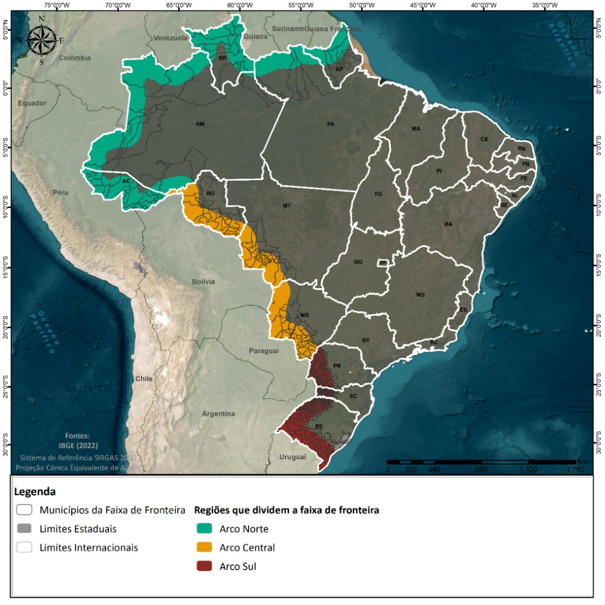

 
 Panorama Geral – Acre| 8 
 
MARCO LEGAL DA FAIXA DE FRONTEIRA BRASILEIRA 
 
A Faixa de Fronteira interna do Brasil com os países vizinhos foi estabelecida em 1979 pela 
Lei nº 6.634/1979 e regulamentada pelo Decreto nº 85.064/1980. A lei estabelece como Faixa 
de Fronteira, indispensável à Segurança Nacional, a faixa interna de 150 Km de largura, 
paralela à linha divisória terrestre do território nacional. A Constituição Federal de 1988 em 
seu artigo 20, § 2º, apontou o caráter estratégico e a importância das fronteiras para a defesa 
do território nacional e em 1991, foi determinada como competência do Conselho de Defesa 
Nacional (CDN) a proposição de “critérios e condições de utilização das áreas indispensáveis 
à segurança do território nacional e opinar sobre seu efetivo uso, especialmente na faixa de 
fronteira”. A Faixa de Fronteira do Brasil abrange a área de 150km ao longo da fronteira, de 
norte a sul, subdividida em Arcos Norte, Central e Sul. Ao longo de seus 15.719 quilômetros, 
abrange 11 Estados e 588 Municípios com aproximadamente 11,7 milhões de habitantes, 
conforme os dados do Censo Demográfico 2022 do Instituto Brasileiro de Geografia e 
Estatística (IBGE). 
 
Mapa 1 - Macrodivisão da Faixa de Fronteira terrestre brasileira 
 
Fonte: Elaborado pelo IBAM, a partir de fontes secundárias. 

# PÁGINA 9
 
 Panorama Geral – Acre| 9 
 
A área objeto deste trabalho engloba o Arco Norte e o estado de Rondônia, que integra o 
Arco Central, compreendendo a chamada Faixa de Fronteira terrestre amazônica, que se 
estende pelo território de 97 Municípios, em 6 unidades da federação. A região do Arco 
Norte, formada pelos estados do Amapá, Pará, Roraima, Amazonas e Acre, destaca-se por 
suas características singulares, marcadas pela diversidade cultural, pela presença de vastas 
áreas de floresta pública e terras indígenas e por sua importância estratégica para o 
desenvolvimento nacional. O estado de Rondônia, embora tenha sido alocado no Arco 
Central devido a particularidades na base produtiva e em indicadores socioeconômicos, está 
integralmente no bioma Amazônia, tendo sido incluído no escopo do trabalho. 
 
Coexistem nesta região espaços territoriais especialmente protegidos, como terras 
indígenas, unidades de conservação e assentamentos, intercalados com áreas de grande 
urbanização. A presença de grupos indígenas e populações tradicionais reforça essa 
diversidade, mesmo fora das terras legalmente atribuídas, compondo um mosaico territorial 
complexo. 
 
A extensão territorial da fronteira nessa região é, certamente, um desafio para 
monitoramento e gestão. Essa realidade evidencia a necessidade de fortalecer e aproximar 
a administração pública das demandas locais, buscando compreender as dinâmicas 
socioeconômicas no território e conciliar estratégias de desenvolvimento local com a 
preservação da sociobiodiversidade da região, de modo a favorecer, pela combinação 
dessas duas dimensões, tanto a segurança na fronteira como a integração com os países 
vizinhos.  
 
Ao longo das décadas de 2000 e 2010 foram desenvolvidos diversos debates e estudos 
técnicos que subsidiaram a elaboração de propostas para enfrentar os múltiplos problemas 
sociais existentes nos municípios que formam esse extenso território nacional. Um dos 
principais documentos de referência é a Proposta de Reestruturação do Programa de 
Desenvolvimento da Faixa de Fronteira, elaborado em 2005, pelo Grupo Retis do 
Departamento de Geografia da Universidade Federal do Rio de Janeiro, sob a liderança da 
professora Lia Osorio Machado, para o então Ministério da Integração Nacional.  
 
Em 2009, a Secretaria de Programas Regionais do Ministério da Integração Nacional, 
apresentou estratégias de implementação para um Programa de Promoção do 
Desenvolvimento da Faixa de Fronteira – PDFF e em 2010, foi elaborado o documento Bases 
para uma proposta de Desenvolvimento e Integração da Faixa de Fronteira, juntamente com 
outros ministérios, como Defesa, Turismo, Fazenda e incluindo representando do Fórum de 
Governadores da Amazônia Legal e da Frente Nacional de Prefeitos.  
 
A partir de 2011, uma série de leis e decretos que tratam sobre planos e programas sobre 
as fronteiras foram instituídos. O primeiro deles, o decreto nº 7.407/2011 instituiu o Plano 
Estratégico de Fronteiras que, entretanto, não foi levado a diante.  
 

# PÁGINA 10
 
 Panorama Geral – Acre| 10 
 
Entre 2015 e 20161, no âmbito de uma auditoria operacional do Tribunal de Contas da União 
(TCU), foi realizada uma avaliação de governança de políticas públicas em fortalecimento da 
faixa de fronteira, que resultou na elaboração de acórdãos que apontavam a necessidade 
de uma coordenação de Fronteira centralizada com maior alcance, integração e 
monitoramento.  
 
Em resposta, foi instituído o Programa de Proteção Integrada de Fronteiras, o PPIF, conforme 
Decreto 8.903/20162, com o propósito de fortalecer a prevenção, o controle, a fiscalização e 
a repreensão aos delitos transfronteiriços. Como órgão de governança foi instituído um 
Comitê Executivo do programa, que hoje é composto 18 órgãos de 8 ministérios, além do 
Ministério Público Federal.  A coordenação das ações do Comitê-Executivo é realizada pela 
Secretaria de Acompanhamento e Gestão de Assuntos Estratégicos (SAGAE), por meio de 
seu Departamento de Assuntos da Câmara de Relações Exteriores e Defesa Nacional 
(DACREDEN). 
 
Uma das resoluções do PPIF foi o estabelecimento da participação dos Estados baseada em 
instrumentos de cooperação entre os ministérios participantes e os órgãos federais que 
compõem o Programa, além da instituição de seus Gabinetes de Gestão Integrada de 
Fronteiras (GGIFs), considerando a importância da coordenação entre os níveis federal, 
estadual e municipal de governo para a realização de um trabalho integrado. 
 
No âmbito do Ministério de Integração Regional, foi criada, em 2010, a Comissão 
Permanente para o Desenvolvimento e a Integração da Faixa de Fronteira (CDIF)3. A 
Comissão tem, entre suas competências, propor ações que visem ao desenvolvimento 
regional que considerem a importância de programas para a integração fronteiriça e para a 
integração sul-americana e apresentar planos regionalizados de desenvolvimento e 
integração fronteiriços. À CDIF também compete a interação com núcleos estaduais 
estabelecidos para debater questões de desenvolvimento e integração fronteiriços em cada 
estado. 
 
Já em 2019 foi institucionalizada a Política Nacional de Desenvolvimento Regional (PNDR), 
através do Decreto nº 9.810/2019 com a finalidade de reduzir desigualdades econômicas e 
sociais, intra e inter-regionais, sendo a faixa de fronteira considerada como uma sub-região 
especial de escala da abordagem da política de desenvolvimento.  
 
Em 2020, o MIDR chegou a atualizar o Manual para os Núcleos Estaduais de Fronteira (NEFs), 
material que apresenta diretrizes gerais de incentivo a criação de núcleos a se repensarem 
enquanto instituições e se reconhecerem como atores centrais e aliados federativos no 
estímulo ao progresso sociopolítico e econômico da região fronteiriça.  
 
1 Vale destacar que no mesmo período, entre 2015 e 2017, o MIN, em parceria com o Instituto de 
Pesquisa Econômica Aplicada (IPEA), realizou diversas oficinas sobre o tema das fronteiras, 
consolidando insumos para estruturação de projetos em diversos estados nos três arcos. 
2 O decreto nº 11.273, de 5 de dezembro de 2022, alterou o Decreto nº 8.903/2016, com atualizações 
sobre a atuação de unidades da administração pública federal para execução do PPIF. 
3 A CDIF foi revisada no decreto nº 9.961, de 8 de agosto de 2019. 

# PÁGINA 11
 
 Panorama Geral – Acre| 11 
 
Finalmente, em 2024, foi criada a Política Nacional de Fronteiras (PNFron) que ampliou o 
escopo da política de fronteiras com vistas não só a promoção da segurança nacional, mas 
também do desenvolvimento sustentável, da integração regional, dos direitos humanos, 
cidadania e proteção social nas fronteiras brasileiras, de modo a orientar as ações do Poder 
Executivo federal para a atuação coordenada com os entes federativos e com as instituições 
privadas. A política ressalta a interdependência entre esses eixos e distribui suas 
responsabilidades entre quatro ministérios: o Ministério da Defesa (responsável pelo eixo I 
- segurança), o Ministério das Relações Exteriores (eixo II – integração regional), o Ministério 
da Integração e Desenvolvimento Regional (eixo III – desenvolvimento sustentável) e o 
Ministério dos Direitos Humanos e da Cidadania (eixo IV - direitos humanos, cidadania e 
proteção social).   
 
A PNFron institui os seguintes instrumentos de sua política:  
 
I - a Estratégia Nacional de Fronteira (ENaFron); 
II - os planos decorrentes da ENaFron; 
III - o Programa de Proteção Integrada de Fronteiras, de que trata o Decreto nº 8.903, 
de 16 de novembro de 2016; 
IV - a Comissão Permanente para o Desenvolvimento e a Integração da Faixa de 
Fronteira, instituída pelo Decreto nº 9.961, de 8 de agosto de 2019; 
V - as Comissões Brasileiras Demarcadoras de Limites, subordinadas ao Ministério das 
Relações Exteriores, de acordo com o disposto no Decreto nº 11.357, de 1º de janeiro 
de 2023; e 
VI - o Comitê Federal de Assistência Emergencial, de que trata o Decreto nº 10.917, de 
29 de dezembro de 2021. 
 
A estrutura de governança criada no âmbito da PNFron foi o Comitê Nacional de Fronteiras, 
que é presidido pelo GSI/PR e composto por 28 ministérios, além de quatros órgãos do 
Poder Executivo Federal. Cabe ao CNFron coordenar a elaboração da Estratégia Nacional de 
Fronteiras, além de sugerir a elaboração de planos decorrentes da Estratégia Nacional de 
Fronteiras, que orientem as ações dos órgãos e das entidades nas fronteiras. Ao CNFron 
compete ainda promover a articulação e a cooperação interinstitucional nos temas definidos 
pelos eixos estruturantes da Política, zelando pela interdependência e complementariedade 
das ações estratégicas em prol das fronteiras brasileiras. 
 
Também em 2024, a PNDR foi atualizada, mantendo a Faixa de Fronteira como uma 
subregião especial da política. Na sequência, o MIDR lançou o Programa Fronteiras 
Integradas 
(PFI), 
como 
estratégia 
de 
implementação 
da 
Política 
Nacional 
de 
Desenvolvimento Regional e da Política Nacional de Fronteiras. O PFI tem como objetivo 
geral o incentivo ao desenvolvimento econômico, social e produtivo no território da faixa de 
fronteira, por meio da cooperação entre os países vizinhos, visando à criação de 
oportunidades que resultem em atração de investimento, crescimento econômico, 
inovação, redução das assimetrias e desigualdades, geração de trabalho e renda por meio 
de planos, programas e projetos de desenvolvimento regional sustentável que beneficiem 
as populações localizadas nas regiões de fronteira. O Fluxograma a seguir reúne as 

# PÁGINA 12
 
 Panorama Geral – Acre| 12 
 
principais informações sobre o marco legal vigente das fronteiras e as interações entre as 
diferentes políticas, programas e projetos sobre o tema:  
Figura 1  -  Marco Legal das Fronteiras 
 
Fonte: Elaborado pelo IBAM, a partir de fontes secundárias. 
 
As recentes alterações dos marcos legais e institucionais da Faixa Fronteira, em especial com 
a aprovação do novo marco da PNFron, revelam algumas sobreposições de iniciativas e até 
de estruturas de governança que devem ser observadas. Parece corresponder a um 
processo, provavelmente ainda inconcluso, de definições de papéis dos diferentes órgãos 
do próprio governo federal que está ligado também à compreensão da própria questão da 
fronteira.  
 
Nesse sentido, Garzon (2024) aponta, corretamente, que “o marco legal instituído ora dá 
peso na questão da segurança nacional, ora no desenvolvimento sustentável”4.Diante deste 
cenário e considerando o caráter transversal da atuação do governo federal e sua 
articulação com outras esferas no tema das fronteiras, o autor analisa os atributos e 
competências do marco regulatório, identificando os seguintes gargalos e desafios para a 
efetivação das políticas de fronteira: 
 
 
4 Trabalho realizado no âmbito de uma consultoria individual através do Projeto de cooperação técnica 
MIDR- IICA BRA/IICA/13/001 voltada à análise de políticas públicas territoriais e governança visando o 
desenvolvimento regional sustentável na Faixa de Fronteira terrestre da Região Amazônica. 

# PÁGINA 13
 
 Panorama Geral – Acre| 13 
 
• 
“Sobreposição continuada de Marcos Regulatórios, evidenciada pela regência de 
transversalidades inerentes às políticas nacionais e setoriais de cada ministério em 
um marco de gestão agregado à compressão do marco normativo da CDIF no interior 
de um marco paralelo proposto pela PNFron, como observado no Artigo 15º do 
Decreto 12.038. 
• 
Desarticulação multiescalar entre as diretrizes pautadas pelo CDIF e as normativas 
municipais e estaduais, especialmente as políticas públicas de ordenamento 
territorial em nível municipal. 
• 
Limitações quanto à integração entre órgãos governamentais, sobretudo no 
atingimento da coordenação das prefeituras envolvidas pela Faixa de Fronteira, 
refletindo na dificuldade de enfrentar de forma eficaz os problemas e gargalos da 
Região, aliado ao foco desproporcional em questões de segurança em detrimento 
do desenvolvimento e integração. 
• 
Limitações das capacidades institucionais e operacionais, considerando a 
hierarquização de prioridades e abordagens, além da sobreposição e lacunas na 
atuação devido à falta de definição clara das competências e responsabilidades. 
• 
Baixa participação dos órgãos públicos nos colegiados e falta de comprometimento 
com as reuniões e ações planejadas conjugada com a falta de uma ferramenta eficaz 
de comunicação e gerenciamento. 
• 
Baixa alocação de recursos e poder decisório limitado, além de deficiências de apoio 
e recursos nas unidades das agências públicas na fronteira. 
• 
Desalinhamento Estratégico na programação orçamentária das ações pertinentes 
aos diversos atores governamentais.” (Garzon, 2024) 
 
O movimento de elaboração de Acordos de Cooperação Técnica (ACTs) que foram assinados 
recentemente parecem trabalhar no sentido de dirimir alguns dos paralelismos entre os 
marcos regulatórios e seus programas. O ACT MIDR/GSI/2024, celebrado entre Ministério da 
Integração e do Desenvolvimento Regional e o Gabinete de Segurança Institucional da 
Presidência da República (GSI/PR) busca atuar no sentido de estabelecer objetivos comuns 
e promover atividades conjuntas na promoção das políticas de fronteira. No âmbito do 
escopo deste trabalho, que envolve os estados do Arco Norte e Rondônia, há de considerar 
também ACT MIDR/CAL/2023, parceria do MIDR com o Consórcio Interestadual de 
Desenvolvimento Sustentável da Amazônia Legal (CAL), que tem por objeto a pactuação de 
uma agenda de desenvolvimento regional, com foco em projetos no segmento de 
Bioeconomia e na elaboração dos PDIFFs. 
 
Por fim, vale destacar que, na região de estudo, há dois Núcleos Estaduais de Fronteira 
instituídos na região do Arco Norte e Rondônia. Criado por meio do Decreto nº 32.729, de 
22 de Agosto de 2012 e atualizado pelo Decreto nº 44.473, de 30 de agosto de 2021, o Núcleo 
Estadual de Fronteira do estado do Amazonas – NIFFAM tem por finalidade assessorar a 
atuação do Governo do Amazonas na sua faixa de fronteira, articulando e mobilizando 
atores e instituições, propondo medidas e ações efetivas prioritárias ao desenvolvimento e 

# PÁGINA 14
 
 Panorama Geral – Acre| 14 
 
integração da Faixa de Fronteira estadual, sob a coordenação da Secretária de Estado de 
Desenvolvimento Econômico, Ciência, Tecnologia e Inovação (SEDECTI). 
 
Rondônia também possui um núcleo instituído, denominado Núcleo Estadual para o 
Desenvolvimento e Integração da Faixa de Fronteira de Rondônia (NEIFRO). Criado pelo 
decreto n° 24.821, de 21 de fevereiro de 2020, o órgão está vinculado à Secretaria de Estado 
de Planejamento, Orçamento e Gestão (SEPOG) e foi reativado recentemente, com o intuito 
de atualizar o Plano de Desenvolvimento e Integração Fronteiriço do Estado de Rondônia. 
 
ORGANIZAÇÃO DO DOCUMENTO 
 
Considerando a estruturação dos planos de fronteira, o presente documento foi organizado 
a partir dos grandes eixos temáticos que deverão orientar a realização das oficinas de 
planejamento. Desta forma, o documento está organizado nos seguintes tópicos: 
 
• 
Caracterização Geral  
• 
Caracterização Sociodemográfica 
• 
Eixo Temático 1: Ordenamento Territorial, Regularização Fundiária e Gestão 
Ambiental e Climática 
• 
Eixo Temático 2: Infraestrutura para o Desenvolvimento 
• 
Eixo Temático 3: Fomento às Atividades Produtivas Sustentáveis e Inclusão Social 
• 
Eixo Temático 4: Povos Indígenas e Comunidades Tradicionais 
 
• 
Eixo Temático 5: Integração Regional, Migrações e Segurança 
CARACTERIZAÇÃO GERAL 
 
No Estado do Acre, todos os municípios integram a Faixa de Fronteira, fazendo fronteira com 
Peru e Bolívia. O estado possui 4 cidades gêmeas que são os municípios de Santa Rosa do 
Purus, Assis Brasil, Brasiléia e Epitaciolândia. A Faixa de Fronteira do Acre abrange 2 
subregiões5: Alto Juruá e Vale do Acre-Alto Purus.  
Alto Juruá está localizada no extremo oeste do Brasil, na divisa com o Peru, composta por 
doze municípios, dos quais dez estão no estado do Acre e dois no Amazonas. Reflete uma 
ocupação humana esparsa, característica marcante das regiões amazônicas, onde vastos 
territórios ainda são pouco habitados, predominando paisagens naturais, terras indígenas 
e unidades de conservação. Cruzeiro do Sul, com quase 92 mil habitantes, destaca-se como 
 
5 Conforme os estudos do, à época, Ministério de Integração Nacional (2005), os municípios da Faixa 
de Fronteira foram classificados segundo subregiões, utilizando critérios como localização geográfica, 
características populacionais e base produtiva. Isso porque as dinâmicas socioeconômicas, culturais e 
ambientais não se restringem aos limites administrativos dos estados. A estrutura das subregiões 
considera elementos como a presença de áreas protegidas, populações indígenas, assentamentos 
rurais, atividades econômicas e de logística. 

# PÁGINA 15

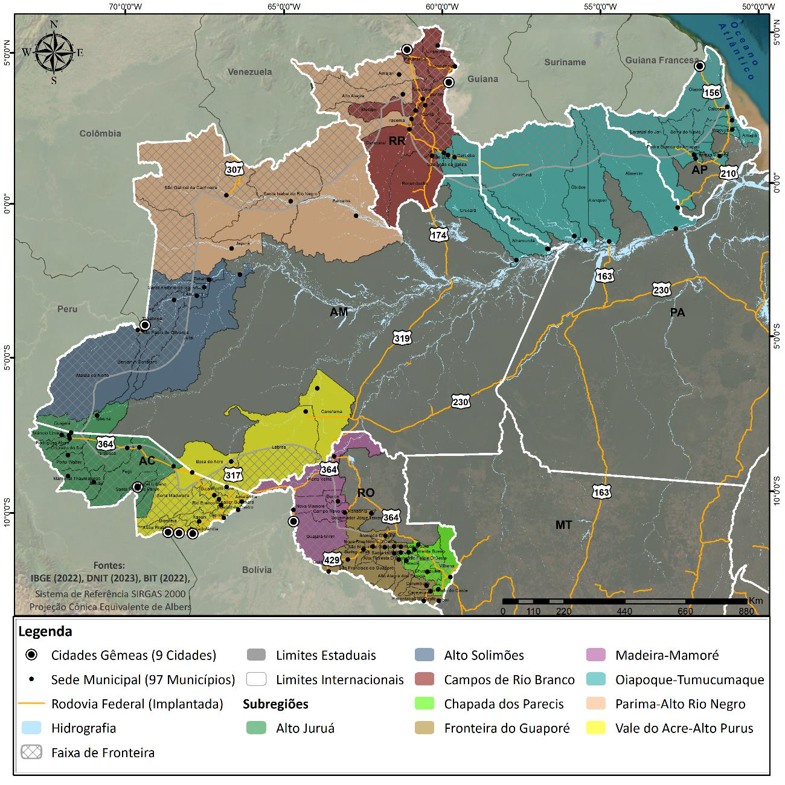

 
 Panorama Geral – Acre| 15 
 
o maior centro urbano da subregião e principal referência no Alto Juruá. Os demais 
municípios são caracterizados por núcleos urbanos de pequeno porte, com economias e 
estruturas de gestão voltadas principalmente para atender às necessidades básicas de suas 
comunidades. 
Já a Subregião Vale do Acre-Alto Purus conecta municípios do Amazonas e Acre. Lábrea e 
Boca do Acre, cortados por rodovias estratégicas como a BR-317, BR-364 e BR-230 
(Transamazônica), funcionam como corredores logísticos que facilitam novas frentes de 
ocupação. Contudo, essa conectividade também agrava a vulnerabilidade ambiental e social 
da região, ao favorecer a pressão sobre áreas florestais, tais como territórios indígenas e 
unidades de conservação. Ambos os municípios estão incluídos na lista de municípios 
prioritários para o combate ao desmatamento do Ministério do Meio Ambiente (MMA). 
 
Mapa 2 – Divisão Sub-regional dos Municípios da Faixa de Fronteira do Arco Norte e Rondônia  
 
Fonte: Elaborado pelo IBAM, a partir de fontes secundárias 
 

# PÁGINA 16
 
 Panorama Geral – Acre| 16 
 
CARACTERIZAÇÃO SOCIODEMOGRÁFICA 
Os municípios da Faixa de Fronteira amazônica abrigam uma população de 3.277.578 
habitantes. Dois estados, Roraima e Acre, possuem todos os municípios, e quase a totalidade 
de seus territórios, inseridos na Faixa de Fronteira. 
Tabela 1 - População por Estado e nas suas respectivas Faixas de Fronteira (2022) 
Estados 
Faixa de Fronteira 
UF 
População 
Total 
Municípios 
População dos 
Municípios Fronteiriços  
Acre 
830.018 
22 
830.018 
Amapá 
733.759 
8 
109.140 
Amazonas 
3.941.613 
19 
504.450 
Pará 
8.120.131 
5 
232.908 
Rondônia 
1.581.196 
28 
964.355 
Roraima 
636.707 
15 
636.707 
Total 
15.843.424 
97 
3.277.578 
Fonte: Elaborado pelo IBAM a partir dos dados Censo IBGE, 2022. 
 
Um aspecto relevante a se observar na análise populacional é a vasta extensão territorial de 
muitos municípios na área de fronteira, que, em alguns casos, supera a área de estados 
brasileiros ou até mesmo de países inteiros. Em algumas regiões, a dimensão municipal 
ultrapassa 700 km de largura, sendo bem superior a faixa de fronteira brasileira. Exemplo 
disso, é o Estado do Pará que conta com apenas 5 municípios na faixa de fronteira, sendo 
que nenhum deles possui sua sede municipal na faixa. A distância das sedes desses 
municípios até a faixa é, inclusive, mais distante que a própria largura da faixa, com seus 150 
km.  
 
Para qualificar esta análise, é necessário considerar o grau de interação dos municípios com 
a linha de fronteira internacional. Conforme a classificação proposta pelo Ministério da 
Integração (2005), os municípios da faixa são divididos entre lindeiros, que possuem limites 
diretos com países vizinhos, e não lindeiros, cuja localização é mais afastada, embora ainda 
inserida na Faixa de Fronteira. Enquanto os primeiros lidam mais diretamente com questões 
específicas de controle e circulação transfronteiriça, os demais enfrentam desafios distintos, 
como o isolamento territorial, a baixa densidade populacional e a dificuldade de acesso às 
políticas públicas. Entre os lindeiros, há três subgrupos: I) aqueles cujo território e sede 
municipal fazem limite direto com o país vizinho, podendo ou não configurar uma cidade 
gêmea; II) os que fazem fronteira territorial, mas têm sede fora da linha internacional; e III) 
aqueles cujo território faz divisa com o país vizinho, mas cuja sede localiza-se além da faixa 
de fronteira. Já os não lindeiros se dividem em dois subgrupos: I) os que possuem sede 
dentro da Faixa de Fronteira, embora sem contato direto com a linha internacional; e II) 
aqueles cuja sede está situada fora da faixa, mas cujo território ainda se insere no limite da 
faixa definida.  
 

# PÁGINA 17

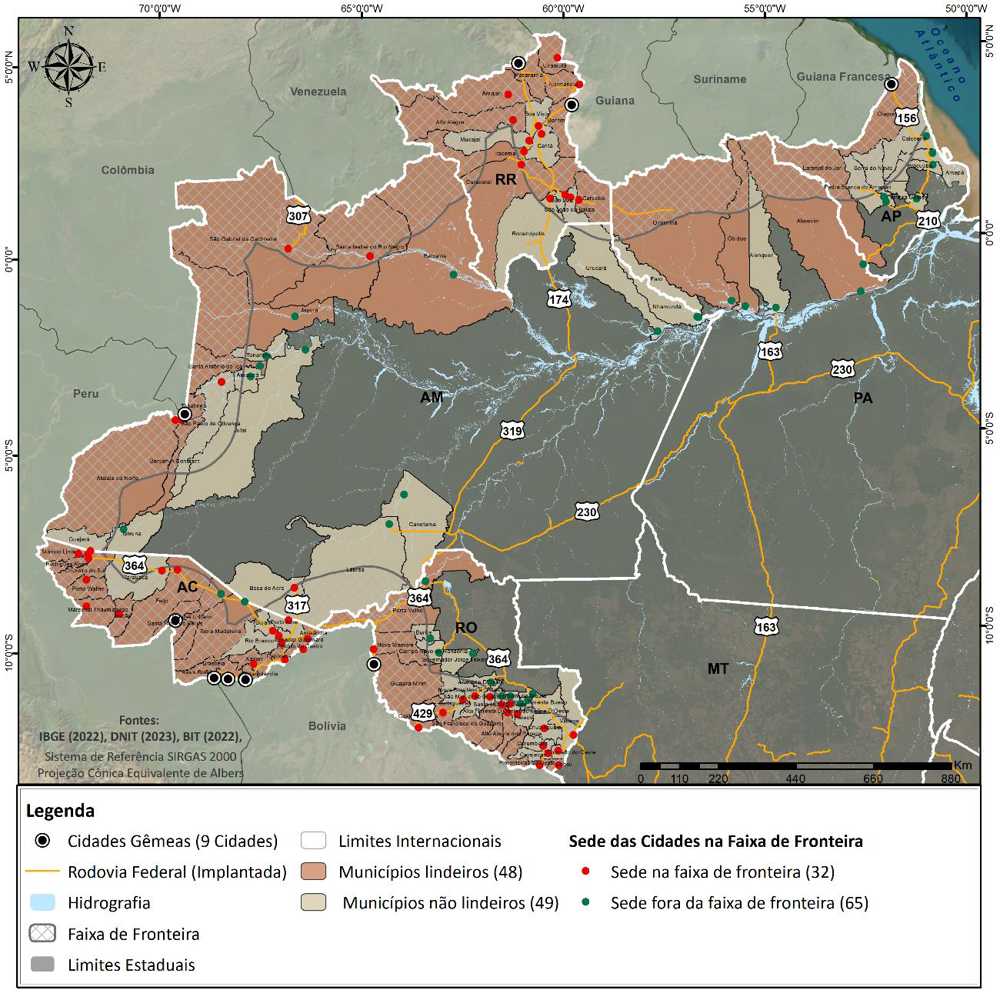

 
 Panorama Geral – Acre| 17 
 
Mapa 3 - Municípios Lindeiros e Não Lindeiros da Faixa de Fronteira e Cidades Gêmeas do Arco 
Norte e Rondônia 
 
Fonte: Elaborado pelo IBAM, a partir de fontes secundárias. 
 
No Acre, os 22 municípios estão dentro da Faixa de Fronteira, ainda que parte dos territórios 
de Tarauacá, Feijó, Manoel Urbano, Sena Madureira não estejam na faixa de 150km. Nos 
casos de Manoel Urbano e Sena Madureira, as sedes municipais se encontram fora da Faixa.  
O estado possui 4 cidades gêmeas: Brasileia, Epitaciolândia, Assis Brasil e Santa Rosa do 
Purus.  Plácido de Castro ainda que tenha sede na faixa de fronteira, não é classificada como 
cidade gêmea conforme o enquadramento nacional6.  
 
6 De acordo com a  Portaria nº 2.507, de 5 de outubro de 2021, são considerados cidades gêmeas:  “os 
Municípios cortados pela linha de fronteira, seja essa seca ou fluvial, articulada ou não por obra de 
infraestrutura, que apresentem grande potencial de integração econômica e cultural, podendo ou não 
apresentar uma conurbação ou semi-conurbação comum a localidade do país vizinho, assim como 
manifestações "condensadas" dos problemas característicos da fronteira, que aí adquirem maior 
densidade, com efeitos diretos sobre o desenvolvimento regional e a cidadania”. 

# PÁGINA 18

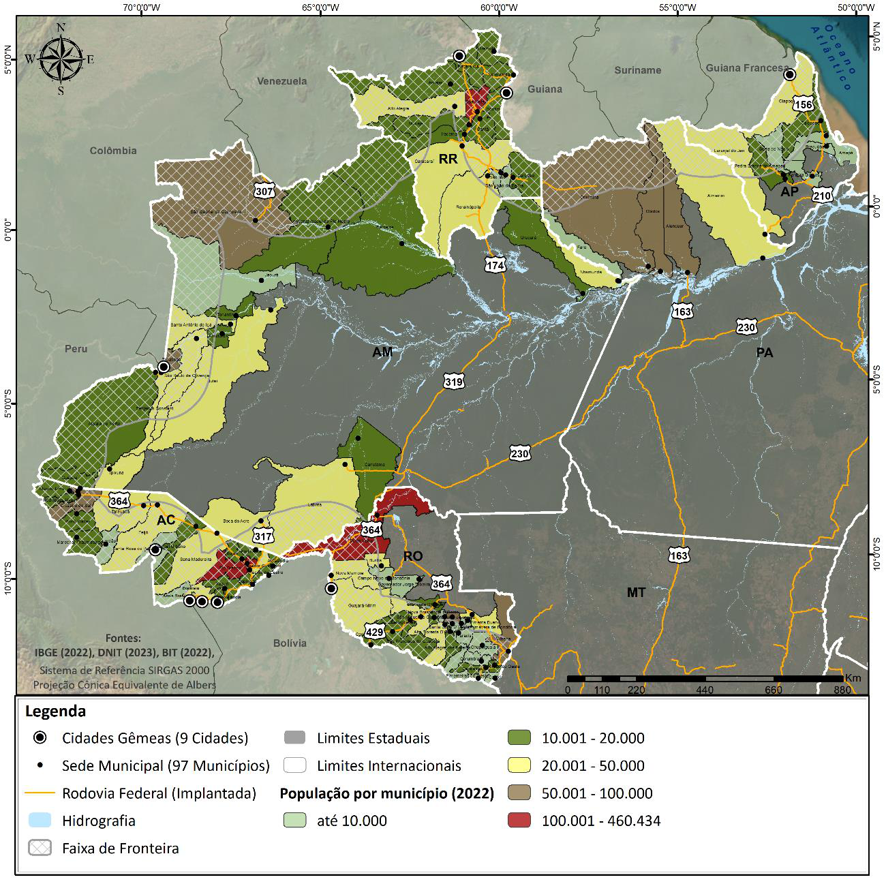

 
 Panorama Geral – Acre| 18 
 
Na fronteira com a Bolívia, os municípios acreanos de Brasiléia e Epitaciolândia integram um 
contínuo urbano binacional com Cobija (Bolívia), consolidando uma dinâmica territorial, 
econômica e social peculiar. Brasiléia e Epitaciolândia, são classificadas pela Regic (IBGE, 
2018) como Centros Subregionais B (3B) e desempenham funções de articulação regional, 
enquanto a capital Rio Branco concentra atividades administrativas e econômicas de maior 
complexidade. Brasiléia e Epitaciolândia também integram o Arranjo Populacional (AP) 
Cobija/Bolívia-Brasiléia/Brasil, refletindo o caráter transfronteiriço e o papel de Cobija como 
um polo econômico e comercial de influência sub-regional. Já Assis Brasil forma uma 
conurbação com Iñapari (Peru) e Bolpebra (Bolívia) e ocupa posição estratégica na BR-317, 
única rodovia que conecta o Brasil ao Peru, reforçando seu papel de corredor internacional 
de integração (MIN, 2005). 
Mapa 4 - População dos municípios que compõem a Faixa de Fronteira Arco Norte e Rondônia 
 
Fonte: Elaborado pelo IBAM, a partir de fontes secundárias 
 
 

# PÁGINA 19
 
 Panorama Geral – Acre| 19 
 
As dinâmicas demográficas na Faixa de Fronteira são influenciadas por uma variedade de 
fatores, que vão desde o desenvolvimento econômico, a expansão agropecuária, a 
urbanização, até as políticas públicas e os desafios ambientais. A população dos municípios 
de Fronteira do Acre totaliza 830.018 habitantes. No entanto, quando se consideram apenas 
os dados dos setores censitários situados dentro da Faixa de Fronteira, conforme o Censo 
IBGE de 2022, esse contingente é reduzido para 788.255 habitantes. 
Cruzeiro do Sul e a capital Rio Branco são os únicos municípios do Estado que ultrapassam 
a faixa de 50 mil habitantes, abrigando 91.888 e 364.756 habitantes respectivamente. Das 
cidades gêmeas, apenas Brasiléia ultrapassa os 20 mil habitantes.  
Tabela 2 – Perfil Demográfico Municípios do Acre 
Município 
Pop 2022 
Urbano  
2022 
Rural 
2022 
Taxa de 
Urbanização (%) 
Acrelândia 
14.021 
7.765 
6.256 
55,40% 
Assis Brasil 
8.100 
4.818 
3.282 
59,50% 
Brasiléia 
26.000 
16.744 
9.256 
64,40% 
Bujari 
12.917 
5.942 
6.975 
46,00% 
Capixaba 
10.392 
4.225 
6.167 
40,70% 
Cruzeiro do Sul 
91.888 
68.215 
23.673 
72,20% 
Epitaciolândia 
18.757 
12.921 
5.836 
68,90% 
Feijó 
35.426 
18.113 
17.313 
51,10% 
Jordão 
9.222 
3.674 
5.548 
39,80% 
Mâncio Lima 
19.294 
12.727 
6.567 
66,00% 
Manoel Urbano 
11.996 
6.725 
5.271 
56,10% 
Marechal Thaumaturgo 
17.093 
5.894 
11.199 
34,50% 
Plácido de Castro 
16.560 
10.739 
5.821 
64,80% 
Porto Acre 
16.693 
9.465 
7.228 
56,70% 
Porto Walter 
10.735 
4.951 
5.784 
46,10% 
Rio Branco 
364.756 
341.025 
23.731 
93,50% 
Rodrigues Alves 
14.938 
5.688 
9.250 
38,10% 
Santa Rosa do Purus 
6.723 
3.291 
3.432 
49,00% 
Sena Madureira 
41.343 
26.943 
14.400 
65,20% 
Senador Guiomard 
21.454 
13.355 
8.099 
62,20% 
Tarauacá 
43.467 
24.414 
19.053 
56,20% 
Xapuri 
18.243 
10.308 
7.935 
56,50% 
Fonte: Elaborado pelo IBAM, a partir de dados Censo, 2022. 
 
A partir dos dados de Censo dos países fronteiriços é possível observar os dados 
populacionais das cidades gêmeas internacionais.  Cobija, na Bolívia, que faz fronteira com 
Brasiléia e Epitaciolândia, é a maior cidade-gêmea internacional, possuindo mais de 50 mil 
habitantes. Inãpari, no Peru, e Bolpebra, na Bolívia, que fazem fronteira com Assis Brasil 

# PÁGINA 20
 
 Panorama Geral – Acre| 20 
 
possuem 2.3907 e 2.7568 habitantes respectivamente. Já Puerto Esperanza (Peru), fronteira 
com Santa Rosa do Purus, tem 3.3469 habitantes. 
Em geral, os municípios da fronteira ganharam, em maior ou menor grau, população nas 
últimas décadas. No acre, os únicos municípios que tiveram o grau de crescimento anual 
acima de 2% foram as cidades gêmeas Santa Rosa do Purus e Assis Brasil, além dos 
municípios de Manuel Urbano, Bujari, Jordão e Mâncio Lima. Com relação ao grau de 
urbanização, os municípios do Acre com maior grau de urbanização são: a capital Rio Branco 
com 93,5% seguido de Cruzeiro do Sul com 74,2% da população urbana.  
De acordo com os dados do Censo Demográfico de 2022, o Acre possui a menor taxa de 
alfabetização entre os estados de fronteira, com apenas 87,7% da população acima de 15 
anos alfabetizada. Ao comparar as quatro cidades gêmeas do Acre com as de outros estados 
da faixa de fronteira do arco norte, observa-se que sua taxa de alfabetização é inferior a 
90%, sendo também a mais baixa entre todas. 
 
 
 
7 Segundo Censo da Bolívia, 2024. Disponível em https://censo.ine.gob.bo/ 
8 Segundo Censo, 2017-Peru. Disponível em: https://estadist.inei.gob.pe/map 
9 Segundo Censo, 2017-Peru. Disponível em: https://estadist.inei.gob.pe/map. Puerto Esperanza é uma localidade 
do distrito de Purus. O dado disponibilizado do Censo refere-se à população total do distrito, não sendo possível 
identificar a população da localidade que corresponde à cidade gêmea. 

# PÁGINA 21
 
 Panorama Geral – Acre| 21 
 
 
EIXO TEMÁTICO 1: ORDENAMENTO TERRITORIAL, 
REGULARIZAÇÃO FUNDIÁRIA E GESTÃO AMBIENTAL E 
CLIMÁTICA  
 
 
O ordenamento territorial da faixa de fronteira brasileira, na região norte do país, representa 
um dos eixos centrais relativos à sua governança fundiária e ambiental. Com grande 
extensão e significativa diversidade de atores envolvidos, a faixa de fronteira abriga 
múltiplas sobreposições de interesses, desde áreas protegidas destinadas à conservação 
ambiental até territórios pressionados pelo agronegócio, mineração e expansão urbana 
desordenada. Nesse contexto, compreender as dinâmicas de acesso, uso e gestão da terra 
torna-se essencial para a formulação e implementação de políticas públicas. 
 
A análise aqui empreendida aborda a distribuição das diferentes categorias fundiárias, a 
incidência de conflitos territoriais e as dinâmicas ambientais que moldam o uso da terra. 
Baseia-se em uma abordagem quali-quantitativa, que explora fontes diversas de 
informações para compreender as relações entre regularização fundiária, desmatamento e 
segurança jurídica dos territórios analisados. A dimensão quantitativa concentrou-se na 
análise de dados obtidos em fontes institucionais, enquanto a dimensão qualitativa buscou 
interpretar as dinâmicas socioespaciais, fornecendo um panorama sobre os fenômenos 
observados. 
 
Dentre as questões investigadas, destacam-se os desafios da implementação do Cadastro 
Ambiental Rural (CAR) em áreas coletivas, a correlação entre a regularização fundiária e a 
redução dos conflitos, e os impactos das mudanças nas políticas ambientais sobre o avanço 
do desmatamento. Além disso, buscou-se identificar a necessidade de estratégias mais 
integradas para enfrentar a degradação ambiental e as disputas territoriais, de modo a 
promover um ordenamento fundiário mais equitativo e sustentável na faixa de fronteira. Os 
dados trabalhados foram coletados, organizados e analisados para identificar padrões, 
sobreposições e dinâmicas territoriais, contribuindo para uma compreensão abrangente do 
ordenamento territorial e fundiário dos estados da região analisada. 
 
Com relação à gestão climática, foram sistematizados os dados do Atlas Brasileiro de 
Desastres Naturais que apontam que os alagamentos, inundações, enxurradas, incêndio 
florestal, estiagem e seca são desastres naturais comuns a todos os Estados dos Arcos Norte 
e Centro (Rondônia) da Faixa de Fronteira. O Sistema de Informações e Análises sobre 
Impactos das Mudanças do Clima (AdaptaBrasil MCTI)10 indica que o risco de impacto 
presente e futuro das mudanças climáticas nos recursos hídricos considerando uma 
situação de seca e a ameaça de desastre geo-hidrológico no evento de deslizamento de 
 
10 O AdaptaBrasil MCTI é desenvolvido por meio de uma cooperação entre o Instituto Nacional de 
Pesquisas Espaciais (INPE) e a Rede Nacional de Pesquisa e Ensino (RNP), sendo fomentado pelo 
Ministério de Ciência, Tecnologia e Inovações (MCTI). Sua governança é exercida por um Comitê Gestor 
composto por dois representantes, sendo um titular e um suplente, das três instituições supracitadas. 

# PÁGINA 22
 
 Panorama Geral – Acre| 22 
 
terra, inundações, enxurradas e alagamentos representam as vulnerabilidades quanto ao 
risco das mudanças climáticas em sistemas socioecológicos e a capacidade adaptativa. 
Quanto as emissões de gases de efeito estufa (GEE), foram analisados os dados por Estado, 
para os anos de 2015, 2022 e 2023, disponibilizado pelo Sistema de Estimativas de Emissões 
e Remoções de Gases de Efeito Estufa (SEEG), desenvolvido pelo Observatório do Clima. 
 
CONFIGURAÇÃO FUNDIÁRIA  
 
A situação fundiária na faixa de fronteira do Acre reflete um quadro de centralização sob 
domínio federal, intensificado durante o período da ditadura empresarial-militar. Esse 
modelo fundiário resultou em um cenário de indefinição fundiária e desafios persistentes 
para a governança territorial. Essa indefinição se manifesta na dificuldade de acesso às 
informações sobre a regularidade dos documentos de domínio existentes, na sobreposição 
de áreas e na interseção de títulos distintos para uma mesma propriedade. Além disso, há 
divergências entre registros documentais e a materialidade territorial, onde propriedades 
são identificadas em locais diferentes daqueles registrados oficialmente. Esses problemas 
históricos favorecem a grilagem de terras públicas, ampliando a insegurança jurídica e 
desencadeando conflitos sociais nas áreas rurais do estado (INCRA, 2021). 
 
Segundo Almeida et al. (2021), aproximadamente 28% do território do Acre permanecia sem 
definição fundiária ou sem informações disponíveis. Deste total, a União detinha a maior 
parcela (69%), sendo que quase toda essa área (99%) estava inserida na faixa de fronteira, o 
que exige autorização do Conselho de Defesa Nacional (CDN) para sua regularização. Além 
disso, em 2021, 18% do estado ainda aguardava uma decisão da Câmara Técnica de 
Destinação e Regularização de Terras Públicas Federais na Amazônia Legal (CTD) sobre sua 
destinação. Essa configuração fundiária singular resultou em um território onde 
predominam espaços territoriais especialmente protegidos, como Terras Indígenas e 
Unidades de Conservação. Na faixa de fronteira, essas categorias juntas representam cerca 
de 48% da área da faixa de fronteira no estado. 
Gráfico 1 - Distribuição das Áreas Legalmente Atribuídas na Faixa de Fronteira do estado do 
Acre. 
 
Fonte: Elaborado pelo IBAM a partir de dados do  Incra, Funai, MMA. 
TIs
16,2%
UCs
31,9%
AssRs
7,2%
APs
0,2%
OTs
44,5%
TIs
UCs
TQs
AssRs
APs
OTs

# PÁGINA 23

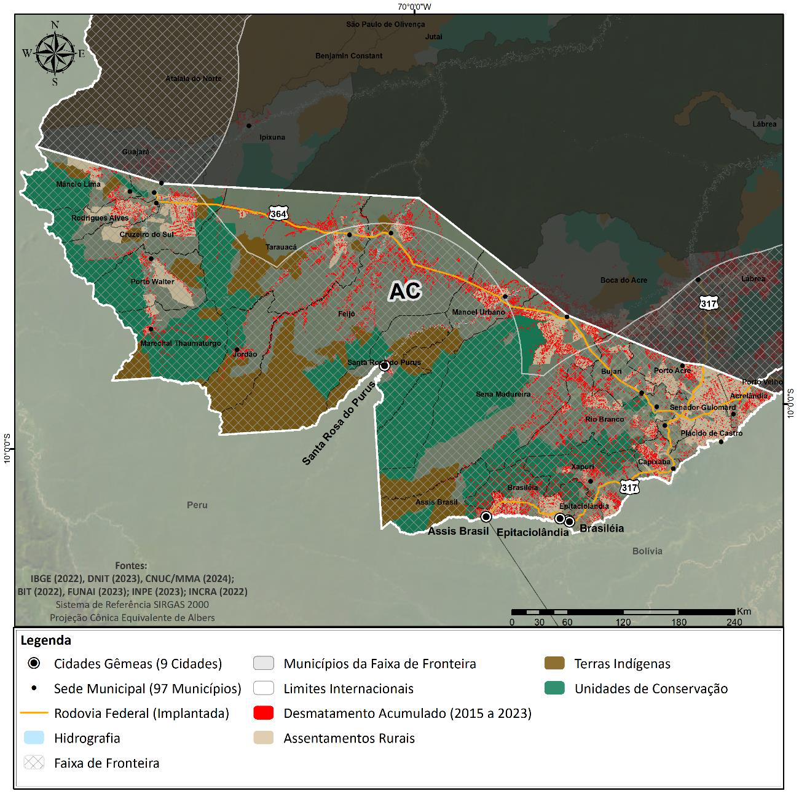

 
 Panorama Geral – Acre| 23 
 
Mapa 5 - Áreas legalmente atribuídas e distribuição do desmatamento acumulado (2015-2023) 
no Acre. 
 
Fonte: Elaborado pelo IBAM, a partir de dados secundários. 
 
As TIs ocupam aproximadamente 23.466,881 km², representando 16,2% da faixa de 
fronteira do Acre. Essas áreas desempenham um papel essencial na preservação dos modos 
de vida e culturas indígenas, além de contribuírem significativamente para a manutenção da 
biodiversidade local. Municípios como Feijó (36,6%), Assis Brasil (10,0%) e Tarauacá (9,2%) 
abrigam extensões expressivas dessas áreas, refletindo o protagonismo histórico e 
territorial dos povos originários no estado. 
As UCs, que ocupam cerca de 32% da faixa de fronteira no Acre, refletem a importância de 
modelos como as Reservas Extrativistas (Resex), criadas para garantir o uso sustentável dos 
recursos naturais por populações tradicionais. Municípios como Marechal Thaumaturgo 
(74,8%), Xapuri (55,9%) e Mâncio Lima (54,2%) possuem extensas porções do seu território 
em áreas protegidas, reforçando o protagonismo do estado na implementação de modelos 

# PÁGINA 24
 
 Panorama Geral – Acre| 24 
 
territoriais sustentáveis. Essas áreas são fruto de uma longa trajetória de resistência liderada 
pelos seringueiros, especialmente por meio dos "empates", movimentos coletivos que 
surgiram em resposta ao avanço do desmatamento nos seringais acreanos. 
Os Assentamentos Rurais no Acre ocupam 7,2% da faixa de fronteira, totalizando 10.449,507 
km², o que representa uma parcela expressiva em relação a outros estados analisados. 
Diferentemente de regiões onde predominam modalidades ambientalmente diferenciadas, 
os assentamentos no Acre são exclusivamente do tipo convencional (PA), refletindo um 
modelo tradicional de reforma agrária voltado à distribuição individual de lotes para 
produção agropecuária. Embora atenda à demandas por inclusão social e acesso à terra, 
esse modelo, implementado em um território de alta sensibilidade socioambiental, reforça 
a necessidade de práticas produtivas sustentáveis. Essas práticas devem conciliar proteção 
ambiental, geração de renda e segurança alimentar e nutricional, aproveitando o grande 
potencial agroecológico da região. 
Por outro lado, as Áreas Privadas correspondem a 0,2% da faixa de fronteira do estado, 
concentrando-se principalmente nos municípios de Manoel Urbano (27,1%), Feijó (14,7%) e 
Rio Branco (10,9%). Essa baixa representatividade reflete as dificuldades estruturais na 
organização fundiária da Amazônia e, particularmente, da faixa de fronteira. A 
predominância de terras sob controle da União tem resultado em um cenário de 
documentação precária e entraves administrativos que dificultam a regularização fundiária 
e a segurança jurídica dos ocupantes. 
A elevada proporção de terras classificadas como Outras terras (64.459,794 km²), que 
correspondem a 44,5% do território estadual na faixa de fronteira, evidencia lacunas no 
ordenamento fundiário. Essa categoria abrange terras devolutas, não tituladas, títulos não 
registrados e documentos com informações insuficientes. Dentro desse montante, 316,515 
km² estão registrados no Sistema de Gestão Fundiária (SIGEF) do Incra como “áreas com 
documentação precária ou incompleta”. Esse quadro reflete a centralização histórica da 
gestão fundiária e a ausência de políticas consistentes para a destinação e regularização de 
terras públicas. 
Essa condição perpetua vulnerabilidades, como grilagem de terras públicas, sobreposição 
de direitos territoriais, conflitos de uso e dificuldades no planejamento territorial. Além 
disso, compromete a implementação de políticas públicas voltadas ao desenvolvimento 
sustentável. No contexto da faixa de fronteira amazônica, a ausência de clareza sobre a 
titularidade das terras torna-se ainda mais sensível, dado o papel estratégico da região para 
a conservação ambiental e a inclusão das populações locais. A indefinição fundiária gera 
insegurança jurídica dos ocupantes e impede uma gestão territorial eficiente.  
GESTÃO AMBIENTAL  
 
A distribuição do Cadastro Ambiental Rural (CAR) nos municípios da faixa de fronteira do 
Acre evidencia variações expressivas tanto em termos absolutos quanto proporcionais. 
Essas discrepâncias refletem as particularidades da estrutura fundiária e da dinâmica 

# PÁGINA 25
 
 Panorama Geral – Acre| 25 
 
territorial da região, levantando questões sobre possíveis sobreposições, inconsistências 
nos registros e desafios na regularização das áreas cadastradas que merecem atenção. 
Os registros do CAR na faixa de fronteira acreana somam 173.441,275 km², cobrindo a 
totalidade da área cadastrada no estado. No entanto, a distribuição desses registros varia 
consideravelmente entre os municípios. Sena Madureira (32.627,861 km²; 18,8%), Xapuri 
(30.826,003 km²; 17,8%) e Feijó (19.436,395 km²; 11,2%) concentram a maior parte das terras 
cadastradas, refletindo sua importância na dinâmica socioeconômica da região. 
Entretanto, discrepâncias expressivas nos percentuais de cadastramento, como 576,1% de 
área cadastrada em Xapuri, 239,2% em Acrelândia e 173,9% em Sena Madureira, sugerem a 
ocorrência de sobreposições ou inconsistências nos dados. Essas distorções podem ser 
atribuídas a diversos fatores, entre eles: i) sobreposição de registros, causada por 
duplicações ou erros no sistema; ii) ausência de validação, uma vez que os dados são 
autodeclaratórios e carecem de fiscalização adequada; e iii) complexidade da gestão 
fundiária, caracterizada pela interação entre terras públicas, privadas e coletivas, bem como 
outras questões relacionadas ao ordenamento territorial. 
A baixa taxa de análise dos cadastros no estado  ̶  somente 4,3% passaram por validação 
(Lopes et al., 2024)  ̶  agrava esse cenário, limitando a capacidade do CAR de refletir com 
precisão a realidade fundiária do Acre. O lento avanço nesse processo dificulta a 
identificação e correção de inconsistências, resultando na permanência de sobreposições e 
distorções que reduzem a precisão dos dados e limitam a eficácia do CAR como instrumento 
de gestão fundiária e ambiental. 
Os desafios da gestão ambiental no Acre são particularmente evidentes em municípios 
como Sena Madureira, Xapuri e Feijó, que concentram grande parte dos registros no CAR. 
Situados em áreas da faixa de fronteira sob forte pressão agropecuária e madeireira, esses 
territórios apresentam um histórico de ocupações em regiões ambiental e socialmente 
sensíveis. Essa dinâmica é agravada pelo destaque de Feijó e Sena Madureira entre os 
municípios com os mais altos índices de desmatamento, reforçando a necessidade urgente 
de estratégias integradas e eficazes de gestão territorial. 
CONFLITOS FUNDIÁRIOS E DESMATAMENTO NA FAIXA DE FRONTEIRA 
 
Os municípios de Feijó, Sena Madureira e Rio Branco destacam-se como áreas críticas na 
faixa de fronteira acriana, registrando desmatamento acumulado entre 2015 e 2023, 
conforme dados do Terra Brasilis (2024). Conforme apresentado no Mapa 8, embora sejam 
classificados nessa categoria como de baixa intensidade (5,01 a 15,00 km²) no período, esses 
índices sinalizam a necessidade de atenção, dado o avanço da pressão territorial e ambiental 
na região. 
De acordo com dados do Plano Estadual de Prevenção e Controle do Desmatamento e 
Queimada (ACRE, 2025), os maiores índices de desmatamento ocorrem em Assentamentos 
Ruraiss e Áreas Privadas, devido à posse consolidada e a um modelo de exploração voltado 

# PÁGINA 26
 
 Panorama Geral – Acre| 26 
 
para atividades agropecuárias extensivas. Em contrapartida, as TIs e UCs, que obedecem a 
regimes de posse institucional e culturalmente diferenciados, desempenham um papel 
fundamental na conservação ambiental, apresentando menores índices de desmatamento. 
Destaca-se ainda o desmatamento nas chamadas “Outras Terras”, que correspondem a 
áreas sem destinação definida ou informação de uso. Essas terras, frequentemente alvo de 
grilagem e ocupações irregulares, evidenciam fragilidades na governança fundiária e na 
fiscalização ambiental, reforçando a necessidade de políticas públicas voltadas à 
regularização dessas áreas e ao fortalecimento de mecanismos de controle ambiental (ACRE, 
2023). 
O desmatamento no estado concentra-se nas proximidades das sedes municipais, ao longo 
das principais redes hidrográficas (rios Acre, Macauã, Iaco, Envira, Tarauacá e Purus) e das 
rodovias BR-364 e BR-317. Esses eixos viários, embora favoreçam o escoamento da 
produção e a conectividade regional, também funcionam como vetores de entrada para 
grileiros e madeireiros ilegais, ampliando a degradação ambiental (ACRE, 2023). 
Feijó, Manoel Urbano, Rio Branco, Sena Madureira e Tarauacá, destacados na lista de áreas 
prioritárias para ações de controle do desmatamento e degradação florestal (MMA, 2024), 
refletem a convergência de pressões sobre áreas privadas, ausência de regularização 
fundiária e expansão agrícola desordenada. Esses fatores destacam a urgência de 
estratégias integradas que combinem fiscalização intensiva, regularização fundiária e 
promoção de práticas produtivas sustentáveis, essenciais para mitigar os impactos 
ambientais e sociais na região. 
O gráfico 2 apresentada a seguir destaca a evolução dos conflitos fundiários no estado do 
Acre entre 2015 e 2023, evidenciando a relação entre o desmatamento e as disputas 
territoriais. Rio Branco, Manoel Urbano e Sena Madureira entre os cinco municípios mais 
conflituosos no estado reflete dinâmicas de pressão em APs, AssRs e OTs. Essa convergência 
entre conflitos e desmatamento reforça o papel do ordenamento territorial e fundiário como 
eixo central para mitigação dos impactos socioambientais na faixa fronteiriça. 

# PÁGINA 27

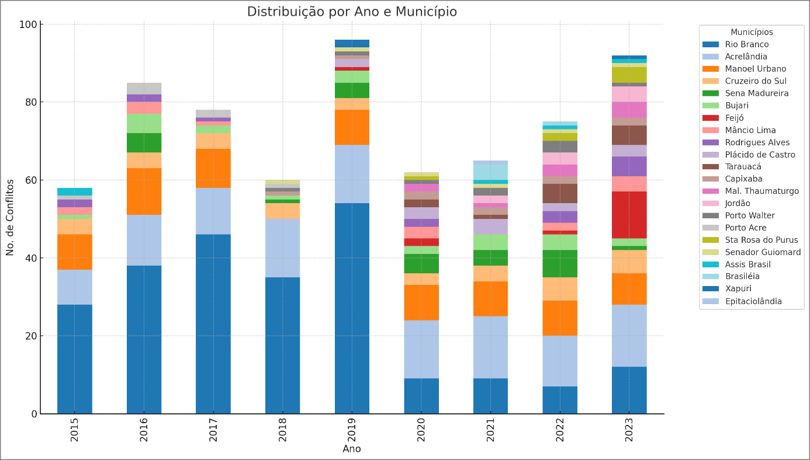

 
 Panorama Geral – Acre| 27 
 
Gráfico 2 - Conflitos por terra e água nos Municípios da Faixa de Fronteira do Acre (2015-2023). 
 
Fonte: Elaborado pelo IBAM a partir de processamento automatizado de dados Conflitos no Campo Brasil 
(CPT, 2016-2024). 
 
A análise dos dados reforça a persistência e a intensidade dos conflitos territoriais em 
municípios críticos do Acre, como Rio Branco e Acrelândia, que concentram boa parte das 
disputas ao longo do período analisado (2015 -2023). A queda acentuada em 2020, durante 
o início da pandemia de COVID-19, seguida de uma retomada significativa nos anos 
subsequentes, culminando em dois picos de registros (2019 e 2023), sugere que “momentos 
críticos”, como mudanças político-institucionais e crises sanitárias, impactam diretamente a 
dinâmica desses conflitos, inclusive em áreas de fronteira, que são reconhecidas pela 
literatura como espaços vulneráveis a pressões múltiplas. Tais flutuações também podem 
indicar a sensibilidade das disputas às ações de fiscalização e à implementação de políticas 
públicas, que ora promovem contenção, ora intensificam tensões em territórios já 
fragilizados. 
Os dados sugerem que a fragilidade no ordenamento territorial e a ausência de uma 
regularização fundiária eficaz alimentam um cenário de instabilidade em seringais, TIs e 
AssRs. Esses territórios tradicionais permanecem como um dos principais focos de disputa, 
com invasões e desmatamento ilegal ameaçando a integridade das áreas ocupadas por 
povos como os Jaminawa, Kaxinawa, Kulina, Katukina e Poyanawa por exemplo. UCs, como 
Reservas Extrativistas (Resex), além de seringais tradicionais, também registram conflitos 
significativos, refletindo a tensão entre modelos de uso sustentável da terra e a crescente 
pressão de grileiros, fazendeiros e agentes do agronegócio. 
 

# PÁGINA 28
 
 Panorama Geral – Acre| 28 
 
Essa tensão é agravada pela regularização fundiária inconclusa e pela sobreposição de 
reivindicações fundiárias, que reforçam a instabilidade social e territorial nos AssRs. O 
aumento nos conflitos em anos marcados por mudanças de governo reflete a disputa entre 
interesses divergentes e evidencia a necessidade de fortalecer ações de fiscalização, 
proteger os territórios vulneráveis e implementar políticas estruturantes, tanto fundiárias 
quanto ambientais, para prevenir novos picos de instabilidade e promover a justiça 
territorial. 
GESTÃO CLIMÁTICA 
 
Os impactos das mudanças climáticas observados nos territórios brasileiros reforçam a 
urgência de repensar os modelos de ocupação e uso da terra ̶ tanto urbanos quanto rurais 
̶, além de aprofundar o entendimento sobre as características geoclimáticas locais, como o 
clima, o padrão das chuvas, o relevo e os tipos de solo 
 
As mudanças climáticas também têm provocado transformações nos ciclos naturais da 
Floresta Amazônica, como os períodos de cheia e vazante dos rios. Em consequência das 
alterações no volume de chuvas e da elevação das temperaturas, tornam-se mais frequentes 
os eventos extremos, como secas severas e inundações intensas. Essas mudanças afetam 
diretamente os municípios ribeirinhos, cujas comunidades organizam seus modos de vida 
na região de várzea com base no calendário natural das águas. A alteração desses ciclos 
compromete práticas tradicionais de manejo, provoca prejuízos econômicos e ambientais e 
afeta a segurança alimentar das populações. Além de impactar atividades como a pesca e 
agricultura, as mudanças no regime hidrológico também comprometem a mobilidade e o 
abastecimento das comunidades. Nas secas extremas, como a de 2023-2024, por exemplo, 
centenas de localidades ficaram isoladas devido à interrupção das rotas fluviais, dificultando 
o transporte de alimentos, medicamentos e combustíveis e o desenvolvimento de atividades 
econômicas ̶ o que acentua a vulnerabilidade e compromete a permanência das populações 
em seus territórios. 
 
Esses efeitos atingem com especial intensidade os povos e comunidades tradicionais ̶ 
indígenas, quilombolas, extrativistas, pescadores artesanais, assentados e agricultores 
familiares ̶ devido à forte dependência da biodiversidade e dos serviços ecossistêmicos, bem 
como à precariedade de acesso a políticas públicas e infraestrutura adequada. Na faixa de 
fronteira do Acre, essas vulnerabilidades ganham contornos ainda mais complexos, diante 
das longas distâncias, da baixa densidade populacional e das limitações estruturais para a 
atuação pública em territórios de difícil acesso. 
 
Embora essas vulnerabilidades se manifestem localmente, é importante considerar também 
os fatores climáticos de escala regional e global que contribuem para a intensificação dos 
eventos extremos na região. Cabe ressaltar que as alterações decorrentes das mudanças do 
clima não são fenômenos isolados na ocorrência dos desastres naturais. Os fenômenos 
naturais El Niño e La Niña11 contribuem com diferentes impactos no mundo e nas regiões 
 
11 O El Niño e a La Niña são parte do fenômeno natural conhecido como El Niño Oscilação Sul (Enos), 
que ocorre no Oceano Pacífico Tropical. O El Niño é um fenômeno caracterizado pelo aquecimento 

# PÁGINA 29
 
 Panorama Geral – Acre| 29 
 
do Brasil, conforme a periodicidade de suas ocorrências. No período de ocorrência do El 
Niño, as secas registradas na Região Norte, nos anos de 2023 e 2024, são os exemplos mais 
recentes de desastres naturais, na forma mais extrema que aconteceu na Amazônia, 
derivadas de uma combinação de diferentes sistemas meteorológicos que ocasionaram 
estiagens históricas. 
 
Os principais desastres naturais ocorridos no período de 1991 a 2022, nos Estados do Acre, 
Amazonas, Amapá, Pará, Rondônia e Roraima, foram consolidados na versão atualizada do 
Atlas Digital de Desastres Naturais - Atlas Digital de Desastres no Brasil, desenvolvido pelo 
Ministério da Integração e do Desenvolvimento Regional, por meio da Secretaria Nacional 
de Defesa Civil (SEDEC), em parceria com a Universidade Federal de Santa Catarina (UFSC).  
 
Para o risco de impacto das mudanças climáticas em sistemas socioecológicos, 
considerando a ameaça climática de seca, observou-se que os Municípios da Fronteira, em 
sua maioria, estão na classe de impacto climático médio e baixo (39,17% e 41,23%, 
respectivamente). No Acre, dos 22 Municípios pertencentes à Faixa de Fronteira, 31,82% 
apresentam o índice muito baixo. Enquanto 63,64% representam o índice baixo e somente 
o Município de Assis Brasil, classificado como índice médio (4,54%). Vale destacar no entanto 
que os dados correspondem ao período de 1991 a 2022, ou seja não agrega informações 
mais recentes que podem indicar intensificação do fenômeno.  
 
 
 
 
anormal das águas do Oceano Pacífico, na sua porção equatorial, e a La Niña corresponde ao 
resfriamento anormal das águas do Oceano Pacífico Equatorial. Fonte: http://enos.cptec.inpe.br/. 
Acesso em: 20 de dez. 2024. 

# PÁGINA 30

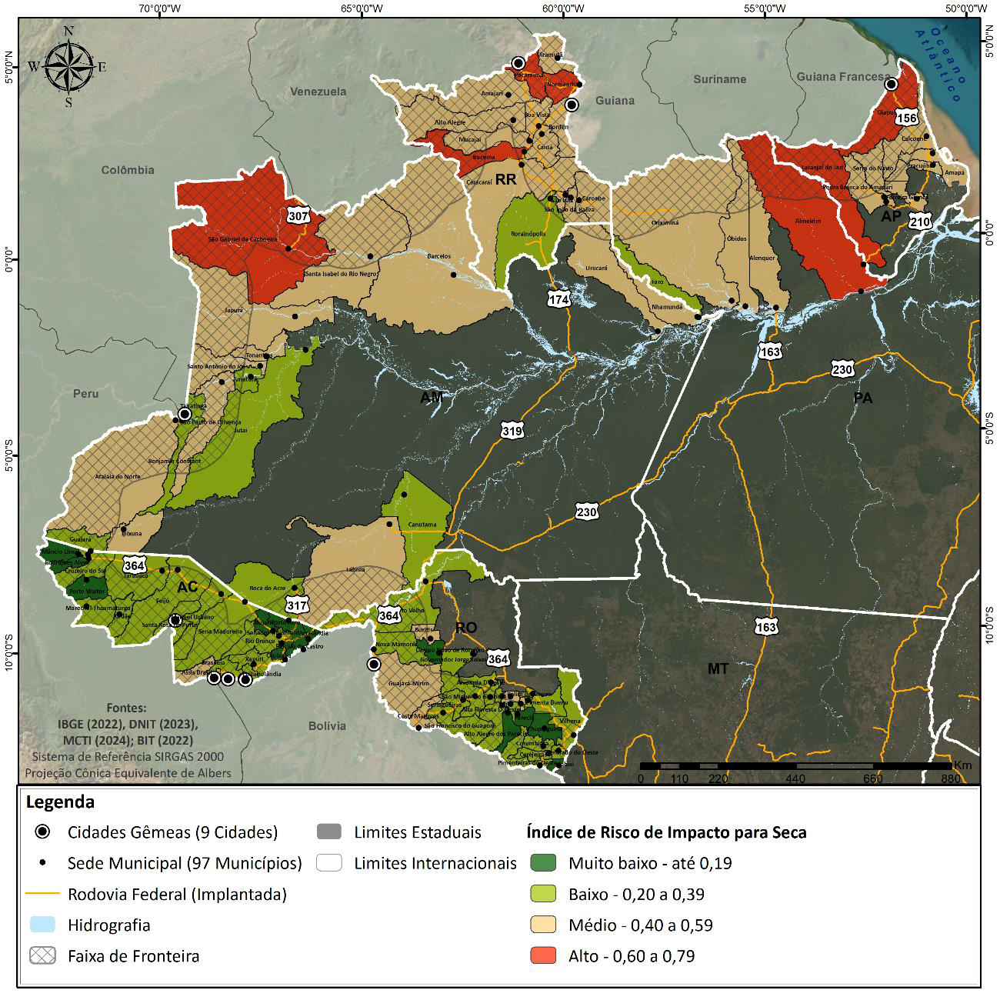

 
 Panorama Geral – Acre| 30 
 
Mapa 6 - Índice de risco de impacto para recursos hídricos, considerando a ameaça climática 
de seca. 
 
Fonte: Elaborado pelo IBAM, a partir de fontes secundárias. 
Nesse aspecto, para diminuição do risco de impacto presente e futuro das mudanças 
climáticas nos recursos hídricos considerando uma situação de seca, o arcabouço legal 
existente, relacionado ao planejamento e gestão indicam que os Municípios do Estado do 
Acre, 54,55% apresentam o índice muito baixo. Enquanto 40,91% representam o índice baixo 
e somente o Município de Rodrigues Alves, classificado como índice médio (4,54%). 
 
Quanto à implementação de programas ou ações de prevenção contra impactos 
relacionados à seca, os dados encontram-se indisponíveis em sua maioria, o que representa 
86,60% do total (84). No Estado do Acre, somente os Municípios de Epitaciolândia e Manoel 
Urbano foram reconhecidos como classe muito baixo, enquanto que nos demais Municípios, 
os dados se apresentam indisponíveis. 
 
Sobre o risco de impacto das mudanças climáticas em sistemas socioecológicos, 
considerando a ameaça de desastres geo-hidrológicos no evento de inundações, enxurradas 
e alagamentos, os Municípios da Faixa de Fronteira Norte e Centro (Rondônia) estão 

# PÁGINA 31

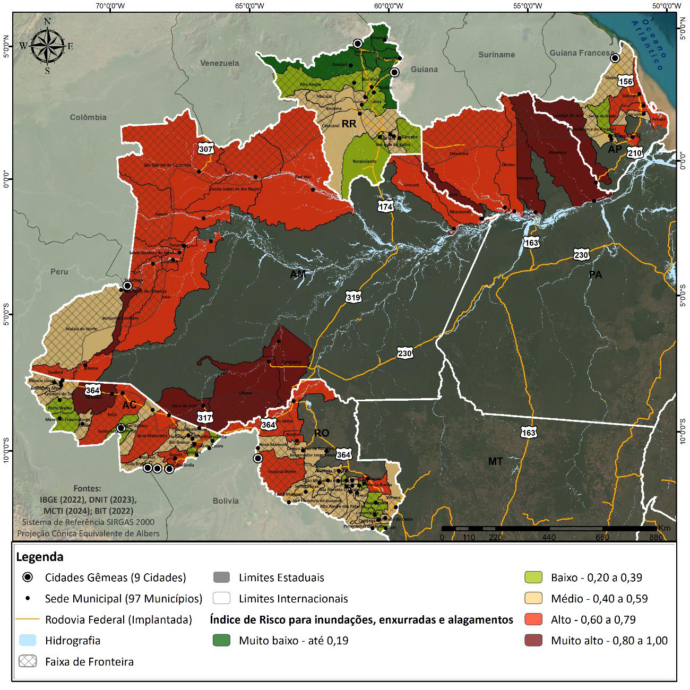

 
 Panorama Geral – Acre| 31 
 
enquadrados predominantemente, entre as classes médio e alto. No Estado do Acre, 
somente o Município de Tarauacá apresenta o índice muito alto. Enquanto 22,73% 
apresentam o índice alto, 50,00% representam o índice médio e 22,73%, o índice baixo. 
Mapa 7 - Índice de risco de impacto para inundações, enxurradas e alagamentos. 
 
Fonte: Elaborado pelo IBAM, a partir de fontes secundárias. 
 
Para o risco de impacto das mudanças climáticas em sistemas socioecológicos, 
considerando a ameaça de desastre geo-hidrológico no evento de deslizamento de terra, 
observou-se que somente o Município de Tarauacá apresenta o índice alto. Enquanto 
31,82% apresentam o índice médio, 54,55% representam o índice baixo e 9,09%, o índice 
muito baixo para deslizamento de terra. 
 

# PÁGINA 32

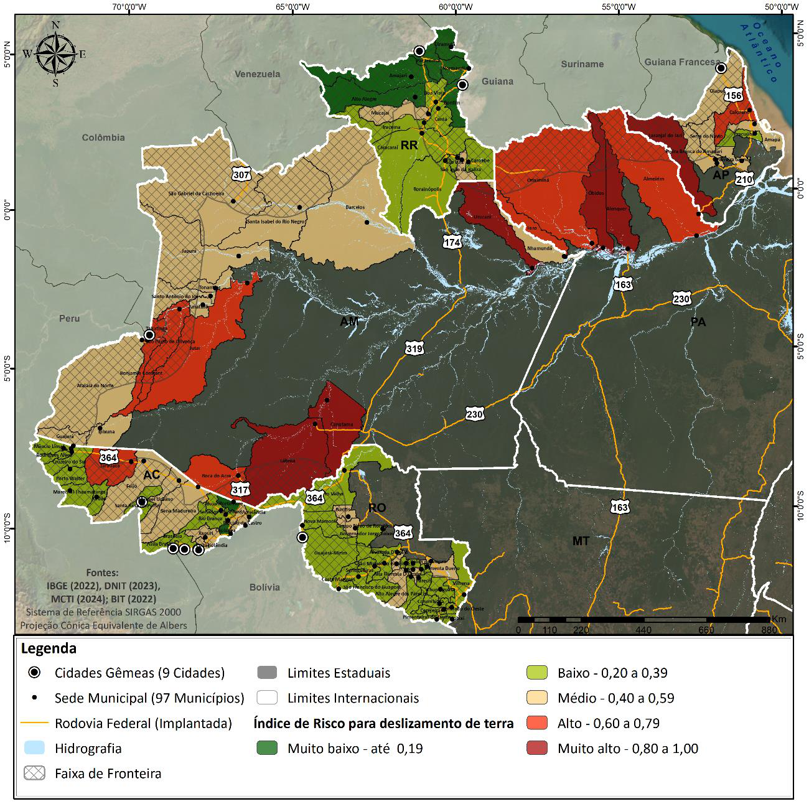

 
 Panorama Geral – Acre| 32 
 
Mapa 8 - Índice de risco de impacto para deslizamento. 
 
Fonte: Elaborado pelo IBAM, a partir de fontes secundárias. 
 
Quanto à capacidade política e institucional em governança do risco, ações para redução e 
resposta em situação de desastre de deslizamento de terra, os Municípios da Faixa de 
Fronteira Norte e Centro (Rondônia) estão enquadrados em sua maioria na classe muito 
baixa. No Estado do Acre, somente o Município de Rio Branco apresenta o índice alto. 
Enquanto 13,64% apresentam o índice médio, 27,27% representam o índice baixo e 54,55%, 
o índice muito baixo para governança e gestão de risco de desastre de deslizamento de 
terra. 
 
Em 2023, com o objetivo de orientar o Governo Federal nas ações de prevenção e mitigação 
de desastres naturais no Plano Plurianual (PPA) 2024-2027, especialmente no contexto do 
Novo Programa de Aceleração do Crescimento (Novo PAC), a Secretaria Especial de 
Articulação e Monitoramento da Casa Civil da Presidência da República, atualizou os critérios 
e indicadores para a identificação dos Municípios mais suscetíveis a deslizamentos, 
enxurradas e inundações. A partir dos dados atualizados sobre desastres, vulnerabilidades 

# PÁGINA 33

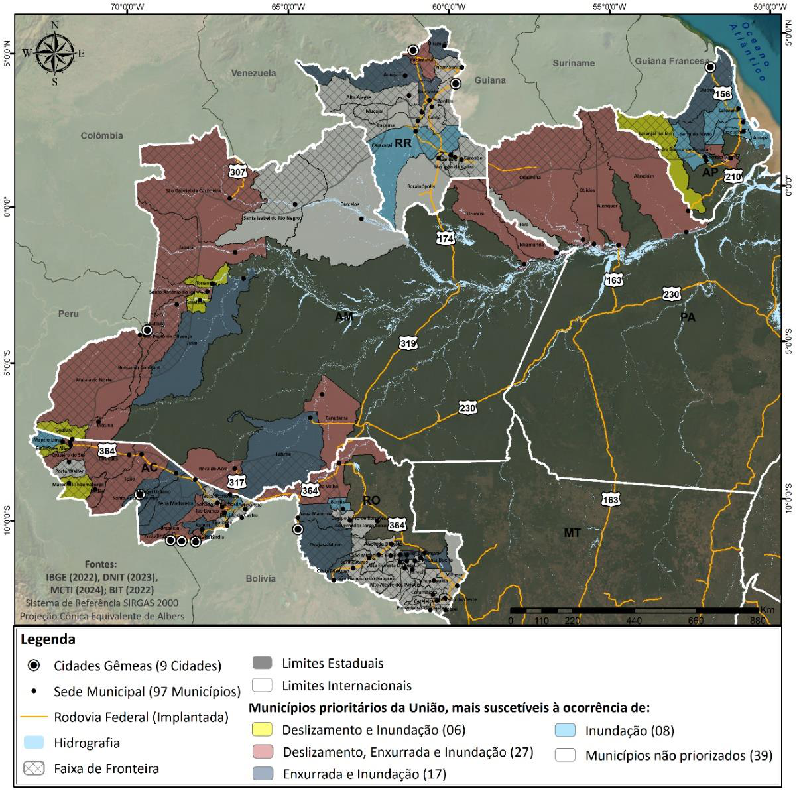

 
 Panorama Geral – Acre| 33 
 
e mapeamento de áreas de risco geológico e hidrológico12,  foram selecionados 1.942 
Municípios. Dos 97 Municípios situados na Faixa de Fronteira do Arco Norte e Rondônia, 
foram identificados 58 mais suscetiveis à ocorrência de desastres naturais relacionados a 
deslizamentos, enxurradas e inundações. No Acre, somente os Municípios de Acrelândia, 
Bujari, Capixaba, Plácido de Castro e Porto Walter foram identificados como não priorizados 
(22,73%). Enquanto que os demais (77,27%) apresentam a ocorrência por tipo de risco 
corresponde a deslizamentos, enxurradas e inundações. 
 
Mapa 9 - Municípios da Faixa de Fronteira, mais suscetíveis à ocorrência de deslizamentos, 
enxurradas e inundações. 
 
Fonte: Elaborado pelo IBAM, a partir de fontes secundárias. 
 
 
12 As fontes de consulta dos dados históricos das últimas décadas, mapeamento atuais e informações 
do Censo 2022, bem como os indicadores e critérios adotados estão disponibilizadas na Nota Técnica 
nº 1/2023/SADJ-VI/SAM/CC/PR, Secretaria Especial de Articulação e Monitoramento - Casa Civil. 
Disponível em: https://www.gov.br/mdr/pt-br/centrais-de-conteudo/publicacoes/protecao-e-defesa-
civil-sedec/copy_of_NotaTcnica12023SADJVISAMCCPR_SEI_00042.000497_2023_74.pdf?utm_source= 
 

# PÁGINA 34
 
 Panorama Geral – Acre| 34 
 
Estabelecido conforme os critérios presentes na mesma Nota Técnica nº 1/2023/SADJ-
VI/SAM/CC/PR, a Secretaria Nacional de Defesa Civil (SEDEC) desenvolveu o Indicador de 
Capacidade Municipal (ICM)13, com o objetivo de retratar a capacidade do Municípios em 
atuar na gestão dos riscos e desastres. Entre as Categorias de Gestão de Riscos e Desastres 
(GDR) definidas, foram identificados na Faixa B (Intermediária Avançada). No Quadro a 
seguir, 22 (vinte e dois) Municípios da Faixa de Fronteira dos Arcos Norte e Centro 
(Rondônia), no Perfil de Risco “Prioritário” e “Não Prioritário”. No Acre, somente os 
Municípios de Epitaciolândia, Feijó e Rio Branco foram classificados como Perfil de Risco 
“Prioritário”.  
 
Quadro 1 - Municípios dos Estados da Faixa de Fronteira - Arcos Norte e Rondônia identificados 
na Faixa B (Intemediária Avançada) 
Estado 
Municípios 
Perfil de Risco  
Prioritário 
Não Prioritário 
Acre 
Epitaciolândia 
 
 
Feijó 
 
 
Rio Branco 
 
 
Amazonas 
Atalaia do Norte 
 
 
Barcelos 
 
 
Labréa 
 
 
São Gabriel da Cachoeira 
 
 
São Paulo de Olivença 
 
 
Amapá 
Macapá 
 
 
Pará 
Oriximiná 
 
 
Rondônia 
Alto Alegre do Parecis 
 
 
Alta Floresta d`Oeste 
 
 
Governador Jorge Teixeira 
 
 
Nova Brasilândia do Oeste 
 
 
Pimenta Bueno 
 
 
Porto Velho 
 
 
São Francisco do Guaporé 
 
 
Roraima 
Boa Vista 
 
 
Bonfim 
 
 
Cantá 
 
 
Caroebe 
 
 
Rorainópolis 
 
 
Fonte: Elaborado pelo IBAM a partir de dados do Indicador de Capacidade Municipal (ICM), 2025. 
 
 
13 O ICM é o principal indicador para o monitoramento do Programa 2318 - Gestão de Riscos e 
Desastres no Plano Plurianual (PPA) 2024-2027, que será considerado ao longo dos próximos quatro 
anos para avaliar o aprimoramento da capacidade dos Municípios em ações de gestão de riscos e 
desastres no Brasil. O ICM é composto por 20 (vinte) variáveis, distribuidos em três dimensões: 
Instrumentos de Planejamento e Gestão; Coordenação Intersetorial e Capacidades; e Políticas, 
Programas e Ações. O quantitativo de Municípios por Categoria de Gestão de Riscos e Desastres (GDR) 
foi distribuído em quatro categorias de índice: Faixa A (Alta); Faixa B (Intermediária Avançada); Faixa C 
(Intermediária 
Inicial) 
e 
Faixa 
D 
(Inicial). 
Ver 
mais 
em: 
https://www.gov.br/mdr/pt-
br/assuntos/protecao-e-defesa-civil/icm. 

# PÁGINA 35
 
 Panorama Geral – Acre| 35 
 
No âmbito estadual, vale destacar ainda uma iniciativa importante existente no Acre. O 
Sistema de Incentivos a Serviços Ambientais (SISA) é resultado de uma política de valorização 
da floresta em pé. Criado pela Lei Estadual nº 2.308/2010, ele reúne um conjunto de 
estratégias e instrumentos que beneficiam quem produz com sustentabilidade e conserva 
o meio ambiente. O SISA tem sete programas que envolvem a redução dos índices de 
desmatamento e queimadas no Acre; a conservação de florestas e o manejo sustentável – 
abrindo caminho para vantagens ambientais e sociais que beneficiam a população acreana, 
especialmente a que mora na floresta. 
 
EMISSÕES DE GASES DE EFEITO ESTUFA 
 
A análise da evolução das emissões de gases de efeito estufa nos Municípios dos Arcos Norte 
e Centro (Rondônia) da Faixa de Fronteira, disponibilizadas pelo Sistema de Estimativas de 
Emissões e Remoções de Gases de Efeito Estufa (SEEG)14, desenvolvido pelo Observatório do 
Clima15, apontam para os anos de 2015, 2022 e 202316, que o principal setor - mudança de 
uso da terra e floresta, corresponde à maior parte das emissões brutas de gases de efeito 
estufa em todos do Municípios da Faixa de Fronteira Norte e Centro (Rondônia), seguido dos 
setores de agropecuária, energia e resíduos. A Tabela abaixo apresenta as emissões de 
gases de efeito estufa dos Municípios do Estado do Acre, nos anos de 2015, 2022 e 2023. 
 
Tabela 3 - Emissões e remoções de gases efeito estufa (GEE) dos Municípios da Faixa de 
Fronteira do Estado do Acre. 
Município 
Ano 
Setor de Emissão (Mt) 
Agropecuária 
Energia 
Mudança de 
Uso da Terra 
e Floresta 
Resíduos 
Total 
Acrelândia 
2015 
361.264 
11.012 
1.177.703 
4.574 
1.554.553 
2022 
517.870 
9.853 
1.386.619 
5.479 
1.919.821 
2023 
530.654 
9.884 
729.250 
5.883 
1.275.671 
Assis Brasil 
2015 
92.527 
8.161 
776.153 
2.529 
879.370 
2022 
143.409 
4.413 
854.981 
2.907 
1.005.710 
2023 
152.222 
4.166 
207.526 
2.697 
366.611 
Brasiléia 
2015 
453.134 
13.550 
2.175.823 
10.393 
2.652.900 
 
14 O SEEG reúne e organiza as estimativas de emissões nos cinco setores, fontes de gases de efeito 
estufa (GEE), - agropecuária, energia, mudança de uso da terra e florestas, processos industrias e 
resíduos - para as 27 Unidades da Federação e os 5.570 Municípios do país. Os dados disponíveis nas 
coleções do SEEG formam uma série histórica que inicia em 1970 (com exceção do setor de mudança 
de uso da terra, que iniciou em 1990), limitando-se ao ano anterior ao lançamento de cada coleção. 
15 O Observatório do Clima (OC) é uma rede de organizações da sociedade civil, dedicada ao 
monitoramento das emissões de gases de efeito estufa (GEE) no Brasil. As instituições integrantes da 
OC coordenam o trabalho técnico do SEEG: IPAM (mudança de uso da terra), IMAFLORA (agropecuária), 
IEMA (energia e processos industriais, e ICLEI - Governos Locais pela Sustentabilidade (resíduos). 
16 Os anos selecionados para a análise representam o ano do compromisso assumido pelo Brasil no 
Acordo de Paris (2015), o último ano do período -2019 a 2022 - de enfraquecimento das políticas de 
controle do desmatamento (2022) e o ano da retomada das ações das medidas de fiscalização e de 
redução por setor de emissão (2023). 

# PÁGINA 36
 
 Panorama Geral – Acre| 36 
 
Município 
Ano 
Setor de Emissão (Mt) 
Agropecuária 
Energia 
Mudança de 
Uso da Terra 
e Floresta 
Resíduos 
Total 
2022 
695.725 
14.511 
3.099.186 
15.181 
3.824.603 
2023 
735.488 
14.666 
815.586 
15.415 
1.581.155 
Bujari 
2015 
429.559 
4.411 
740.522 
4.871 
1.179.363 
2022 
660.449 
9.550 
2.387.935 
5.718 
3.063.652 
2023 
718.893 
9.915 
668.957 
5.359 
1.403.124 
Capixaba 
2015 
312.251 
8.038 
772.352 
3.779 
1.096.420 
2022 
435.665 
9.895 
1.588.601 
3.460 
2.037.621 
2023 
442.082 
9.868 
548.513 
3.728 
1.004.191 
Cruzeiro do 
Sul 
2015 
80.260 
189.748 
1.004.219 
33.081 
1.307.308 
2022 
107.424 
196.211 
2.476.894 
46.391 
2.826.920 
2023 
110.170 
199.980 
1.145.760 
45.065 
1.500.975 
Epitaciolândia 
2015 
187.826 
11.879 
951.985 
6.795 
1.158.485 
2022 
349.312 
11.036 
911.125 
9.864 
1.281.337 
2023 
366.240 
11.094 
219.383 
9.625 
606.342 
Feijó 
2015 
193.080 
27.534 
2.200.267 
11.440 
2.432.321 
2022 
460.175 
29.685 
11.175.904 
12.458 
11.678.222 
2023 
511.605 
30.221 
3.333.905 
12.067 
3.887.798 
Jordão 
2015 
13.240 
1.166 
227.936 
2.161 
244.503 
2022 
27.950 
3.088 
887.719 
3.489 
922.246 
2023 
31.757 
3.157 
185.250 
3.532 
223.696 
Mâncio Lima 
2015 
29.962 
4.572 
316.319 
4.654 
355.507 
2022 
53.622 
7.438 
876.557 
5.666 
943.283 
2023 
56.713 
7.554 
384.051 
5.481 
453.799 
Manoel 
Urbano 
2015 
70.158 
11.863 
1.494.006 
2.580 
1.578.607 
2022 
205.046 
6.419 
4.757.646 
4.156 
4.973.267 
2023 
241.314 
6.248 
958.342 
4.628 
1.210.532 
Marechal 
Thaumaturgo 
2015 
26.832 
4.841 
407.081 
3.999 
442.753 
2022 
36.441 
9.607 
682.161 
3.910 
732.119 
2023 
37.938 
9.866 
305.690 
3.886 
357.380 
Plácido de 
Castro 
2015 
370.322 
6.976 
358.653 
7.275 
743.226 
2022 
609.500 
6.381 
500.699 
7.406 
1.123.986 
2023 
637.808 
6.421 
263.977 
7.597 
915.803 
Porto Acre 
2015 
365.890 
8.088 
832.315 
5.021 
1.211.314 
2022 
714.237 
10.750 
1.576.459 
5.177 
2.306.623 
2023 
730.448 
10.706 
376.043 
5.381 
1.122.578 
Porto Walter 
2015 
18.998 
4.414 
434.768 
6.281 
464.461 
2022 
38.609 
8.252 
635.466 
7.050 
689.377 
2023 
42.186 
8.418 
481.417 
7.207 
539.228 
Rio Branco 
2015 
1.076.517 
317.650 
2.508.137 
165.891 
4.068.195 
2022 
1.216.023 
296.449 
8.497.113 
171.411 
10.180.996 
2023 
1.249.341 
299.845 
2.712.383 
188.432 
4.450.001 
Rodrigues 
Alves 
2015 
24.408 
2.056 
494.177 
4.180 
524.821 
2022 
54.336 
2.242 
979.700 
31.524 
1.067.802 
2023 
63.064 
2.275 
556.699 
27.461 
649.499 
2015 
12.972 
1.761 
203.723 
1.443 
219.899 

# PÁGINA 37
 
 Panorama Geral – Acre| 37 
 
Município 
Ano 
Setor de Emissão (Mt) 
Agropecuária 
Energia 
Mudança de 
Uso da Terra 
e Floresta 
Resíduos 
Total 
Santa Rosa do 
Purus 
2022 
24.629 
3.417 
362.356 
2.135 
392.537 
2023 
26.575 
3.615 
43.486 
2.053 
75.729 
Sena 
Madureira 
2015 
564.126 
40.066 
3.684.749 
14.532 
4.303.473 
2022 
950.659 
36.992 
7.461.764 
20.394 
8.469.809 
2023 
1.062.244 
36.418 
1.519.119 
19.670 
2.637.451 
Senador 
Guiomard 
2015 
451.493 
20.634 
361.822 
15.528 
849.477 
2022 
767.883 
23.756 
956.030 
13.397 
1.761.066 
2023 
776.097 
25.515 
280.305 
15.531 
1.097.448 
Tarauacá 
2015 
282.049 
36.783 
1.458.889 
11.249 
1.788.970 
2022 
441.352 
42.613 
6.666.635 
13.650 
7.164.250 
2023 
490.534 
43.363 
1.986.628 
13.579 
2.534.104 
Xapuri 
2015 
468.113 
7.213 
2.018.783 
5.772 
2.499.881 
2022 
644.148 
8.415 
4.987.225 
7.813 
5.647.601 
2023 
676.149 
8.438 
1.030.062 
8.007 
1.722.656 
Total 
Municípios 
2015 
5.884.981 
742.416 
24.600.382 
328.028 
31.555.807 
2022 
9.154.464 
750.973 
63.708.775 
398.636 
74.012.848 
2023 
9.689.522 
761.633 
18.752.332 
412.284 
29.615.771 
Total 
24.728.967 
2.255.022 
107.061.489 
1.138.948 
135.184.426 
Fonte: Adaptado do Sistema de Estimativas de Emissões e Remoções de Gases de Efeito Estufa (SEEG), 2024 
O Estado do Acre compreende os seguintes cenários, quanto a emissão de GEE nos 
Municípios da Faixa de Fronteira: 
 
- Os Municípios na sua totalidade, têm como principal fonte de emissão o setor 
mudança de uso da terra e floresta, especialmente devido ao desmatamento e ao 
aumento das pastagens, seguida da atividade pecuária. Somente os Municípios de 
Plácido de Castro e Senador Guiomard, apresentam a maior emissão de GEE no setor 
de agopecuária, em comparação aos demais setores; 
 
- A comparação das emissões por setor, nos anos de 2015 e 2023, aponta: (i) a redução 
da emissão de GEE no setor de mudança de uso da terra e floresta no ano de 2023, em 
comparação ao ano de 2015, em 68,18% do total dos Municípios; (ii) o aumento das 
emissões no setor da agropecuária no ano de 2023, em comparação ao ano de 2015, 
na totalidade dos Municípios; (iii) o aumento da emissão de GEE no setor de energia no 
ano de 2023, em 68,18% dos Municípios, em comparação ao ano de 2015; (iv) o aumento 
da emissão de GEE no setor de resíduos em 90,91%, no ano de 2023, em comparação 
ao ano de 2015, com exceção dos Municípios de Capixaba e Marechal Thaumaturgo; 
 
- A comparação das emissões por setor, nos anos de 2022 e 2023, aponta: (i) a redução 
da emissão de GEE no setor de mudança de uso da terra e floresta no ano de 2023, na 
totalidade dos Municípios, em comparação ao ano de 2022; (ii) o aumento das emissões 
no setor da agropecuária, no ano de 2023, na totalidade dos Municípios, em 

# PÁGINA 38
 
 Panorama Geral – Acre| 38 
 
comparação ao ano de 2022; (iii) o aumento da emissão de GEE no setor de energia no 
ano de 2023, em comparação ao ano de 2022, com exceção dos Municípios de Assis 
Brasil, Capixaba, Manoel Urbano, Porto Acre e Sena Madureira; (iv) o aumento da 
emissão de GEE no setor de resíduos em 50,00% dos Municípios, no ano de 2023, em 
comparação ao ano de 2022. 
 
Vale destacar que o Estado do Acre conta com o programa REM, uma iniciativa que premia 
pioneiros da proteção florestal e da mitigação do clima. Lançado na Conferência Rio+20, em 
junho de 2012, com recursos do Fundo de Energia e Clima do Governo Federal da Alemanha, 
esse Programa incentiva a conservação das florestas e a redução de emissões de carbono 
de modo a contribuir para a mitigação das mudanças do clima, especialmente do 
aquecimento global. A finalidade do Programa REM é apoiar com “financiamento ponte” 
implementadores de programas jurisdicionais de REDD+ para fortalecer sua autonomia e 
sustentabilidade. Nomeado mundialmente como – REDD +, de acordo com as decisões sob 
o marco da Organização das Nações Unidas Mudança Climática (UNFCCC). 
 
O Programa REM com o Estado do Acre também consiste na remuneração ou “premiação” 
sobre resultados (ex-post) de reduções de emissões de gases de efeito estufa oriundos do 
desmatamento, teve sua primeira fase implementada com recursos de Ajuda Oficial para o 
Desenvolvimento (AOD) no âmbito da Cooperação Financeira Alemã e agora inicia a 
implementação de uma segunda fase, também com a parceria do Reino Unido/BEIS17. 
 
 
 
17 Ver mais em: http://imc.ac.gov.br/programa-para-pioneiros-em-redd-rem/ 

# PÁGINA 39
 
 Panorama Geral – Acre| 39 
 
 
EIXO TEMÁTICO 2: INFRAESTRUTURAS PARA O 
DESENVOLVIMENTO 
 
 
A implantação de infraestruturas no contexto da região Amazônica é marcada por desafios 
geográficos, socioeconômicos e políticos. De um lado, a expansão da infraestrutura 
possibilita a conexão de áreas onde a presença do Estado é fundamental para facilitar 
acesso a serviços, possibilitar o comércio com países vizinhos e promover ações de 
segurança nacional. Por outro lado, o próprio isolamento de determinadas regiões funciona 
como um mecanismo natural de proteção ambiental. Nesse contexto, o planejamento e os 
investimentos em infraestrutura devem ser conduzidos de forma criteriosa e 
territorialmente sensível, de modo a garantir os direitos das comunidades locais sem 
comprometer a sociobiodiversidade. 
 
Este capítulo apresenta uma análise sobre as infraestruturas presentes na Faixa de Fronteira 
do Arco Norte e Rondônia. Inicialmente, fez-se um levamento dos principais órgãos federais 
atuantes no tema das fronteiras de modo a obter um panorama geral da presença do Estado 
nesse território. Identificar as estruturas de governo existentes é um primeiro passo para 
avaliar os possíveis gargalos para o desenvolvimento local, gestão do território e 
fortalecimento da atuação do poder público na região. 
 
Em seguida, são apresentadas as informações referentes às infraestruturas viárias, tanto 
com relação ao transporte rodoviário, quanto fluvial, aéreo e ferroviário. A estruturação de 
rede de transporte integrada ainda representa um desafio para a integração da Região 
Amazônica ao restante do país e aos países vizinhos, em termos logísticos. Observa-se que 
há um esforço crescente por parte do Governo Federal e de organizações locais para investir 
nesse tipo de infraestrutura, especialmente com relação às rodovias, ampliação das 
hidrovias e desenvolvimento de portos. Desde os anos 2000, a crescente demanda por 
exportações e o aumento da atuação federal em projetos de infraestrutura resultaram em 
avanços significativos, com a revitalização e construção de novos trechos rodoviários, 
expansão da malha ferroviária e a modernização de aeroportos. 
 
Também a infraestrutura energética e de comunicações nos Estados analisados apresenta 
desafios que impactam o desenvolvimento socioeconômico dessas regiões fronteiriças. Esse 
contexto demanda um exame atento sobre as políticas públicas, o planejamento e a 
execução de projetos estratégicos, com vistas a integração com o restante do Brasil e com 
os países vizinhos. Dentre as questões que merecem atenção, destaca-se a cobertura da 
rede elétrica, a melhoria da qualidade dos serviços de telecomunicações, a implantação de 
soluções tecnológicas inovadoras e de adaptação das infraestruturas existentes às 
necessidades locais. A proximidade com as fronteiras pode resultar em vulnerabilidades, 
tanto na segurança das infraestruturas, quanto na gestão das redes de comunicação e de 
energia. 
 

# PÁGINA 40
 
 Panorama Geral – Acre| 40 
 
Já com relação à gestão das infraestruturas de saneamento básico, particularmente nas 
cidades gêmeas, demanda-se uma abordagem integrada entre os países e estados, que 
possa fortalecer a cooperação e as sinergias locais, uma vez que tais questões estão 
intimamente ligadas a aspectos ambientais, sociais e de saúde pública. 
 
Por fim, é fundamental destacar a preocupação com os impactos socioambientais da 
expansão dos grandes projetos de infraestrutura, especialmente aqueles relacionados à 
implantação de rodovias, geração de energia elétrica e instalação de linhas de transmissão. 
Historicamente, a implantação desses sistemas e redes vêm acompanhados de degradação 
ambiental e conflitos sociais, que abrangem o desmatamento, fragmentação de habitats e 
ameaças aos povos e comunidades tradicionais. 
 
INFRAESTRUTURAS DE GOVERNO 
 
O governo federal mantém uma rede de unidades espalhadas pelos municípios fronteiriços, 
com o objetivo de fiscalizar, proteger e planejar o uso de seu território. O levantamento aqui 
realizado busca um mapeamento preliminar das estruturas de governo presentes nos 
municípios da Faixa de Fronteira do estado do Acre, a partir da identificação de órgãos que 
atuam em áreas estratégicas para a discussão das fronteiras. Os órgãos mapeados foram 
organizados em quadro grandes categorias, com o intuito de oferecer um panorama geral 
sobre temas fundamentais como meio ambiente, segurança e gestão territorial. São eles:  
Quadro 2 - Categorias e Órgãos Federais presentes na Faixa de Fronteira 
Categoria 
Órgãos Federais 
Segurança, 
Defesa e 
Fiscalização 
Receita Federal, Polícia Federal, Polícia Rodoviária Federal, Vigilância 
Agropecuária Internacional, Exército Brasileiro, Aeronáutica, Marinha do Brasil, 
Pelotão Especial de Fronteira.  
Gestão Territorial 
e Comunidades 
Tradicionais 
Instituto Brasileiro de Geografia e Estatística (IBGE), Fundação Nacional dos 
Povos Indígenas (FUNAI), Instituto Nacional de Colonização e Reforma Agrária 
(INCRA). 
Meio Ambiente, 
Agricultura e 
Desenvolvimento 
Instituto Brasileiro do Meio Ambiente e dos Recursos Naturais Renováveis 
(IBAMA) e Empresa Brasileira de Pesquisa Agropecuária (EMBRAPA) 
Educação, 
Ciência e 
Tecnologia 
Universidades e Institutos federais 
Fonte: Elaborado pelo IBAM 
 
O Estado do Acre conta com 6 unidades do Pelotão Especial de Fronteira, responsável pelo 
patrulhamento terrestre em pontos estratégicos da fronteira, reforçando a presença do 
Estado em regiões de difícil acesso. Eles estão localizados nos municípios de Plácido de 
Castro, Epitaciolândia, Assis Brasil, Manoel Urbano, Marechal Thaumaturgo e Mâncio Lima. 
Também as Forças Armadas, compostas por 6 unidades do Exército Brasileiro, uma Marinha 
do Brasil e 3 batalhões da Aeronáutica, estão presentes no estado, especialmente no Rio 
Branco e em Cruzeiro do Sul.  

# PÁGINA 41
 
 Panorama Geral – Acre| 41 
 
A Receita Federal conta com inspetorias nos municípios de Epitaciolândia, Assis Brasil e 
Cruzeiro do Sul e com uma Delegacia da Receita Federal, em Rio Branco. Com relação as 
inspetorias, há necessidade de melhorias dos serviços para regulação do comércio exterior 
e prevenção de crimes como contrabando e evasão de divisas. Há também postos da 
Vigilância Agropecuária Internacional (Vigiagro), ligada ao Ministério da Agricultura e 
Pecuária (MAPA), responsável pelo controle e fiscalização do trânsito internacional de 
produtos agropecuários, em unidades em Rio Branco, Epitaciolândia, Cruzeiro do Sul e Assis 
Brasil.  
 
Além das instituições de segurança e fiscalização, há órgãos federais voltados ao 
monitoramento territorial e à proteção das comunidades tradicionais. Há 3 agências do 
Instituto Brasileiro de Geografia e Estatística (IBGE), sendo localizadas nos municípios de 
Tarauacá, Cruzeiro do Sul e Rio Branco. A Fundação Nacional dos Povos Indígenas (FUNAI) 
também está presente em Rio Branco e Cruzeiro do Sul. Também há 4 polos do Instituto 
Nacional de Colonização e Reforma Agrária (INCRA) que atua na regularização fundiária e na 
mediação de conflitos agrários, garantindo a implementação de políticas de assentamento 
e acesso à terra. 
 
Com relação aos órgãos de preservação ambiental, foram identificadas a presença de 3 
unidades do Instituto Brasileiro do Meio Ambiente e dos Recursos Naturais Renováveis 
(IBAMA), localizadas em Cruzeiro do Sul, Rio Branco e na cidade gêmea de Brasiléia, também 
foram encontradas um escritório da Empresa Brasileira de Pesquisa Agropecuária 
(EMBRAPA) no estado do Acre, em Rio Branco  
 
Com relação ao mapeamento de instituições de educação, ciência e tecnologia, que 
desempenham papel importante não só na qualificação de profissionais como polos de 
integração e cooperação transfronteiriça, fortalecendo laços entre os países vizinhos e 
impulsionando pesquisas voltadas às necessidades regionais. No Acre, há um total de nove 
instituições de ensino superior na esfera federal, sendo três campi da Universidade Federal 
do Acre (UFAC), sendo o Campus Rio Branco, na capital, e Campus Floresta em Cruzeiro do 
Sul. Conta também com núcleos de ensino a distância em Acrelândia, Brasileia, Feijó, Sena 
Madureira, Tarauacá e Xapuri. Já o Instituto Federal do Acre (IFAC), conta com seis campi, 
sendo o Campus Rio Branco e o Campus Rio Branco Avançado Baixada do Sol, ambos na 
capital, o Campus Xapuri, o Campus Sena Madureira, o Campus Tarauacá e o Campus Cruzeiro 
do Sul.  
 
A cooperação entre a Universidade Amazônica de Pando (UAP), localizada na cidade gêmea 
de Cobija (Bolívia), e o Instituto Federal de Educação, Ciência e Tecnologia do Acre 
(IFAC) ilustra como parcerias acadêmicas podem fortalecer o intercâmbio de conhecimento 
e impulsionar o desenvolvimento regional, beneficiando tanto a comunidade acadêmica 
quanto a sociedade em geral. Cobija faz fronteira com duas cidades gêmeas brasileiras, 
Brasileia e Epitaciolândia, o que facilita a interação entre as instituições. A implementação 
conjunta de projetos científicos, tecnológicos e culturais amplia as oportunidades para 
estudantes e pesquisadores, promovendo uma integração mais sólida entre Brasil e Bolívia.  
 

# PÁGINA 42

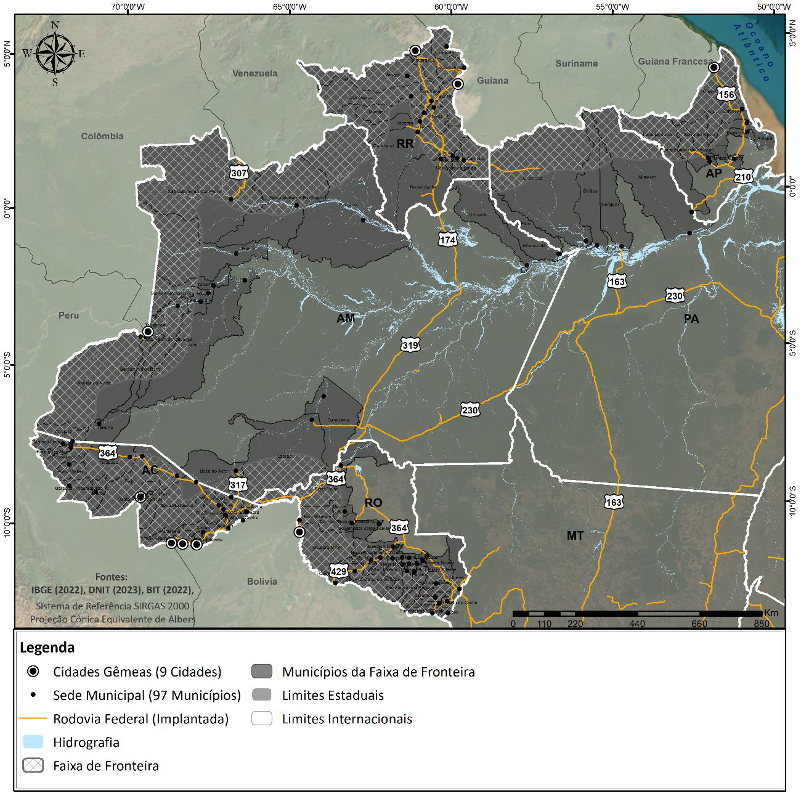

 
 Panorama Geral – Acre| 42 
 
INFRAESTRUTURAS DE TRANSPORTES E LOGÍSTICA 
 
O acesso à Faixa de Fronteira da Amazônia é viabilizado, principalmente, por quatro 
Rodovias Federais: a BR-364 (Cuiabá - Porto Velho), a BR-319 (Manaus - Porto Velho), a BR-
174 (Manaus - Boa Vista) e a BR-230 (Transamazônica). Projetadas no contexto dos 
Programas de Integração Nacional (PIN), durante o regime militar, essas rodovias tinham 
como objetivo conectar a Amazônia às demais regiões do Brasil, promovendo a ocupação 
dos chamados "espaços vazios" e a exploração econômica da região. No Acre, a BR – 317, 
conhecida como Estrada do Pacífico, também é uma das rodovias mais importantes. Com 
início em Porto Acre, a BR-317 atravessa as cidades de Senador Guiomard, a capital Rio 
Branco, Capixaba, Plácido de Castro, Xapuri, Epitaciolândia, Brasiléia, até chegar em Assis 
Brasil, município localizado na tríplice fronteira entre Brasil, Peru e Bolívia. 
 
Mapa 10 - Rodovias Federais que interligam os Estados da Faixa de Fronteira do Arco Norte e 
Rondônia 
Fonte: Elaborado pelo IBAM, a partir de fontes secundárias 

# PÁGINA 43
 
 Panorama Geral – Acre| 43 
 
A BR-364 desempenha um papel estratégico na conectividade da região. Partindo de Alto 
Araguaia, no Mato Grosso, ela atravessa Rondônia, passando por cidades como Porto Velho, 
Ji-Paraná e Vilhena, até alcançar o Acre. Nesse Estado, cruza Municípios importantes como 
Rio Branco, Feijó e Tarauacá, finalizando em Mâncio Lima. Além de conectar áreas 
produtoras aos mercados nacional e internacional, a rodovia é vital para o escoamento de 
produtos agropecuários e industriais das regiões Norte e Centro-Oeste. 
 
Dada a presença de extensos rios e cursos d`água, o transporte fluvial representa papel 
importante na logística regional para o escoamento e abastecimento de bens e produtos, 
além da mobilidade das comunidades amazônicas e das cidades ribeirinhas dos Municípios 
da Faixa de Fronteira dos Arcos Norte e Rondônia. Entre os rios navegáveis, os Rios 
Amazonas/Solimões, Negro, Branco, Madeira. Juruá e Purus, representam importantes 
meios de integração entre as cidades da região amazônica e Estados vizinhos.  
Do conjunto dos portos existentes e previstos na região da fronteira do Arco Norte e 
Rondônia, 88 estão em operação, 05 estão em obras e 31 planejados. Os portos em 
operação se concentram nos Rios Amazonas, Juruá e Purus, sendo os principais para o 
comércio com os estados vizinhos, o escoamento de mercadorias, o transporte de cargas e 
o deslocamento da população.  
No Acre, segundo o levantamento do Banco de Informações e Mapas de Transportes (BIT), 
há 7 portos públicos operando no Acre em municípios como Porto Acre, Cruzeiro do Sul e 
Porto Walter. Há ainda outros 10 portos planejados especialmente nas regiões do Vale do 
Acre.  

# PÁGINA 44

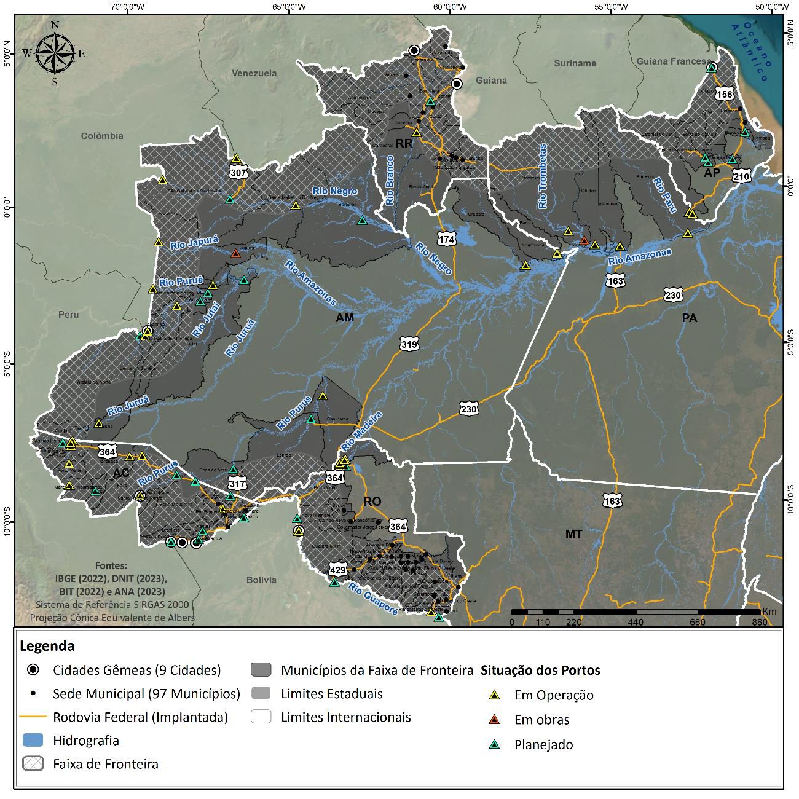

 
 Panorama Geral – Acre| 44 
 
Mapa 11 - Portos em operação, em obras e planejados nos Estados da Faixa de Fronteira do Arco Norte e 
Rondônia 
 
Fonte: Elaborado pelo IBAM, a partir de fontes secundárias 
 
Entre os modais disponíveis, o transporte fluvial desempenha papel fundamental na 
logística e integração regional na Amazônia, especialmente aos Municípios da Faixa de 
Fronteira, possibilitando o escoamento de produtos, o abastecimento de cidades ribeirinhas 
e a mobilidade das comunidades locais. Contudo, no contexto das alterações climáticas, com 
suas consequências na alteração da dinâmica dos rios, especialmente aos períodos de secas 
e estiagens, apresentam desafios significativos, afetando tanto a navegação, quanto as 
condições de vida das populações tradicionais. A adaptabilidade e a gestão eficiente das 
infraestruturas portuárias e fluviais serão essenciais para mitigar os impactos e favorecer a 
resiliência da população local. 
 
Devido à vastidão territorial e à dificuldade de acesso terrestre, o transporte aéreo regional 
também possui importância essencial na conectividade entre cidades de difícil acesso. 
Devido ao modelo de ocupação, os primeiros aeroportos construídos foram destinados a 

# PÁGINA 45
 
 Panorama Geral – Acre| 45 
 
atender às demandas militares e governamentais. Ao longo das décadas, a infraestrutura 
aeroportuária foi ampliada para atender ao comercio e à população. 
 
Na região de fronteira, o Acre possui 2 aeroportos concedidos, o de Rio Branco e Cruzeiro 
do Sul e outros 2 públicos, que operam regionalmente em determinados dias da semana, 
que são o Aeroporto de Feijó e o Aeroporto José Galera dos Santos em Taraucá. Há ainda 
pistas de pouso nas cidades de Porto Walter, Marechal Thaumaturgo, Santa Rosa do Purus 
e Jordão. A aviação regional, além de garantir a mobilidade de passageiros, desempenha um 
papel estratégico no transporte de cargas, facilitando a circulação de produtos e insumos 
essenciais para o comércio local e o crescimento econômico da região. 
 
Vale destacar que no contexto da crescente globalização no início do milênio, os países da 
América do Sul intensificaram os esforços de integração regional, resultando na criação da 
Iniciativa de Integração Regional Sul-Americana (IIRSA) em 2000. A IIRSA visava conectar os 
países sul-americanos por meio de grandes investimentos em infraestrutura, especialmente 
nos setores de transporte, energia e telecomunicações. Um dos principais projetos foi a 
construção da rodovia que liga Assis Brasil (Brasil) aos portos do Pacífico no Peru, concluída 
em 2011. Conhecida como Interoceânica Sul no Peru, a obra pretendia facilitar o 
escoamento de produtos brasileiros para a Ásia. No entanto, atualmente, a estrada é usada 
principalmente por turistas, distante dos objetivos econômicos originais. 
 
Atualmente, no âmbito das propostas para implementação de transporte e logística, vale 
destacar o Programa Rotas de Integração Sul-Americana. Criado em 2022, pelo Ministério 
do Planejamento e Orçamento (MPO), o programa tem como objetivo promover a integração 
logística entre os países da América do Sul, facilitar o comércio e reduzir tempo e custo do 
transporte de mercadorias entre o Brasil e seus vizinhos e a Ásia. Das cinco Rotas da 
Integração Sul-Americana definidas, a Rota 3, Quadrante de Rondon, é a que tem previsão 
de atravessar o Acre. 
 
A Rota 3 compreende integralmente dois Estados brasileiros da região Norte - Acre e 
Rondônia - parte do Amazonas, do Mato Grosso e do Mato Grosso do Sul. Estas vias 
conectam o Brasil ao Peru e à Bolívia, tendo como ponto de destino pelo menos quatro 
portos no Oceano Pacífico: três no Peru (Chancay, Ilo e Matarani) e um ao norte do Chile 
(Arica). As saídas do território brasileiro se dão por meio de cidades do Acre (Assis Brasil), 
Rondônia (Guajará-Mirim), Mato Grosso (Cáceres e Vila Bela da Santíssima Trindade) e Mato 
Grosso do Sul (Corumbá). Essa rota é, hoje, majoritariamente rodoviária, tanto no território 
nacional quanto no dos vizinhos (MPO, 2024). 
 
De acordo com o Relatório 2024 - Rotas de Integração Sul-Americana, dos 190 projetos 
inseridos no Novo PAC, 150 estão contemplados na LOA-2024, tendo recursos e ações 
orçamentárias, e algumas dezenas são concessões e contarão com recursos do setor 
privado. O Quadro 3 reúne informações sobre os projetos de obras de infraestrutura 
previstos no Estado do Acre: 

# PÁGINA 46
 
 Panorama Geral – Acre| 46 
 
Quadro 3 - Projetos previstos nas Rotas de Integração Sul-Americana previstas na Faixa de 
Fronteira do Arco Norte e Rondônia 
Rota 
Síntese 
Projeto 
Localização 
Rota 3 
 
Quadrante 
Rondon 
Exportação de 
alimentos, 
máquinas, 
equipamentos e 
bens de consumo 
final para a Peru, 
Bolívia e Chile, além 
do mercado asiático. 
(*) 
 
Construção do 
Contorno de Brasileia 
(BR-317) 
Brasileia (AC) 
Construção de duas 
pontes na BR-425 
Entre Nova Mamoré-RO e 
Guajará-Mirim-RO 
Construção da Ponte 
de Guajará-Mirim 
Guajará-Mirim (RO) 
Duplicação da BR-364 
Entre Vilhena (RO) e Porto Velho 
(RO) - parcialmente na Faixa de 
Fronteira) 
Dragagem do Rio 
Madeira 
Entre Porto Velho (RO) e 
Itacotiara (AM) - fora da Faixa de 
Fronteira 
Infovia MT 
Mato Grosso - fora da Faixa de 
Fronteira  
Fonte: MPO, 2024. 
 
INFRAESTRUTURA ENERGÉTICA E DE COMUNICAÇÕES 
 
As particularidades da matriz energética da Região Norte, as características geográficas 
remotas e os impactos dos empreendimentos de geração de energia elétrica instalados e 
previstos na Região Amazônica são aspectos significativos que devem ser considerados na 
análise da infraestrutura energética. Segundo dados do Balanço Energético Nacional (BEN, 
2024), a Região Norte possui a capacidade instalada de geração de energia18 de 35.638 MW, 
o que representa 17,9% do total disponível no Brasil.  
 
Da capacidade instalada no território brasileiro, os dados da Região Norte indicam que a 
fonte hidroelétrica (29,10%) representa a maior capacidade de geração, seguida da 
termoelétrica (7,6%) e do solar (0,4%).  
 
No contexto do Arco Norte, os Estados do Amazonas (5,91%), Pará (59,43%) e Rondônia 
(23,53%), representam 88,87% da geração de energia. Nos Estados do Acre (0,30%), Amapá 
(2,15%), Roraima (1,70%), o potencial de geração corresponde a 4,15% do total da Região 
Norte. 
 
 
18 A capacidade instalada de geração elétrica é a potência máxima que uma usina pode gerar, enquanto 
a geração de eletricidade por fonte é a quantidade de energia produzida a partir de uma fonte 
específica. 

# PÁGINA 47
 
 Panorama Geral – Acre| 47 
 
Quadro 4 - Capacidade instalada de geração de energia por tipo de fonte nos Estados da Região 
Norte19 
Estados 
Hidroelétrica 
Termoelétrica 
Solar 
Total 
Total MW 
% 
Total 
MW 
% 
Total 
MW 
% 
Total MW 
% 
Acre 
0 
0,0 
104 
2,88 
1 
2,17 
106 
0,30 
Amapá 
745 
2,33 
15 
0,42 
4 
8,70 
765 
2,15 
Amazonas 
275 
0,86 
1.832 
50,69 
1 
2,17 
2.107 
5,91 
Pará 
20.770 
64,95 
393 
10,87 
17 
36,96 
21.180 
59,43 
Rondônia 
7.781 
24,33 
588 
16,27 
15 
32,61 
8.384 
23,53 
Roraima 
10 
0,03 
593 
16,41 
2 
4,35 
605 
1,70 
Tocantins 
2.395 
7,49 
89 
2,46 
6 
13,04 
2.491 
6,99 
Região Norte 
31.977 
90 
3.614 
10 
46 
0,00 
35.638 
100 
Fonte: Adaptado do BEN, 2025. 
 
No Estado do Acre, estão estabelecidas a Usina Fotovoltaica da Vila Conceição, em Marechal 
Thaumaturgo e as Usinas Termelétricas Acre e Triunfo, no Município de Rio Branco. Convém 
destacar que no Estado do Acre, a fonte termoelétrica representa a maior capacidade 
instalada de geração de energia. 
 
Embora parte do estado esteja interligado ao Sistema Interligado Nacional (SIN), regiões 
interiores e de difícil acesso e ainda depende de sistemas isolados ou de geração própria, 
como pequenos sistemas fotovoltaicos ou hidrelétricas locais.  
 
 
19 Não há produção de energia eólica ou nuclear na região. 

# PÁGINA 48

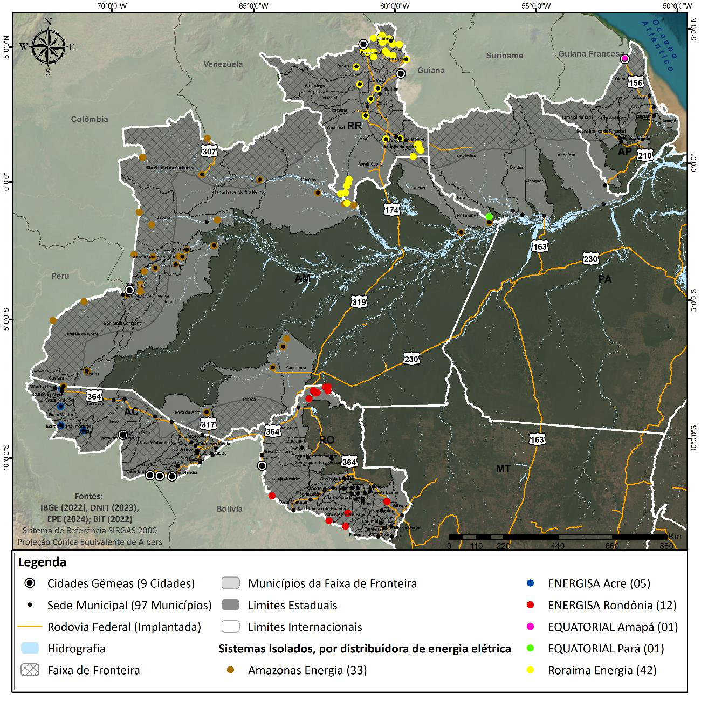

 
 Panorama Geral – Acre| 48 
 
Mapa 12 - Sistemas Isolados localizados nos Municípios da Faixa de Fronteira do Arco Norte e 
Rondônia 
 
Fonte: Elaborado pelo IBAM, a partir de fontes secundárias. 
 
Com o objetivo de promover o acesso à energia elétrica, por meio da extensão das redes de 
distribuição, principalmente em áreas rurais, o Governo Federal lançou em 2003, o 
Programa Luz para Todos (PLPT). Apesar do alcance e dos resultados, os desafios logísticos 
e técnicos encontrados nas regiões remotas da Amazônia Legal, conduziu o Governo Federal 
a instituir em 2020, o Programa Nacional de Universalização do Acesso e Uso da Energia 
Elétrica na Amazônia Legal - Programa Mais Luz para a Amazônia (MLA), com o propósito de 
promover o acesso à energia elétrica, exclusivamente por fontes renováveis, para 219 mil 
unidades consumidoras, até 2022. No Estado do Acre, no âmbito deste programa foram 
instaladas placas de energia solar nas comunidades extrativistas e terras indígenas. Após 
mais de dois anos e com menos de 5% da meta cumprida, o Governo Federal unificou os 
dois programas, incorporando as premissas e diretrizes do MLA ao PLPT. 
 

# PÁGINA 49

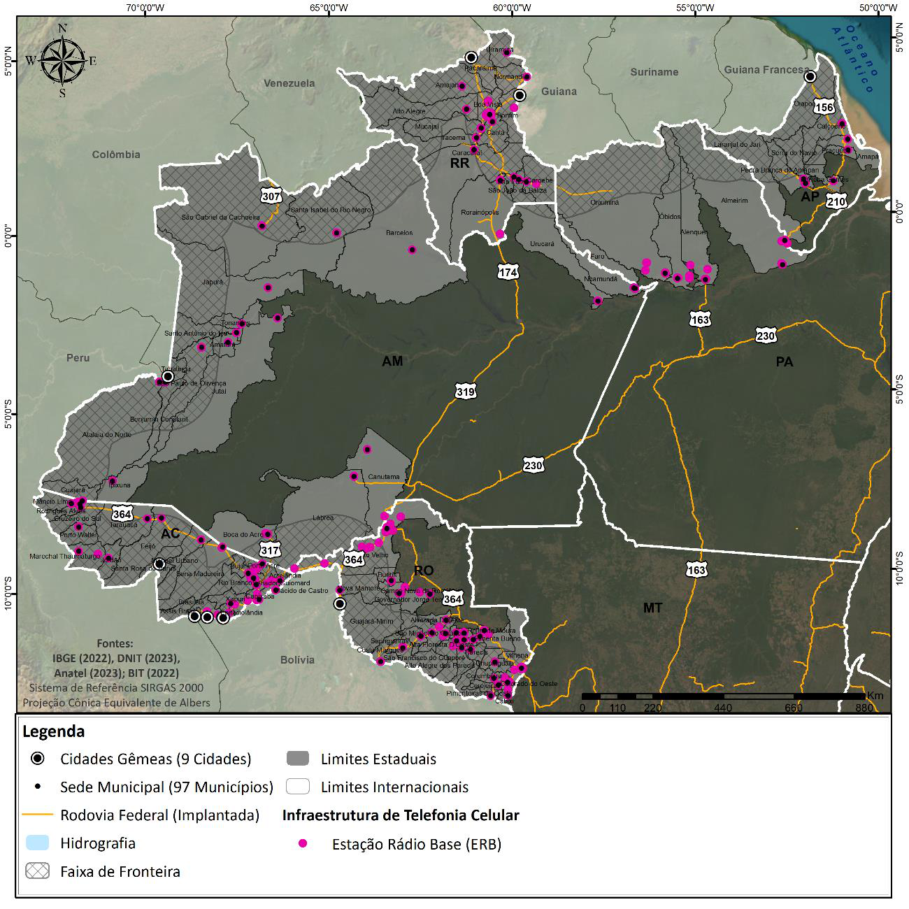

 
 Panorama Geral – Acre| 49 
 
Para o planejamento e organização do fornecimento de energia elétrica a comunidades e 
localidades não conectadas à rede elétrica convencional, especialmente em áreas remotas 
e de difícil acesso, o MME coordena o Planejamento do Atendimento aos Sistemas Isolados. 
Para subsidiar o planejamento pelo MME, os resultados do Planejamento do SISOL são 
publicados pela EPE, com base nas informações fornecidas pelas distribuidoras de energia 
elétrica - Amazonas Energia, Energisa Acre, Energisa Rondônia, Equatorial Amapá, Equatorial 
Pará e Roraima Energia. Em fevereiro em 2024, o MME lançou o Portal de Acompanhamento 
e Informações dos Sistemas Isolados (PASI)20, com o propósito de agregar informações 
atuais e a dimensão dos SISOL e dar maior transparência sobre os dados.  
Mapa 11 - Infraestrutura de telefonia celular nos Municípios da Faixa de Fronteira do Arco 
Norte e Rondônia 
 
Fonte: Elaborado pelo IBAM, a partir de fontes secundárias 
 
20 Disponível em: <https://pasi.epe.gov.br/>. Acesso em: 05 de fev. 2025. 

# PÁGINA 50
 
 Panorama Geral – Acre| 50 
 
A expansão da infraestrutura de comunicações na Região Amazônica, particularmente nos 
Municípios da Faixa de Fronteira, foi impulsionada nos últimos anos com o avanço de 
iniciativas, como o Programa Norte Conectado, que desde 2020, conecta 59 Municípios dos 
Estados do Acre, Amapá, Amazonas, Pará, Roraima e Rondônia, por meio da implantação de 
cabos de fibra óptica subfluvial. No Acre, as infovias “Manacapuru (AM) a Rio Branco (AC)” e 
“Tabatinga (AM) a Cruzeiro do Sul (AC)” que percorrem os Rios Purus e Juruá, 
respectivamente, não contemplam os Municípios localizados na Faixa de Fronteira, no 
Programa Norte Conectado. 
 
Embora a infraestrutura de comunicações nos Municípios da Faixa de Fronteira tenha 
apresentado avanços, especialmente com a implementação de programas como o Norte 
Conectado, ainda persistem desafios logísticos e técnicos que precisam ser superados para 
assegurar a conectividade da região. 
 
A integração de tecnologias, como satélites e redes móveis tem sido uma estratégia para 
superar a vastidão territorial, a densidade populacional reduzida e as dificuldades 
geográficas, mas a necessidade de investimentos contínuos e políticas públicas eficazes é 
fundamental para a inclusão digital nos Municípios da Faixa de Fronteira. 
 
SANEAMENTO BÁSICO 
 
A gestão do saneamento básico tem como principal objetivo a universalização dos serviços 
essenciais em seus quatro componentes: abastecimento de água potável, esgotamento 
sanitário, limpeza urbana e manejo de resíduos sólidos, drenagem e manejo de águas 
pluviais urbanas. A precariedade nesses serviços tende a comprometer a qualidade de vida 
das populações locais, impactar a saúde pública e pode gerar consequências ambientais 
graves, como a contaminação dos rios, que são a principal fonte de água para muitas 
comunidades. 
 
De acordo com dados do Sistema Nacional de Informações em Saneamento Básico (SINISA, 
2022), apresentados a seguir, observa-se que os índices dos municípios da Faixa de Fronteira 
do Arco Norte e Rondônia ainda são preocupantes e representam um dos grandes desafios 
para os gestores públicos.  
 
Com relação ao abastecimento de água potável, Municípios lindeiros da Faixa de Fronteira 
do Arco Norte e Rondônia enfrentam um déficit significativo nesse serviço, com localidades 
como Oiapoque (8,9%) e Uiramutã (4,1%) apresentando cobertura extremamente baixa. No 
as cidades gêmeas têm cobertura de atendimento maior que 50%, com exceção de Santa 
Rosa do Purus que tem uma cobertura de 40,4%. Assis Brasil chega a 69,5% da população 
com acesso à rede de água potável.  
 
Sobre os serviços de esgotamento sanitário, não há dados disponíveis, evidenciando sua 
inexistência ou a falta de estrutura para o monitoramento desse serviço, porém é possível 
observar que em alguns municípios a oferta de saneamento é baixa, como na Capital Rio 
Branco onde somente 10,2% da população possui acesso a esgotamento sanitário.  
 

# PÁGINA 51
 
 Panorama Geral – Acre| 51 
 
No que se refere à limpeza urbana e manejo de resíduos sólidos, observa-se a 
predominância de lixões como forma de disposição final, comprometendo a qualidade 
ambiental e a saúde da população. Os Municípios que abrangem fronteiras secas podem 
enfrentar a circulação irregular de resíduos entre os países vizinhos, ou que exijam maior 
articulação entre as pessoas envolvidas na gestão desses serviços. A cidade gêmea Santa 
Rosa do Purus é o município que possui menor taxa (29,75%) de cobertura de coleta dentre 
os municípios do estado, a capital Rio Branco possui a maior taxa do estado (93,12%). Com 
relação à drenagem urbana, considerando a diversidade de indicadores sobre o tema, 
adotou-se para esta análise a parcela de domicílios não sujeitos a risco de inundação. Os 
dados revelam grande variação entre os municípios lindeiros, com destaque para 
Acrelândia, Bujari e Capixaba, já em Cruzeiro do Sul cerca de 70,8% da população está sujeito 
a risco inundação.  
Tabela 2 – Saneamento Básico: índice de atendimento em relação à população total (%) 
Municípios da 
Faixa de 
Fronteira do 
Acre 
Abastecimento de 
água potável 
Esgotamento Sanitário 
Limpeza Urbana e 
Manejo de 
Resíduos Sólidos  
Drenagem e manejo de 
águas pluviais urbanas e 
manejo de águas 
pluviais urbanas 
Índice de 
atendimento em 
relação à 
população total (%) 
Índice de atendimento 
em relação à 
população total (%) 
Taxa de cobertura 
da coleta 
domiciliar em 
relação à 
população total (%) 
Parcela de domicílios 
não sujeitos a risco de 
inundação (%) 
Acrelândia 
39,86 
NI 
42,76 
100 
Assis Brasil 
69,53 
NI 
58,02 
97 
Brasiléia 
61,84 
NI 
73,65 
75,2 
Bujari 
44,03 
NI 
44,51 
100 
Capixaba 
42,53 
NI 
41,84 
100 
Cruzeiro do Sul 
50,68 
NI 
83,8 
29,2 
Epitaciolândia 
63,42 
NI 
70,09 
96,7 
Feijó 
18,31 
NI 
50,69 
IN 
Jordão 
34,94 
NI 
41,6 
31,3 
Mâncio Lima 
61,31 
62,2 
31,1 
100 
Manoel Urbano 
56,42 
NI 
67,51 
94,2 
Marechal 
Thaumaturgo 
26,51 
NI 
32,18 
81,3 
Plácido de 
Castro 
52,92 
NI 
59,43 
99,4 
Porto Acre 
24,29 
NI 
59,91 
80 
Porto Walter 
40,09 
NI 
36,12 
95 
Rio Branco 
53,5 
20,67 
93,12 
97,3 
Rodrigues Alves 
40,32 
NI 
52,48 
65,8 
Santa Rosa do 
Purus 
40,37 
NI 
29,75 
71,8 
Senador 
Guiomard 
33,35 
NI 
63,55 
97,9 
Sena Madureira 
38,15 
NI 
48,97 
67,9 
Tarauacá 
34,13 
NI 
57,51 
77,8 
Xapuri 
60,18 
NI 
63,98 
IN 

# PÁGINA 52
 
 Panorama Geral – Acre| 52 
 
 
 
 (*) Fronteira seca. NI = Não Informado 
Fonte: Sinisa, 2022. 
 
 
 
Municípios da 
Faixa de 
Fronteira do 
Acre 
Abastecimento de 
água potável 
Esgotamento Sanitário 
Limpeza Urbana e 
Manejo de 
Resíduos Sólidos  
Drenagem e manejo de 
águas pluviais urbanas e 
manejo de águas 
pluviais urbanas 
Índice de 
atendimento em 
relação à 
população total (%) 
Índice de atendimento 
em relação à 
população total (%) 
Taxa de cobertura 
da coleta 
domiciliar em 
relação à 
população total (%) 
Parcela de domicílios 
não sujeitos a risco de 
inundação (%) 
Estado 
48 
10,5 
74,1 
87,9 
Brasil  
84,9 
56 
90,4 
95,7 

# PÁGINA 53
 
 Panorama Geral – Acre| 53 
 
 
EIXO TEMÁTICO 3: FOMENTO ÀS ATIVIDADES PRODUTIVAS 
SUSTENTÁVEIS E INCLUSÃO SOCIAL 
 
 
O desenvolvimento sustentável exige um equilíbrio entre o crescimento econômico, a 
conservação ambiental e a justiça social. Nesse contexto, o fomento às atividades produtivas 
sustentáveis surge como caminho para garantir que o aproveitamento dos recursos naturais 
ocorra de forma responsável e regenerativa. A bioeconomia, um dos pilares dessa 
abordagem, propõe a “produção, utilização e conservação de recursos biológicos, incluindo 
os conhecimentos relacionados, ciência, tecnologia e inovação, para fornecer informações, 
produtos, processos e serviços em diversos setores econômicos”, segundo definido pela 
Organização das Nações Unidas para Agricultura e Alimentação (FAO).  
 
Deste modo, o diagnóstico do eixo das atividades produtivas buscou sintetizar um 
panorama econômico geral sobre os estados do Arco Norte e Rondônia, para compreender 
o cenário econômico dessa região e as possibilidades de avanço em práticas de 
desenvolvimento sustentável. Inicialmente, analisou-se as informações extraídas de bases 
de dados quantitativas, principalmente do IBGE e do Ministério do Desenvolvimento, 
Indústria, Comércio e Serviços (MDIC), sobre a evolução do Produto Interno Bruto (PIB), a 
composição setorial, o emprego formal, a balança comercial, e, mais especificamente sobre 
o setor agropecuário, incluindo a análise de estabelecimentos de Agricultura Familiar e Valor 
da Produção (VP) por tipo de atividade econômica agropecuária21. 
 
Diversas atividades socioeconômicas da Faixa de Fronteira amazônica estão vinculadas aos 
recursos naturais da floresta.  Segmentos relacionados à bioeconomia constituem 
potencialidades econômicas da região como o extrativismo de produtos florestais 
madeireiros sob manejo sustentável e de produtos florestais não madeireiros - frutos, óleos, 
resinas e ervas, pesca de manejo sustentável, cultivo de lavouras permanentes, temporárias 
e a hortifruticultura. Sem contar o desenvolvimento de novos mercados, como medicinais, 
fármacos e cosméticos, associados à biodiversidade; o ecoturismo e visitação às Unidades 
de Conservação, associada a navegação fluvial, e o conhecimento do artesanato e culinária 
das populações tradicionais locais. 
 
A importância socioeconômica desses produtos decorre da possibilidade de aproveitamento 
de elementos da cultura local, de comunidades e povos tradicionais, que podem integrar 
práticas tradicionais de agroextrativismo, respeitando a biodiversidade local, para gerar 
ganhos econômicos com inclusão produtiva, preservação e restauração ambiental.  
 
 
 
 
21 Foi adotada a série de anos mais recentes, sendo para o PIB a evolução de 2017 a 2021, e para 
retratos atuais, o foco no último ano disponível para o dado em questão. No caso do PIB municipal e 
emprego formal, o ano de 2021; para as atividades agropecuárias; o ano de 2017, e para o extrativismo 
vegetal e exportações, o ano de 2023. 

# PÁGINA 54
 
 Panorama Geral – Acre| 54 
 
INDICADORES ECONÔMICOS 
 
Dos estados analisados, o Acre apresenta resultados de PIB entre os três menores valores, 
juntamente com Amapá e Roraima. No Gráfico 3, apresenta-se o valor do PIB para a última 
série de cinco anos nos seis estados. Em 2017, observa-se que o Acre aparece o estado com 
a segunda menor economia já em 2021 ultrapassa o Amapá, com PIB de 21,4 bilhões.  
Gráfico 3 - Produto Interno Bruto a preços correntes de mercado em bilhões de reais 
 
Fonte: Elaborado pelo IBAM a partir de dados do IPEADATA. 
 
Para conhecer melhor o perfil da economia, analisou-se a participação do valor adicionado 
dos setores de agropecuária, indústria, serviços e administração pública22 no valor 
adicionado bruto total23.  No Acre o setor de serviços tem uma contribuição relevante 
 
22 O setor de Agropecuária corresponde a: Agricultura, Pecuária e Produção Florestal; Pesca e 
Aquicultura. O setor Industrial corresponde a: indústria extrativa e mineral; indústria de 
transformação; produção e distribuição de eletricidade, gás, água, esgoto e limpeza urbana; 
construção civil. O setor “Serviços”, agrega administração pública e os demais. 
23 A definição de valor adicionado bruto é o valor que a atividade agrega aos bens e serviços 
consumidos no seu processo produtivo. Dessa forma, ele mede a contribuição ao produto interno 
bruto pelas diversas atividades econômicas, obtida pela diferença entre o valor bruto da produção e o 
2017
2018
2019
2020
2021
Acre
14,3
15,3
15,6
16,5
21,4
Amazonas
93,2
100,1
108,2
116,0
131,5
Amapá
15,5
16,8
17,5
18,5
20,1
Pará
155,2
161,3
178,4
215,9
262,9
Rondônia
43,5
44,9
47,1
51,6
58,2
Roraima
12,1
13,4
14,3
16,0
18,2
0,0
50,0
100,0
150,0
200,0
250,0
300,0
Acre
Amazonas
Amapá
Pará
Rondônia
Roraima

# PÁGINA 55
 
 Panorama Geral – Acre| 55 
 
(74,0%), em especial o setor de Administração, defesa, educação e saúde públicas e seguridade 
social (40,8%). Também é possível observar que é a segunda maior contribuição do setor agropecuário, 
com participação em mais de 18,9% na economia do estado, atrás apenas de Rondônia.  
Tabela 4 - Participação setorial no valor adicionado dos estados em 2021 (em %) 
Setores econômicos  
Acre 
Rondônia Amazonas Roraima 
Pará 
Amapá 
Agropecuária 
18,9 
20,7 
5,2 
7,6 
10,1 
1,9 
Indústria 
7,1 
15,1 
38,3 
9,4 
46,4 
12,8 
Indústria extrativa 
0,0 
0,0 
2,3 
0,1 
34,1 
0,0 
Indústria de 
transformação 
2,1 
1,7 
27,6 
1,4 
4,3 
1,7 
Serviços industriais de 
Utilidade Pública (SIUP) 
2,1 
2,2 
4,8 
3,6 
4,4 
6,9 
Construção 
3,8 
3,3 
3,6 
4,3 
3,6 
4,2 
Serviços 
74,0 
64,2 
56,5 
83,0 
43,5 
85,3 
Comércio e reparação 
de veículos 
automotores e 
motocicletas 
14,2 
12,7 
11,0 
15,4 
8,7 
12,3 
Transporte, 
armazenagem e correio 
1,1 
1,1 
3,7 
2,2 
2,1 
1,3 
Informação e 
comunicação 
1,3 
1,0 
1,5 
1,0 
0,7 
1,1 
Atividades financeiras, 
de seguros e serviços 
relacionados 
3,3 
3,6 
1,9 
3,3 
1,6 
2,1 
Atividades imobiliárias 
12,4 
10,5 
7,1 
7,8 
6,2 
10,9 
Administração, defesa, 
educação e saúde 
públicas e seguridade 
social 
40,8 
34,4 
20,8 
44,0 
16,6 
46,4 
Outros serviços 
12,3 
10,8 
10,5 
9,4 
7,7 
11,2 
Fonte: IBGE, em parceria com os Órgãos Estaduais de Estatística, Secretarias Estaduais de Governo e 
Superintendência da Zona Franca de Manaus - SUFRAMA. 
 
No período de 2017-2021, a balança comercial do Acre foi positiva, porém apresentou o 
saldo mais baixo entre os estados selecionados. 
 
 
consumo intermediário absorvido por essas atividades. Isto é, quanto efetivamente o setor contribui 
para o PIB total. 

# PÁGINA 56
 
 Panorama Geral – Acre| 56 
 
Gráfico 4 - Saldo da balança comercial - 2017 a 2021 
 
 
Fonte: Elaborado pelo IBAM a partir de dados do Ipeadata 
 
Com relação ao total de ocupados por setor de atividade, os dados da PNAD (2023) mostram 
que também o setor de serviços que aparece como principal setor empregador na economia 
desta região. Apesar da indústria contribuir num patamar elevado para o valor adicionado 
no Pará e no Amazonas, isto não se traduz na mesma proporção total de ocupados. No Acre 
por exemplo a relevância do setor industrial não chega a 10%, mas o setor da agropecuária 
chega 18,9%, ressaltando a importância das atividades rurais para a região. 
 
-1.500
-1.000
-500
0
500
1.000
1.500
2.000
2.500
3.000
Pará
Amazonas
x 10000000
2017
2018
2019
2020
2021
-40
-20
0
20
40
60
80
100
120
Rondônia
Roraima
Acre
Amapá
x 10000000
2017
2018
2019
2020
2021

# PÁGINA 57
 
 Panorama Geral – Acre| 57 
 
Gráfico 5 - Total de Ocupados por setor de atividade econômica nos estados em 2023 
 
Fonte: Fonte: Elaborado pelo IBAM a partir de dados do IBGE, Pesquisa Nacional por Amostra de Domicílios 
Contínua (PNAD, 2023). 
 
No estado do Acre, nota-se que há presença de mais cidades gêmeas – Assis Brasil, Brasileia 
Epitaciolândia e Santa Rosa. Em Assis Brasil e Brasileia, o segmento agropecuário alcança 
cerca de um terço do valor adicionado. Já nas outras cidades gêmeas, assim como nos outros 
municípios lindeiros com sede dentro da faixa de fronteira, atinge-se para este setor o 
patamar de 28,0%, bem acima de Rio Branco e dos outros municípios do PDIFF. Em geral a 
indústria responde pelo menor percentual do valor adicionado. Em Rio Branco ocorre a 
maior participação industrial, alcançando 9,3% do seu VA total, e das cidades gêmeas, 
Brasileia atinge 7,5%. Em Santa Rosa do Purus a administração pública responde por mais 
de 60% do valor, uma participação muito superior do que ocorre nos outros municípios 
selecionados. 
 
0,0%
10,0%
20,0%
30,0%
40,0%
50,0%
60,0%
70,0%
80,0%
90,0%
100,0%
110,0%
Serviços domésticos
Outros serviços
Administração pública
 Ativ Infor, comunica,financ, imobil, e
administ
Alojamento e alimentação
Transporte, armazenagem e correio
Comércio, reparação de veículos
Construção
Indústria geral
Agropecuária

# PÁGINA 58
 
 Panorama Geral – Acre| 58 
 
Gráfico 6 -  Participação dos setores no valor adicionado total da categoria territorial PDIFF no 
estado do Acre em 2021. 
 
Fonte: Elaborado pelo IBAM a partir de dados do PIB dos municípios, IBGE 
 
 
INDÍCE DE DESENVOLVIMENTO HUMANO (IDH) 
 
O Índice de Desenvolvimento Humano (IDH), de acordo com o Atlas de Desenvolvimento 
Humano no Brasil, é uma metodologia complementar ao Produto Interno Bruto (PIB), que à 
época era a principal medida de desenvolvimento de um país. Em contraponto ao PIB, o IDH 
não só leva em consideração os dados econômicos, mas também a qualidade de vida e o 
bem-estar dos indivíduos, já que a avaliação do crescimento econômico, de maneira isolada, 
não implica na análise da qualidade de vida da população, e muitas vezes, pode intensificar 
as desigualdades.   
 
O Índice de Desenvolvimento Humano Municipal (IDHM) é uma variação do IDH voltada para 
municípios, estados e regiões metropolitanas do Brasil. Criado pelo PNUD Brasil, em 
conjunto com o Ipea e a Fundação João Pinheiro, adequa a metologia ao contexto brasileiro, 
utilizando os dados obtidos pelos censos realizados pelo IBGE. O Indice de Desenvolvimento 
varia entre 0 e 1; quanto mais próximo do 1 maior é o desenvolvimento humano naquela 
localidade. A metodologia envolve a análise de três dimensões que são:  vida longa e 
saudável (Longevidade), acesso ao conhecimento (Educação) e padrão de vida (Renda). Os 
valores podem ser classificados da seguinte forma:  
 
• 
0,000 até 0, 499 – Muito Baixo  
• 
0, 500 até 0,599 – Baixo  
0%
10%
20%
30%
40%
50%
60%
70%
80%
90%
100%
% VA AGROPECUÁRIA
% VA INDUSTRIA
% VA SERVIÇOS EXCETO ADM PUB
% VA ADM PUB

# PÁGINA 59
 
 Panorama Geral – Acre| 59 
 
• 
0, 600 até 0,699 – Médio  
• 
0, 700 até 0,799 – Alto  
• 
0, 800 até 1,000 – Muito Alto  
 
Ao analisarmos o gráfico comparativo do IDHM entre os Censos de 2010 e 2021 dos estados 
que compõem a Faixa de Fronteira do Arco Norte e Rondônia, observa-se que, em 2021, 
alguns desses estados apresentaram um crescimento significativo em seus índices. O Acre 
possui o maior IDHM entre os estados da Faixa de Fronteira analisada. Vale destacar a 
expressiva melhora do IDHM entre 2010 e 2021, já que em 2010 o IDHM do Acre apresentava 
segundo pior índice.  
 
Gráfico 7 - Evolução do IDHM nos Estados do Arco Norte e Rondônia, 2010 e 2021 
 
Fonte: Elaborado pelo IBAM, a partir de Atlas do Desenvolvimento Humano no Brasil. Pnud Brasil, Ipea e 
FJP, 2022. 
 
No que se refere aos componentes do IDHM, nos temas de Renda e Educação, o Acre 
apresenta terceiro maior índice da região. Destaca-se principalmente no indicador de 
Longevidade, com IDHM superior a 0,700. No ranking nacional o Acre ocupa a 16ª colocação, 
a melhor colocação entre os estados pertencentes a faixa fronteira do Arco Norte. 
Quando se observa o IDHM dos municípios da Faixa de Fronteira da Amazônia, há variações 
significativas em relação ao IDH estadual. Vale destacar que, para os municípios, a 
informação de IDH mais atualizada é de 2010, uma vez que ainda não há atualizações 
referentes ao último Censo do IBGE divulgado. De acordo com os dados disponíveis, dos 97 
municípios analisados, apenas 7 possuem IDHM classificado como alto.  No Acre, a maioria 
dos municípios apresenta índices na faixa de 0,500 e 0,599, considerado baixo. O Município 
de Jordão tem IDHM classificado muito baixo. Já a capital Rio Branco é a única cidade do 
estado que tem IDHM classificado como alto.   
 
0,663
0,708
0,674
0,646
0,69
0,707
0,710
0,688
0,700
0,690
0,700
0,699
0,600
0,620
0,640
0,660
0,680
0,700
0,720
Acre
Amapá
Amazonas
Pará
Rondônia
Roraima
IDHM 2010
IDHM 2021

# PÁGINA 60

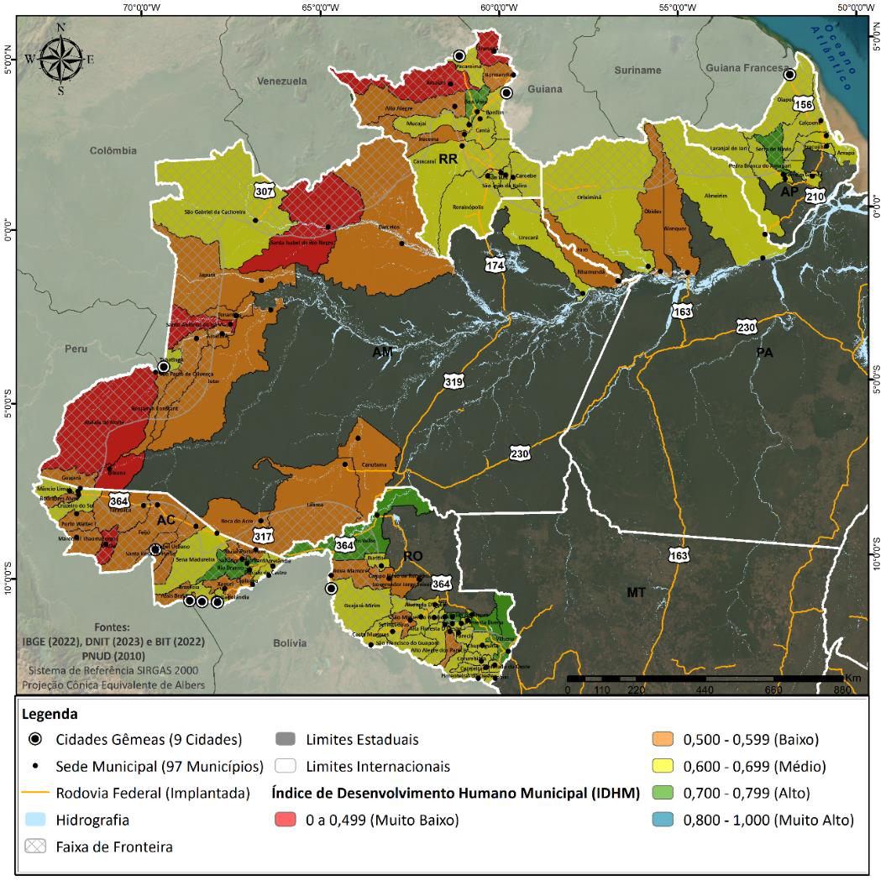

 
 Panorama Geral – Acre| 60 
 
Mapa 13 - Classificação do IDHM nos municípios do Arco Norte e Rondônia 
 
Fonte: Elaborado pelo IBAM, a partir de fontes secundárias. 
Ao analisarmos as cidades gêmeas observa-se Epitaciolândia ocupa o terceiro lugar entre as 
cidades gêmeas, já Santa Rosa do Purus, Brasiléia e Assis Brasil, possuem os piores 
indicadores, ficando nas últimas colocações. Na análise por dimensões do IDHM, o indicador 
de longevidade apresenta os melhores resultados, uma vez que todas as nove cidades 
possuem classificação alta ou muito alta nesse componente. Por outro lado, o indicador de 
educação se destaca negativamente, pois a maioria das cidades gêmeas se enquadra na 
classificação baixa. Santa Rosa do Purus é a que apresenta índice mais baixo.  
 
 
 
 
 

# PÁGINA 61
 
 Panorama Geral – Acre| 61 
 
Gráfico 8 - Classificação do IDHM nas cidades gêmeas em 2021 
 
Fonte: Elaborado pelo IBAM, a partir de Atlas do Desenvolvimento Humano no Brasil. Pnud Brasil, Ipea e 
FJP, 2010. 
 
ÍNDICE DE GINI 
 
O índice de Gini é indicador que serve de medida para a desigualdade socioeconômica. Ele 
sintetiza a análise da distribuição de rendimento domiciliar per capita. Ele aponta a diferença 
entre os rendimentos dos mais pobres e dos mais ricos, e varia de 0 a 1, sendo 0 a situação 
de perfeita igualdade na distribuição dos rendimentos e 1, de perfeita desigualdade, em que 
todo o rendimento estaria concentrado nas mãos de uma única pessoa. No Brasil, este 
0,658
0,657
0,653
0,65
0,626
0,616
0,614
0,588
0,517
0,693
0,663
0,654
0,624
0,597
0,602
0,619
0,578
0,519
0,527
0,519
0,553
0,558
0,509
0,505
0,485
0,456
0,34
0,779
0,823
0,771
0,788
0,809
0,769
0,77
0,77
0,781
0
0,1
0,2
0,3
0,4
0,5
0,6
0,7
0,8
0,9
Oiapoque (AP)
Guajará-Mirim (RO)
Epitaciolândia (AC)
Pacaraima (RR)
Bonfim (RR)
Tabatinga (AM)
Brasiléia (AC)
Assis Brasil (AC)
Santa Rosa do Purus (AC)
IDHM
IDHM Renda
IDHM Educação
IDHM Longevidade

# PÁGINA 62
 
 Panorama Geral – Acre| 62 
 
índice pouco se alterou de 2010 a 2021, caindo um décimo de 0,60 para 0,59. 
Para os estados do Arco Norte e Rondônia, seguem os seguintes resultados: 
 
Gráfico 9 - Evolução do Índice de Gini - 2010 a 2021 
 
Fonte: Elaboração própria a partir de Atlas do Desenvolvimento Humano no Brasil. Pnud Brasil, Ipea e FJP, 
2022. 
 
Nota-se que, em geral, houve redução nos primeiros anos da série com os benefícios de 
programas sociais, até 2015, registrando crescimento no período de 2016 a 2018, e 
estabilidade em 2019. Em 2020, um novo recuo é registrado com todos os Estados 
apresentando seus resultados mais baixos, em função da introdução dos benefícios 
emergenciais de transferência de renda no período da pandemia. Observa-se posterior 
aumento em 2021, com o mercado de trabalho enfraquecido e a redução dos benefícios dos 
programas sociais emergenciais24. O Acre reduziu seu índice passando de 0,630 em 2010 a 
0,539 em 2021. 
 
Na sequência, foram analisados os municípios que integram a Faixa de Fronteira. Assim 
como no caso do IDHM, para esta análise foram utilizados dados de 2010, último dado 
 
24 Na publicação Síntese de Indicadores Sociais no Brasil em 2023, feita pelo IBGE, a análise por grandes 
regiões indicou o impacto dos benefícios dos programas sociais no índice, baseando na PNAD 2022. 
2010
2012
2013
2014
2015
2016
2017
2018
2019
2020
2021
Acre
0,630
0,566
0,553
0,529
0,549
0,564
0,545
0,557
0,559
0,515
0,539
Amapá
0,600
0,528
0,513
0,522
0,547
0,554
0,589
0,546
0,513
0,5
0,529
Amazonas
0,650
0,589
0,581
0,562
0,553
0,558
0,591
0,544
0,566
0,533
0,541
Pará
0,620
0,533
0,531
0,507
0,514
0,51
0,506
0,562
0,528
0,48
0,529
Rondônia
0,560
0,487
0,475
0,443
0,462
0,465
0,447
0,496
0,472
0,438
0,458
Roraima
0,630
0,549
0,555
0,523
0,537
0,537
0,526
0,566
0,579
0,54
0,596
0,40
0,45
0,50
0,55
0,60
0,65
0,70
Acre
Amapá
Amazonas
Pará
Rondônia
Roraima

# PÁGINA 63

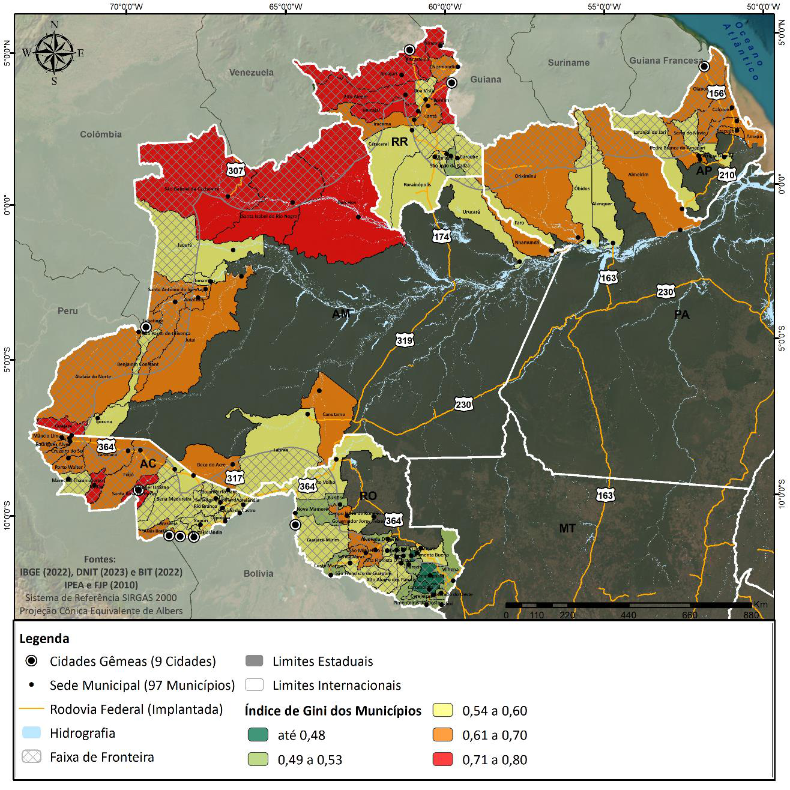

 
 Panorama Geral – Acre| 63 
 
disponível a nível municipal. No Acre, uma parte dos municípios encontram-se numa faixa 
do índice de 0,54 a 0,60, inferior ao resultado do Estado, que foi 0,63 neste mesmo ano. 
Outro grupo de municípios, mais ao norte, tem índices que variam entre 0,61 e 0,70. Santa 
Rosa do Purus e Jordão apresentam índices maiores de desigualdade, de 0,78 e 0,71 
respectivamente. 
 
 
Mapa 14 - Classificação do Índice de Gini nos municípios do Arco Norte e Rondônia (2010) 
 
Fonte: Elaborado pelo IBAM, a partir de fontes secundárias. 
 
Na análise por cidades gêmeas, aquela com maior nível de desigualdade é Santa Rosa do 
Purus no Acre, com 0,78, sendo seguido das duas cidades de Roraima, Pacaraima com 0,74 
e Bonfim com 0,72.  
 
 
 
 

# PÁGINA 64
 
 Panorama Geral – Acre| 64 
 
Gráfico 10 - Classificação do Índice de Gini nas cidades gêmeas em 2010 
 
Fonte: Elaboração própria a partir de Atlas do Desenvolvimento 
Humano no Brasil. Pnud Brasil, Ipea e FJP, 2010. 
 
RENDIMENTO DOMICILIAR 
 
No Brasil, em média, 74,5% da renda das famílias advém dos rendimentos do trabalho. 
Segundo a Pesquisa Nacional de Amostra por Domicílios (PNAD contínua, 2023) realizada 
pelo IBGE, outros 18,1% vêm de rendimentos de aposentadoria e pensões, 3,0% de 
benefícios e 4,4% de outras fontes. Conforme levantamentos recentes, é importante levar 
em consideração que quanto maior a faixa de salários da população, maior a participação 
dos rendimentos do trabalho no total da renda. Assim, para as famílias com menor renda, 
sinaliza-se maior percentual advinda de programas sociais25. 
 
O relatório de Síntese de Indicadores Sociais (IBGE, 2023) demonstra a variação da economia 
brasileira e seus efeitos sobre o mercado de trabalho e rendimentos das famílias. A primeira 
metade da década registrou variação positiva do PIB, enquanto a sequência dos anos 2015 
e 2016 quedas significativas, e então, houve uma pequena recuperação de 2017 a 2019. Em 
2020, mais uma vez o quadro se reverteu no contexto da pandemia do Covid, devido à 
retração das atividades econômicas. A partir de 2021 iniciou-se a recuperação do 
crescimento do PIB, que se revelou maior em 2022. Somente em 2022, o processo de 
recuperação pós-pandemia veio a se consolidar e a refletir efetivamente na geração de 
postos de trabalho. Ou seja, segundo o mesmo relatório, em 2021 e 2022, tanto o PIB como 
o consumo das famílias registraram taxas positivas consecutivamente, favorecendo a 
recuperação do mercado de trabalho, demonstrada pelos indicadores de taxa de 
desocupação e nível de ocupação, este último ficando em patamar próximo ao registrado 
em 2019. 
 
25 O período 2020-2022 foi marcado por alteração nos benefícios transferidos pelo governo nos 
programas de transferência de renda, em razão da pandemia do covid-19, quando foram aportados 
recursos de auxílio emergencial e depois de finalizados, transformou-se o Bolsa Família em Auxílio 
Brasil, com ampliação dos valores, que em 2023, retornou à denominação de Bolsa Família. Fonte: 
IBGE, Síntese de Indicadores Sociais: uma análise das condições de vida da população brasileira 2023. 
Este relatório utilizou a Pesquisa Nacional por Amostra de Domicílios Contínua 2012/2022. 
0,54
0,58
0,60
0,61
0,65
0,69
0,72
0,74
0,78
0,00
0,20
0,40
0,60
0,80
1,00
Guajará-Mirim (RO)
Brasiléia (AC)
Epitaciolândia (AC)
Assis Brasil (AC)
Tabatinga (AM)
Oiapoque (AP)
Bonfim (RR)
Pacaraima (RR)
Santa Rosa do Purus (AC)

# PÁGINA 65
 
 Panorama Geral – Acre| 65 
 
Analisar o rendimento segundo sua distribuição por classes de salário mínimo é uma forma 
de avaliar a incidência da desigualdade na sociedade brasileira. Para averiguar-se os 
rendimentos das famílias para os municípios do Arco Norte e Rondônia, de acordo com o 
resultado mais recente, trabalhou-se com dados do rendimento do trabalho formal do ano 
de 2022, levantados pela PNAD. Em que pese as limitações de considerar somente os 
rendimentos do trabalho formal, esta é a informação mais atualizada e organizada 
sistematicamente, que traz elementos que possibilitam um panorama dos municípios nas 
regiões estudadas. 
 
Para observar o efeito sobre o rendimento das famílias, selecionou-se o indicador 
“Rendimento domiciliar per capita médio”, que em 2022, foi de R$ 1.586 mensais para o total 
da população. Em termos regionais, as Regiões Sul (R$ 1.927), Sudeste (R$ 1.891) e Centro-
Oeste (R$ 1.857) apresentaram os rendimentos domiciliares per capita médios mais 
elevados, enquanto os menores estavam nas Regiões Norte (R$ 1.096) e Nordeste (R$ 1.011). 
na Região Norte, o rendimento equivalia a 58,0% do rendimento domiciliar per capita médio 
do Sudeste, o que demonstra a desigualdade econômica estrutural entre as Regiões do 
País26. Em 2020,2021,2022 o Amazonas teve a menor rendimento per capita dentre os 
estados, em 2019 e 2023 ele foi estado com o segundo menor rendimento. O Estado do Acre 
que se manteve em posição intermediária em quase todos os anos analisados, em 2023 
torna-se o lanterna, com um rendimento domiciliar per capita médio inferior a R$ 1.100. 
 
Para todos os Estados do Arco Norte e Rondônia, observa-se que mais de 60% da população 
recebe até 1 salário mínimo. O Acre é o estado com terceiro maior percentual populacional 
na faixa até 1 SM, com 76,1%. 
 
Gráfico 11 - Distribuição percentual da população total, por classes de rendimento domiciliar 
per capita mensal, em salários mínimos - 2022 
 
Fonte:  Elaborado pelo IBAM, a partir de Síntese de Indicadores Sociais (IBGE) - SIS_RDPCMEDIO, 2023 
 
 
26 Todos estes resultados encontram-se na divulgação Relatório Síntese de Indicadores Sociais (IBGE). 
 
80,1
78,4
76,1
73,1
73,1
63,1
16,8
17,4
19,5
22,4
20,6
32,4
3,1
4,2
4,3
4,4
6,3
4,5
0
20
40
60
80
100
Amazonas
Pará
Acre
Amapá
Roraima
Rondônia
Até 1 SM
De 1 a 3 SM
Acima de 3 SM

# PÁGINA 66

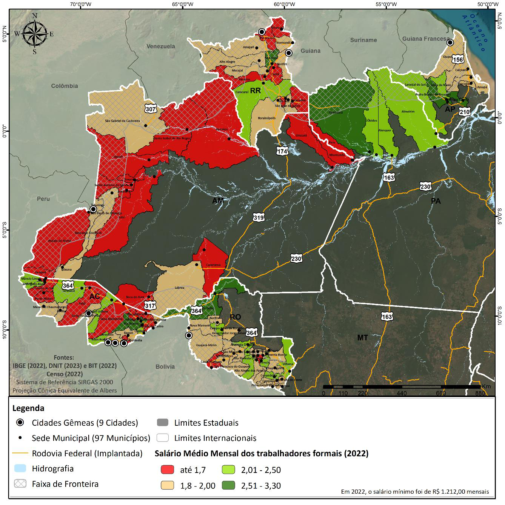

 
 Panorama Geral – Acre| 66 
 
O mapa a seguir apresenta uma análise do salário médio mensal dos trabalhadores formais 
a nível municipal. No Estado do Acre, em 2022, a capital Rio Branco se destacou pelo maior 
salário médio dos trabalhadores formais, com 3,1 salários mínimos. Acima de 2 salários 
ficam as cidades de Manoel Urbano, Tarauacá, Rodrigues Alves, Capixaba, Mâncio Lima e 
Assis Brasil. O município com menor rendimento é de Acrelândia.  
 
Mapa 15 - Salário médio mensal dos trabalhadores formais -2022. 
 
Fontes: Elaborado pelo IBAM, a partir de dados secundários. 
 
CADASTRO ÚNICO 
 
No exercício de buscar novas fontes de dados atualizadas para a elaboração do diagnóstico, 
optou-se também por analisar as informações do Cadastro Único (CadÚnico). Criado em 
2007 pelo Decreto Federal nº 6.135 e alterado pelo Decreto Federal nº 11.016 de 2022, o 
CadÚnico tem como finalidade ser um instrumento de coleta, processamento, 
sistematização e disseminação de informações sociais que permitem a identificação e a 

# PÁGINA 67
 
 Panorama Geral – Acre| 67 
 
caracterização socioeconômica de famílias e indivíduos brasileiros de baixa renda. Trata-se 
do cadastro central, e por isso sua unicidade, para o acesso a diferentes políticas 
socioassistenciais, programas e benefício sociais. De maneira geral, sua base de usuários é 
composta por famílias com renda familiar per capita de até 1/2 salário mínimo27. Devido sua 
constante atualização (as famílias e indivíduos devem atualizar seus cadastros a cada 2 
anos), o programa possui uma periodicidade cíclica e seus dados são coletados e 
disponibilizados com uma frequência mensal sendo uma ferramenta importante para a 
análise de determinadas características do contexto de vulnerabilização social.  
 
No Acre, 58% da população está inscrita. Ou seja, mais da metade da população depende 
de políticas assistenciais na região, evidenciando desafios socioeconômicos significativos. 
 
Tabela 5 - População e total de pessoas cadastradas no CadÚnico nos estados do Arco Norte e 
Rondônia 
Estados  
População 
(Censo 2022) 
Quantidade de pessoas inscritas no 
Cadastro Único em famílias com renda 
per capita mensal até meio salário 
mínimo (Pobreza + Baixa renda) 
% Pop. CadÚnico/ 
Pop. geral 
Acre 
830.018 
479.629 
58% 
Amapá 
733.759 
432.133 
59% 
Amazonas 
3.941.613 
2.283.478 
58% 
Pará 
8.120.131 
4.577.125 
56% 
Rondônia 
1.581.196 
568.947 
36% 
Roraima 
636.707 
324.829 
51% 
Fonte: Dados do CadÚnico 2025 e do Censo 2022. 
 
Na análise por município, nota-se que na região de fronteira amazônica a maior parte dos 
municípios (58) apresenta cenário em que mais de 50% da população está inscrita no 
Cadastro Único, indicando que ao menos metade dos habitantes se enquadra em critérios 
de baixa renda. Dezessete municípios possuem mais de 80% cadastrada no CadÚnico, 
evidenciando um contexto de maior vulnerabilidade socioeconômica. Nessas localidades, 
pelo menos oito em cada dez habitantes vivem em condições que qualificam para 
programas sociais, o que pode indicar dificuldades estruturais no mercado de trabalho 
formal e forte dependência de atividades informais.  
 
 
27 A partir de 2023, a apresentação do banco de dados dos inscritos no CadÚnico foi alterada, separando grandes 
três categoria, por faixa de renda: Quantidade de pessoas inscritas no Cadastro Único em famílias em situação de 
pobreza, segundo a faixa do Programa Bolsa Família, Quantidade de pessoas inscritas no Cadastro Único em 
famílias com renda per capita mensal até meio salário mínimo (Pobreza linha administrativa de pobreza, de acordo 
com a legislação do Programa Bolsa Família (R$ 0 a R$ 218,00) + Baixa renda: linha baseada no salário mínimo (R$ 
218,01 a 1/2 salário mínimo) e Quantidade de pessoas inscritas no Cadastro Único em famílias com renda per capita 
mensal acima de 1/2 salário mínimo. Esta última categoria inclui famílias com renda per capita superior que acessam 
políticas sociais específicas, como o benefício de prestação continuada, por exemplo. Nesta análise foram utílizados 
somente os dados referentes à quantidade de pessoas inscritas no Cadastro Único em famílias com renda per 
capita mensal até meio salário mínimo (Pobreza + Baixa renda). 

# PÁGINA 68

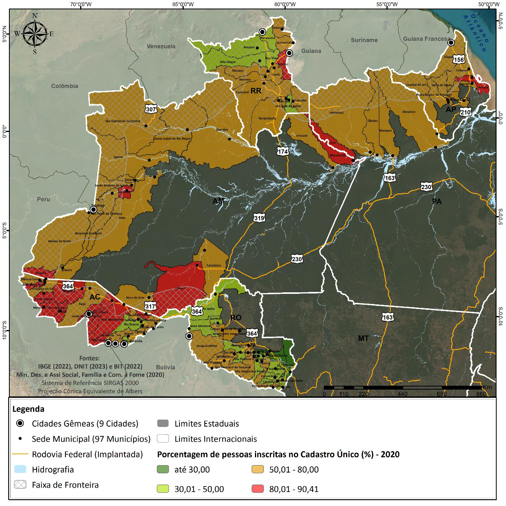

 
 Panorama Geral – Acre| 68 
 
No Acre, observa-se que diversos municípios tem mais de 80,01% da população cadastrada 
no sistema: São eles: Assis Brasil, Jordão, Manoel Urbano, Marechal Thaumaturgo, Porto 
Acre, Porto Walter, Rodrigues Alves, Santa Rosa do Purus, Sena Madureira e Tarauacá. Em 
Assis Brasil, 90% da população está cadastrada no sistema.  
 
Mapa 16 - Porcentagem de pessoas inscritas no Cadastro Único - 2020 
 
Fontes: Elaborado pelo IBAM, a partir de dados secundários. 
 
ATIVIDADES AGROPECUÁRIAS 
 
Uma vez que o trabalho em questão envolve um foco maior na bioeconomia e cadeias 
produtivas sustentáveis e inclusivas dos produtos da sociobiodiversidade, foram analisados 
outros dados econômicos a fim de contribuir para o diagnóstico dessas atividades. Assim, 
foram selecionados dados secundários, especialmente vinculados ao setor agropecuário ou 
agroindustrial, a fim de demonstrar um panorama das atividades produtivas dos estados e 
municípios. O Censo Agropecuário e a pesquisa de extração vegetal e silvicultura, 

# PÁGINA 69
 
 Panorama Geral – Acre| 69 
 
produzidos pelo IBGE correspondem a uma base de dados consolidada no Brasil, que 
fornecem informações relevantes para o conhecimento sobre o cenário da atividade 
agropecuária em todo o território brasileiro.  
 
De modo geral. observa-se uma alta participação, em termos de número de 
estabelecimentos, da agricultura familiar nos municípios de faixa de fronteira e capitais. Em 
geral, eles apresentam mais de 80% sob condição de agricultura familiar. No entanto, Rio 
Branco (AC) é o município com menor percentual dos estabelecimentos agropecuários sobre 
a agricultura familiar, depois de Manaus. Dentre as cidades gêmeas que tiveram os 
percentuais de estabelecimentos sob agricultura familiar mais elevados: está Epitaciolândia, 
cerca de 94%.  
 
Gráfico 12 - Número de Estabelecimentos por condição do produtor 
 
Fonte: Elaborado pelo IBAM a partir de Censo Agropecuário 2017, IBGE 
 
As atividades econômicas exercidas pela agroindústria rural identificadas para essas regiões 
foram: produção de lavouras (permanentes e temporárias), pecuária e criação de animais, 
0%
10%
20%
30%
40%
50%
60%
70%
80%
90%
100%
Municipios Lindeiros com sede FF
Demais municípios fronteiriços
Porto Velho
Guajará-mirim
Municipios Lindeiros com sede FF
Demais municípios fronteiriços
Rio Branco
Assis Brasil
Brasiléia
Epitaciolândia
Santa Rosa do Purus
Municipios Lindeiros com sede FF
Demais municípios fronteiriços
Manaus
Tabatinga
Municipios Lindeiros com sede FF
Demais municípios fronteiriços
Boa Vista
Bonfim
Pacaraima
Demais municípios fronteiriços
Macapá
Oiapoque
Demais municípios fronteiriços
Belém
Agricultura familiar - sim
Agricultura familiar - não
Amazonas:
Roraima:
Amapá
Pará
Rondônia: 
Acre: 

# PÁGINA 70
 
 Panorama Geral – Acre| 70 
 
pesca e aquicultura, produção florestal (florestas nativas e plantadas) e horticultura ou 
floricultura. 
 
Observa-se um padrão na produção do valor, em que as lavouras temporárias ocupam o 
primeiro lugar e a pecuária, o segundo, com exceção de Rondônia. O resultado do Pará, 
especialmente para as lavouras fica bem acima, o que contribuiu para distorções na 
visualização dos valores. No Acre, predominam a produção de lavouras (permanentes e 
temporárias), seguida da pecuária e criação de animais.  
 
Gráfico 13 - Valor da Produção das atividades agropecuárias (em mil reais)  
 
 
Fonte: Elaborado pelo IBAM a partir de Censo Agropecuário 2017, IBGE 
 
Dados específicos sobre extração vegetal, também contribuem para o diagnóstico 
produtivo, sendo, no caso da bioeconomia, de extrema relevância. Pela pesquisa de extração 
vegetal e silvicultura do IBGE (PEVS), seguem abaixo os principais produtos do extrativismo 
vegetal segundo seu valor da produção em 2023. Levando-se em conta o valor da produção 
total e o percentual dos estados que produzem maior valor em cada um, do primeiro ao 
terceiro, observa-se, no geral a predominância dos estados do Amazonas e do Pará e nestes 
produtos.  
 
0
200.000
400.000
600.000
800.000
1.000.000
PA
AM
Lavouras permanentes ou temporárias
Pecuária e criação de outros animais
Produção florestal - nativas ou plantadas
Pesca ou aquicultura
Horticultura e floricultura
0
50.000
100.000
150.000
200.000
AC
AP
RO
RR
Lavouras permanentes ou temporárias
Pecuária e criação de outros animais
Produção florestal - nativas ou plantadas
Pesca ou aquicultura
Horticultura e floricultura

# PÁGINA 71
 
 Panorama Geral – Acre| 71 
 
Tabela 6 - Valor da produção dos principais produtos extrativos (em mil reais) - 2023 
Produtos 
extrativos 
Valor da 
Produção 
1º 
2º 
3º 
Madeira em tora28  
2.126.167 
Pará 
83,0% Amazonas 
6,4% 
Rondônia 
5,5% 
Açaí (fruto)  
799.986 
Pará 
81,4% Amazonas 
15,9% Amapá 
1,2% 
Castanha  
160.137 
Acre 
41,2% Amazonas 
27,2% Pará 
19,7% 
Carvão vegetal  
113.048 
Pará 
89,6% Amapá 
3,9% 
Rondônia 
2,6% 
Lenha (Met cub) 
78.295 
Pará 
51,1% Amapá 
13,7% Amazonas 
13,7% 
Hevea (látex coagu) 
17.851 
Acre 
73,5% Amazonas 
21,4% Rondônia 
5,1% 
Palmito  
16.833 
Pará 
86,6% Rondônia 
13,4% 
Copaíba (óleo)  
11.767 
Amazonas 
78,4% Rondônia 
21,6% 
Cumaru (amêndoa)  
5.423 
Pará 
87,8% Amazonas 
12,2% 
Fonte: Elaborado pelo IBAM a partir de PEVS 2023, IBGE 
 
A castanha (conhecida como castanha-do-Brasil, castanha-do-Pará ou ainda castanha-da-
Amazônia) é um contraponto, já que o estado do Acre lidera o seu valor da produção. O 
mesmo estado também lidera o valor na produção de borracha hevea (látex). Outros 
produtos configuram na lista, embora em menor escala de valor. Xapuri lidera a lista, mas 
há também diversos municípios acreanos que possuem valor de produção expressivo. 
 
 
28 No bioma Amazônico na presença das florestas nativas, o manejo florestal sustentável é a prática 
legal e adotada desde a Lei Federal nº 4.771/1965. Ressalva-se, que os dados representam a 
exportação de madeira, não estando em evidência a forma do seu manejo.  
 

# PÁGINA 72
 
 Panorama Geral – Acre| 72 
 
Gráfico 14 - Valor da produção na extração vegetal (em mil reais), 2023. Tipo de produto 
extrativo: Castanha - Principais municípios  
 
Fonte: Pesquisa de extração vegetal e silvicultura do IBGE (PEVS, 2023). 
 
No caso do Açaí, este é o produto extrativo florestal não madeireiro com maior produção 
nos estados amazônicos deste estudo. É o maior produto não madeireiro com maior 
quantidade, valor da produção, e também, de número de municípios que realizam seu 
extrativismo. O gráfico abaixo contém uma lista apenas com os municípios com maior valor 
da produção no açaí, que fazem parte do projeto. Observa-se a presença de Feijó como o 
terceiro maior valor da região. 
 
Gráfico 15 - Valor da produção na extração vegetal (em mil reais), 2023. Tipo de produto 
extrativo: açaí. Principais municípios em VP  
 
Fonte: Pesquisa de extração vegetal e silvicultura do IBGE (PEVS, 2023). 
0
2.000
4.000
6.000
8.000
10.000
12.000
14.000
16.000
      Porto Acre (AC)
      Senador Guiomard (AC)
      Plácido de Castro (AC)
      Lábrea (AM)
      Bujari (AC)
      São Luiz (RR)
      Acrelândia (AC)
      Capixaba (AC)
      Rorainópolis (RR)
      São João da Baliza (RR)
      Amaturá (AM)
      Caroebe (RR)
      Porto Velho (RO)
      Boca do Acre (AM)
      Epitaciolândia (AC)
      Óbidos (PA)
      Oriximiná (PA)
      Xapuri (AC)
VP (mil)
QTDE
0
500
1.000
1.500
2.000
2.500
3.000
3.500
4.000
4.500
5.000
5.500
6.000
São Gabriel da Cachoeira (AM)
Boca do Acre (AM)
Barcelos (AM)
Óbidos (PA)
Santa Isabel do Rio Negro (AM)
Feijó (AC)
Jutaí (AM)
Lábrea (AM)
VP (mil)
QTDE

# PÁGINA 73
 
 Panorama Geral – Acre| 73 
 
MAPEAMENTO PRELIMINAR DE CADEIAS PRODUTIVAS SUSTENTÁVEIS  
 
Faz parte do diagnóstico identificar as atividades produtivas em andamento no território do 
Arco Norte e Rondônia, assim como suas potencialidades econômicas. Tratando-se de 
economia regional, a noção de Arranjos Produtivos Locais (APLs) contribui de forma decisiva 
para esta caracterização produtiva, já que, por definição, os APLs são o conjunto de 
empresas, produtores e instituições que, em um mesmo território, mantêm vínculos de 
cooperação, interação, articulação e aprendizagem. Com produtos similares, participam da 
mesma cadeia produtiva, utilizam insumos comuns, necessitam de tecnologias semelhantes 
e informações sobre os mesmos mercados. Os APLs envolvem atores locais – governo, 
empresas, produtores, associações instituições de crédito, ensino e pesquisa – constituindo 
prioridade nas regiões na construção do seu desenvolvimento econômico. 
 
A cadeia produtiva é a base do arranjo produtivo local, pois trata-se de um processo de 
atividades e operações capazes de serem separadas e ligadas entre si por meio de um 
encadeamento técnico e, também, de um conjunto de relações comerciais e financeiras que 
se estabelecem entre os agentes econômicos que compõem a cadeia produtiva. 
 
Por meio do estudo das cadeias produtivas dos produtos da sociobiodiversidade brasileira, 
é possível analisar a atuação em conjunto dos agentes econômicos; a estruturação das 
etapas e atividades da cadeia; de que modo os produtores locais estão inseridos; os 
problemas e lacunas para o seu funcionamento, assim como suas potencialidades; 
possibilidades de políticas públicas para o setor rural (como as políticas de extensão e de 
crédito rural) e outros segmentos envolvidos. O objetivo é fortalecer, colaborar para a 
estruturação e fomentar atividades existentes e potenciais, sejam incipientes ou em estágios 
intermediário ou avançado. 
 
Em suma, as cadeias produtivas agropecuárias apresentam uma estrutura-padrão 
composta basicamente: produção e fornecimento insumos; os produtores agropecuários ou 
extrativistas; a indústria de processamento (agroindústria); a comercialização no atacado e 
varejo; o consumidor final. 
 
Também são importantes as atividades consideradas de apoio às cadeias produtivas, tais 
como, pesquisa e tecnologia, assistência técnica e capacitação, infraestrutura de 
processamento, transporte e comercialização, crédito e financiamento. 
 
Todas essas etapas e atividades envolvem atuação e relacionamento entre os atores sociais 
nas diferentes esferas, pública e privada, e escalas local, regional, nacional ou internacional. 
A Figura 1 a seguir ilustra um esquema básico de uma cadeia. 
 
 
 
 
 
 
 

# PÁGINA 74

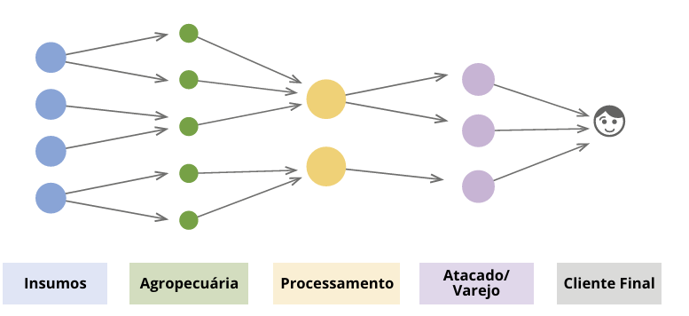

 
 Panorama Geral – Acre| 74 
 
Figura 2 - Cadeia produtiva agroindustrial organizada 
 
Crédito e 
financiamento 
Pesquisa, 
tecnologia e 
desenvolvimento 
Controle técnico e 
sanitário 
Políticas públicas 
apoio/fomento 
Outras 
Fonte: Serviço Nacional de Aprendizagem Rural (SENAR), com alterações próprias 
 
O mapeamento das atividades produtivas existentes e potenciais nas regiões do Arco Norte 
e Rondônia, envolve algumas especificidades, atreladas à questão da sustentabilidade e da 
inclusão social, que apresentam entre si importante conexão. Na Amazônia Legal, milhares 
de famílias vivem de atividades produtivas relacionadas aos produtos da biodiversidade da 
floresta, com cerca de dois milhões de pessoas no extrativismo dos produtos florestais não 
madeireiros (IMAFLORA, 2016). A maior parte dessas famílias constitui população 
tradicional, indígenas, ribeirinhos, extrativistas, etc. 
 
A bioeconomia ocupa lugar central neste projeto, pois no contexto de real agravamento das 
condições climáticas e sua ameaça a manutenção da biodiversidade e da própria 
sobrevivência humana, é necessário foco numa economia baseada na sustentabilidade 
ambiental, preservação e restauração ambiental. São as populações tradicionais que ali 
vivem, que há muitos anos garantem a manutenção desse ecossistema, central no equilíbrio 
climático global. Elas detêm conhecimentos sobre os recursos naturais disponíveis, técnicas 
e práticas socioculturais de cultivos, benéficos à preservação ambiental. No entanto, há 
avanços organizacionais, tecnológicos e financeiros que podem colaborar na resolução de 
gargalos produtivos, assim como no melhoramento dessas práticas, com vistas ao 
fortalecimento dessas atividades, suas populações e seus potenciais ganhos econômicos.  
 
Hoje, a economia global estrutura-se em cadeias de valor, ou seja, ou seja, em etapas de 
atividades realizadas territorialmente que agregam valor ao longo de toda a cadeia ao 
produto final e ao seu valor final. No projeto em questão, trata-se de relacionar potenciais 
cadeias produtivas de valor envolvendo produtos da biodiversidade brasileira, que são 
elementos das culturas locais. Contudo, essas cadeias encontram-se, grande parte das vezes 
desestruturadas, ou com perda de valor econômico relevante para os produtores locais, as 
populações regionais e a economia nacional.  
 

# PÁGINA 75
 
 Panorama Geral – Acre| 75 
 
Neste diagnóstico, foi feito um primeiro mapeamento de atividades produtivas identificadas 
nas regiões do Arco Norte e Rondônia. Cumpre frisar a importância de analisar de forma 
mais aprofundada essas e outras iniciativas ao longo do trabalho para avaliar as 
possibilidades de integrarem as carteiras de projetos estaduais, como uma perspectiva 
socioambiental territorial relevante no desenvolvimento socioeconômico.  
Foram levantadas informações disponíveis e sistematizadas sobre os APLs através de dados 
do Observatório dos Arranjos Produtivos Locais29. Foram identificados 11 APLs que 
envolvem municípios que compõem a Faixa de Fronteira, sendo 2 no Acre, um em 
Brasileia/Epitaciolândia e outro em Rio Branco. Também procurou-se identificar 
organizações que atuam com projetos nesses territórios de fronteira. 
Contemplam-se setores, de cacau, café, polpas de frutas, fibras e artesanato, madeireiro, 
entre outros.  Vale destacar que, ao longo do trabalho será necessário identificar, se em 
alguns casos, se o manejo e a as práticas envolvidas são sustentáveis. Este é especialmente 
o caso da extração de madeira, fabricação de móveis, construção naval e indústria de 
confecções. As missões técnicas e oficinas de planejamento a serem realizadas nas próximas 
etapas, possibilitará a consolidação de um panorama mais informativo a respeito dessas 
atividades produtivas, para construção das carteiras de projeto. 
 
 
29 Disponível em: https://www.gov.br/empresas-e-negocios/pt-br/portais-
desconhecidos/observatorioapl. Acesso em 04 de fevereiro de 2025. 

# PÁGINA 76
 
 
 Panorama Geral – Acre| 76 
 
Quadro 5 – Mapeamento Preliminar de Cadeiras Produtivas  
Atividade ou Arranjo 
Produtivo Local 
identificado 
Estado/Municípios envolvidos 
Organizações envolvidas 
Observações 
Castanha-do-Brasil 
Polpa de Frutas 
Acre (Rio Branco 
Xapuri, Senador Guiomard, Brasileia e Sena 
Madureira) 
Parceiros em Rondônia, Amazonas e Pará 
Cooperativa Central de 
Comercialização Extrativista do Acre 
- COOPEACRE 
7 complexos de beneficiamento 
2 pontos comerciais 
Agrega 13 cooperativas 
Fortalecendo a Economia de Base Florestal Sustentável:  
Este projeto teve financiamento do Fundo Amazônia, e como 
objetivo o fortalecimento das cadeias produtivas da castanha do-
brasil e de polpa de frutas no Acre. O projeto foi implantado por 
meio de ações de apoio direto e indireto às suas aglutinadas: 
associações e cooperativas filiadas à COOPERACRE, cujos 
beneficiários foram pequenos proprietários/as rurais familiares e 
extrativistas das Regiões Administrativas do Purus, Baixo Acre e Alto 
Acre. Entre as ações e investimentos realizados estão: instalação de 
armazéns comunitários, ampliação do número de cooperativas 
aglutinadas, implantação de Sistemas Agroflorestais sustentáveis 
(SAFs), recuperação de áreas degradadas, assistência técnica 
(ATER); melhorias na estrutura de beneficiamento; estudos e 
pesquisas de campo, ampliação da certificação, comunicação e 
marketing. 
Palmito 
Látex 
Acre 
Cooperativa Central de 
Comercialização Extrativista do Acre 
- COOPEACRE 
Projeto em fase inicial 
APL Avicultura 
Acre 
(Brasileia /Epitaciolândia) 
69 empresas  
Produção e processamento de aves 
APL Produção 
moveleira do Estado 
do Acre 
Acre 
(Rio Branco) 
23 empresas  
Fabricação de móveis e acessórios de madeira.          

# PÁGINA 77

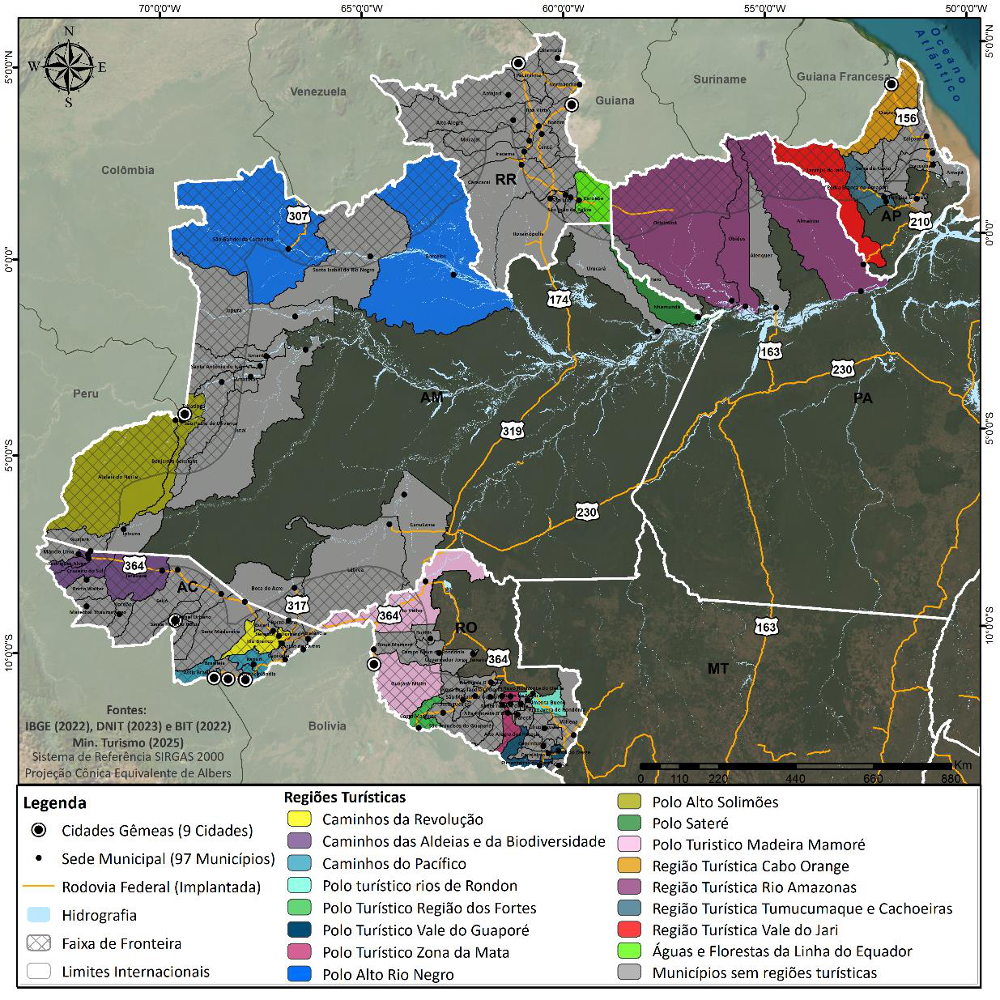

 
 Panorama Geral – Acre| 77 
 
POTENCIAL TURÍSTICO 
 
No contexto da Faixa de Fronteira, é importante observar as potencialidades e desafios de 
desenvolvimento de um turismo transfronteiriço, explorando oportunidades de integração 
entre cidades brasileiras e municípios dos países vizinhos, além de fortalecer o ecoturismo, 
o etnoturismo, o turismo cultural e de negócios. De acordo com os dados obtidos do Mapa 
do Turismo30 (2025), elaborado pelo Ministério do Turismo, pode-se observar, no Mapa, a 
existência de 16 regiões turísticas distribuídas ao longo do Arco Norte e Rondônia, 
abrangendo 28 municípios fronteiriços. 
Mapa 17 - Regiões Turísticas nos municípios na Faixa de Fronteira 
 
Fonte: Elaborado pelo IBAM, a partir de dados secundários.  
 
30 A Categorização dos Municípios das Regiões Turísticas é um instrumento desenvolvido pelo 
Ministério do Turismo (MTur) para classificar os municípios inseridos no Mapa do Turismo Brasileiro 
com base na sua importância e desempenho no setor turístico. Essa categorização tem como objetivo 
orientar a formulação de políticas públicas, a destinação de recursos e o planejamento estratégico do 
turismo no país. 

# PÁGINA 78
 
 Panorama Geral – Acre| 78 
 
Os municípios das Regiões Turísticas são classificados em cinco categorias distintas (A, B, C, 
D e E), de acordo com indicadores como número de empregos formais no setor de 
hospedagem, quantidade de estabelecimentos formais de hospedagem e estimativa de 
fluxo de turistas domésticos e internacionais. Municípios das categorias A, B e C possuem 
maior estrutura turística e movimentam um volume significativo de visitantes, sendo 
considerados polos turísticos regionais. Já os das categorias D e E têm menor fluxo turístico 
e, geralmente, atuam como municípios de apoio, fornecendo mão de obra ou produtos para 
destinos turísticos próximos. Essa categorização permite ao governo federal, aos gestores 
municipais e estaduais compreenderem melhor a dinâmica do turismo em cada área, 
facilitando a implementação de ações específicas para fortalecer o setor.  
No Acre, há três regiões turísticas, que englobam sete municípios, entre eles Epitaciolândia 
e Assis Brasil que são cidades-gêmeas. A tabela 3 evidencia que a capital do Acre se destaca 
entre os municípios do estado, estando classificada na categoria A. Rio Branco concentra o 
maior número de estabelecimentos turísticos, registra o maior fluxo de visitantes e 
apresenta a maior arrecadação de impostos provenientes do setor, reforçando seu papel 
como principal polo turístico do Acre. 
Tabela 7 - Dados das Regiões Turísticas do Acre 
Município 
Região 
Turística 
Estimati
va de 
Turistas 
Domésti
co 
Estimativa 
 de  
Turistas 
Internacio
nais 
Qtd.  
Estabelecime
ntos Formais 
de 
Hospedagem 
Qtd. 
Estabelecime
ntos Formais 
de Empregos 
Arrecada-ção 
de Impostos 
Categ
o-ria 
Assis Brasil 
Caminhos 
do Pacífico 
0 
82 
1 
0 
7.944,00 
D 
Cruzeiro 
do Sul 
Caminhos 
das Aldeias 
e da 
Biodiversid
ade 
481 
8034 
11 
105 
1.605.035,
00 
B 
Epitaciolân
dia 
Caminhos 
do Pacífico 
0 
0 
6 
22 
88.449,00 
C 
Rio Branco 
Caminhos 
da 
Revolução 
4602 
26333 
30 
228 
11.391.318
,00 
A 
Rodrigues 
Alves 
Caminhos 
das Aldeias 
0 
0 
0 
0 
4.504,00 
D 

# PÁGINA 79
 
 Panorama Geral – Acre| 79 
 
Município 
Região 
Turística 
Estimati
va de 
Turistas 
Domésti
co 
Estimativa 
 de  
Turistas 
Internacio
nais 
Qtd.  
Estabelecime
ntos Formais 
de 
Hospedagem 
Qtd. 
Estabelecime
ntos Formais 
de Empregos 
Arrecada-ção 
de Impostos 
Categ
o-ria 
e da 
Biodiversid
ade 
Tarauacá 
Caminhos 
das Aldeias 
e da 
Biodiversid
ade 
0 
1622 
8 
4 
430.912,00 
C 
Xapuri 
Caminhos 
do Pacífico 
0 
670 
1 
2 
15.618,00 
D 
Total 
5.083 
36.741 
57 
361 
13.543.780,00 
- 
Fonte: Ministério do Turismo (2025) 
 

# PÁGINA 80
 
 Panorama Geral – Acre| 80 
 
 
EIXO TEMÁTICO 4: POVOS INDÍGENAS E COMUNIDADES 
TRADICIONAIS 
 
 
Povos e Comunidades Tradicionais são reconhecidos no Brasil por suas formas próprias de 
organização social e cultural, muito fortemente relacionadas aos seus vínculos com o 
território e com a natureza. Atualmente, são classificados na Política Nacional de 
Desenvolvimento 
Sustentável 
dos 
Povos 
e 
Comunidades 
Tradicionais 
(Decreto 
6.040/200728) 28 segmentos de comunidades tradicionais que englobam comunidades de 
matriz africana, pescadores artesanais, extrativistas, caiçaras, ribeirinhos, entre tantos 
outros. 
 
Os povos e comunidades tradicionais estão presentes em todas as regiões do país, mas com 
significativa expressão na Amazônia. Distribuídos por toda a região, os povos e comunidades 
tradicionais compõem a sociobiodiversidade da floresta e são agentes essenciais para sua 
manutenção em pé. Entretanto, não raramente estão sob pressão por dinâmicas de 
desenvolvimento, atividades criminais e disputas fundiárias que avançam sobre seus 
territórios. A proteção desses povos e comunidades, de seus modos de morar e de viver, 
suas práticas culturais e seus saberes, constitui dimensão essencial para qualquer projeto 
comprometido com o desenvolvimento sustentável na Amazônia. 
 
Em relação as informações sistematizadas, há informações sistematizadas sobre povos 
indígenas e quilombolas, inclusive a delimitação de territórios reconhecidos e o contingente 
populacional. No entanto, quanto aos demais segmentos de comunidades tradicionais, não 
há registros mais consistentes em bases de dados oficiais que permitam uma visão 
abrangente, ao menos, de localização dos mesmos. As Unidades de Conservação dos tipos 
Reserva Extrativista, Floresta Nacional e Floresta Estadual são indicativos de presença de 
comunidades extrativistas no território. 
 
Deste modo, são apresentadas a seguir as informações existentes sobre os povos indígenas 
e comunidades quilombolas em bases de dados secundários. Ao longo do trabalho, 
informações mais específicas sobre comunidades tradicionais dos estados poderão ser 
trabalhadas.  
 
POVOS INDÍGENAS 
 
A maior parte das terras indígenas da Faixa de Fronteira do Arco Norte e Rondônia está 
localizada nos nos Estados do Amazonas e de Roraima, ainda que se tenha grandes áreas 
demarcadas em todos os estados. 
 

# PÁGINA 81

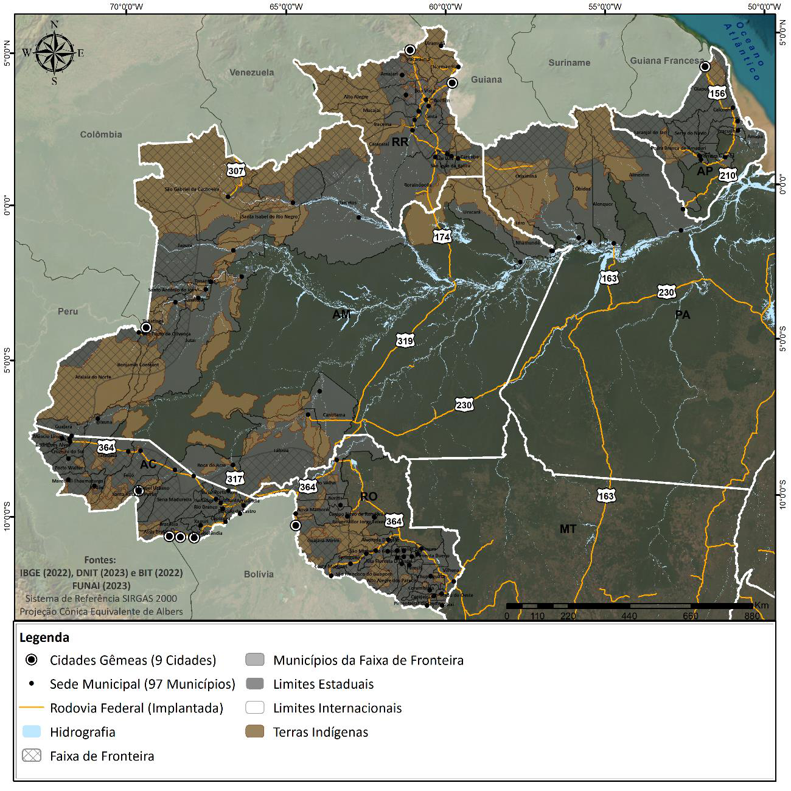

 
 Panorama Geral – Acre| 81 
 
Mapa 18 - Terras Indígenas na Faixa de Fronteira do Arco Norte e Rondônia 
 
Fonte: Elaborado pelo IBAM, a partir de dados secundários. 
 
No Acre, de acordo com os últimos dados disponíveis pela FUNAI indicados no mapa acima, 
há 30 terras indígenas no estado. A Comissão Pró-Indígenas do Acre31 indica a presença de 
mais 5 TIs em estudo, totalizando 35 terras indígenas. Já pelo levantamento do Instituto 
Socioambiental (ISA) são contabilizadas ao todo 38 TIs, sendo 9 em estudo ou processo de 
regularização.  
 
Na tabela 8 a seguir, apresenta-se a sistematização de todas as TIs encontradas no estado, 
com informações sobre a localização nos municípios, etnias, área e status de regularização. 
 
31 A Comissão Pró-Indígenas do Acre (CPI-Acre) é uma organização da sociedade civil brasileira fundada 
em 1979, sem fins lucrativos, com sede em Rio Branco, que tem como missão o apoio aos povos 
indígenas que vivem no Acre em suas lutas pela conquista e o exercício de seus direitos coletivos – 
territoriais, ambientais, linguísticos, socioculturais – por meio de ações que articulem a gestão 
territorial e ambiental das terras indígenas, a educação intercultural e bilíngue e as políticas públicas. 

# PÁGINA 82
 
 Panorama Geral – Acre| 82 
 
Sobre a situação jurídica, vale destacar que essas informações são dinâmicas devido aos 
próprios processos de regularização fundiária.  
 
Tabela 8 – Terras Indígenas localizados na Faixa de Fronteira do Acre 
Nome da terra 
indígena 
Municípios 
Etnia 
Área em ha 
Status 
Alto Rio Purus 
Santa Rosa do 
Purus,Manoel 
Urbano 
Kaxinawá,Kulina 
Páno 
263.130 
Regularizada 
Kampa e Isolados 
do Rio Envira 
Jordão,Feijó 
Ashaninka 
232.795 
Regularizada 
Cabeceira do Rio 
Acre 
Sena 
Madureira,Assis 
Brasil 
Yaminawa 
78.513 
Regularizada 
Alto Tarauacá 
Jordão,Feijó 
Isolados 
142.619 
Regularizada 
Kaxinawá do Rio 
Humaitá 
Feijó 
Kaxinawá 
127.384 
Regularizada 
Arara do Igarapé 
Humaitá 
Tarauacá,Porto 
Walter 
Arara do Acre 
87.572 
Regularizada 
Kaxinawá do Rio 
Jordão 
Jordão 
Kaxinawá 
87.294 
Regularizada 
Kampa do Rio 
Amônia 
Marechal 
Thaumaturgo 
Ashaninka 
87.205 
Regularizada 
Kulina do Rio 
Envira 
Feijó 
Kaxinawá,Kulina 
Páno 
84.365 
Regularizada 
Jaminaua/Envira 
Feijó 
Kulina Madijá 
80.618 
Regularizada 
Kaxinawá da 
Praia do 
Carapanã 
Tarauacá 
Kaxinawá 
60.699 
Regularizada 
Kulina Igarapé do 
Pau 
Feijó 
Kulina Páno 
45.591 
Regularizada 
Campinas/Katuki
na 
Cruzeiro do Sul 
Katukina 
32.624 
Regularizada 
Kaxinawá 
Ashaninka do Rio 
Breu 
Marechal 
Thaumaturgo,Jordão 
Kaxinawá,Ashaninka 
31.278 
Regularizada 
Jaminawa Arara 
do Rio Bagé 
Marechal 
Thaumaturgo,Jordão 
Yaminawa,Arara do 
Acre 
28.926 
Regularizada 
Kaxinawá Nova 
Olinda 
Feijó 
Kaxinawá 
27.533 
Regularizada 
Nukini 
Mâncio Lima 
Nukiní 
27.264 
Regularizada 
Jaminawa do 
Igarapé Preto 
Cruzeiro do Sul 
Yaminawa 
25.652 
Regularizada 
Poyanawa 
Mâncio Lima 
Poyanáwa 
24.499 
Regularizada 
Katukina/Kaxina
wá 
Feijó 
Kaxinawá,Katukina 
23.474 
Regularizada 

# PÁGINA 83
 
 Panorama Geral – Acre| 83 
 
Nome da terra 
indígena 
Municípios 
Etnia 
Área em ha 
Status 
Kampa do 
Igarapé 
Primavera 
Tarauacá 
Ashaninka 
21.987 
Regularizada 
Mamoadate 
Sena 
Madureira,Assis 
Brasil 
Machineri,Yaminawa 
313.647 
Regularizada 
Igarapé do 
Caucho 
Tarauacá,Feijó 
Kaxinawá 
12.318 
Regularizada 
Kaxinawá do 
Baixo Rio Jordão 
Jordão 
Kaxinawá 
8.726 
Regularizada 
KaxinawA 
Colônia Vinte e 
Sete 
Tarauacá 
Kaxinawá 
105 
Regularizada 
Rio Gregório 
Tarauacá 
Katukina,Yawanawá 
187.125 
Regularizada 
Arara do Rio 
Amônia 
Marechal 
Thaumaturgo 
Arara do Acre 
20.534 
Regularizada 
Riozinho do Alto 
Envira 
Santa Rosa do 
Purus,Feijó 
Isolados 
260.972 
Em estudo ou 
processo de 
regularização 
Kaxinawá 
Seringal 
Independência 
Jordão 
Kaxinawá 
11.584 
Em estudo ou 
processo de 
regularização 
Nawa 
Mâncio Lima 
Nawa 
- 
Em estudo ou 
processo de 
regularização 
Kaxinawá 
Seringal 
Curralinho 
Feijó 
Huni Kuῖ (Kaxinawá) 
- 
Em estudo ou 
processo de 
regularização 
Jaminawa do Rio 
Caeté 
Sena Madureira 
Jaminawa 
- 
Em estudo ou 
processo de 
regularização 
Manchineri do 
Seringal 
Guanabara 
(Riozinho do 
Iaco) 
Assis Brasil, Sena 
Madureira 
Manchineri, 
Jaminawa 
- 
Em estudo ou 
processo de 
regularização 
Igarapé Taboca 
do Alto Tarauacá 
Jordão 
Isolados 
- 
Em estudo ou 
processo de 
regularização 
Kulina do Médio 
Juruá 
Tarauacá 
Kulina 
- 
Em estudo ou 
processo de 
regularização 
Estirão 
Santa Rosa do Purus 
Kulina e Yaminawá 
- 
Em estudo ou 
processo de 
regularização 

# PÁGINA 84
 
 Panorama Geral – Acre| 84 
 
Nome da terra 
indígena 
Municípios 
Etnia 
Área em ha 
Status 
Kuntanawa 
Marechal 
Thaumaturgo 
Kuntanawa 
- 
Em estudo ou 
processo de 
regularização 
Mashco do Rio 
Chandless 
Manoel Urbano, 
Santa Rosa do Purus 
e Sena Madureira 
Mashco Isolados do 
Rio Chandless 
- 
Em estudo ou 
processo de 
regularização 
Fonte: Elaborado pelo IBAM, a partir de dados da FUNAI, 2024,SEGEO/CPI-Acre, 2025 e ISA,2025. 
 
As TIs existentes, independentemente do estágio do processo de reconhecimento ou 
demarcação, são referências essenciais para orientar o ordenamento territorial na região 
amazônica, bem como para formulação de programas e projetos. Entretanto, é importante 
observar dois aspectos relevantes em relação à questão indígena na faixa de fronteira de 
modo geral e no Arco Norte e Rondônia especificamente. O primeiro deles é que a noção de 
fronteira, que delimita e separa países, não é necessariamente uma referência para os 
indígenas que estão na fronteira, pois transitam indistintamente em suas terras de um lado 
e de outro dos países. O segundo aspecto a ser destacado é que parte significativa da 
população indígena não está localizada em TIs.  
 
De acordo com os dados do último Censo Demográfico (IBGE, 2022), a população indígena 
na área estudada é de 397.355 habitantes, o que representa 12% da população total dos 
municípios que integram a Faixa de Fronteira, independentemente de serem municípios 
com sede fora da faixa. Se forem excluídas as três capitais na faixa de fronteira (Porto Velho, 
Rio Branco e Boa Vista) onde estão os maiores contingentes populacionais, a participação 
da população indígena no conjunto dos demais municípios se eleva para 18,2%. As maiores 
concentrações de população indígena são identificadas em Roraima e, principalmente, no 
Amazonas. Juntos somam 333.383 indígenas, quase 84% do total presente nos municípios 
da faixa de fronteira da região Norte. 
 
No Acre, o município com maior população indígena é Santa Rosa do Purus, cuja a população 
indígena representa 64% do total da população do município, totalizando 4.297 indígenas. 
Mais de 1/3 da população indígena de Santa Rosa do Purus não está em terras indígenas 
(38,6%). Em seguida, destaca-se o município de Jordão, que apresenta 44,6% da população 
declarada indígena, dos quais 79,6% está em terras indígenas.  
 
Em termos absolutos, no entanto, a população indígena de Feijó também é expressiva, 
chegando a 4.436 indígenas.  
 

# PÁGINA 85

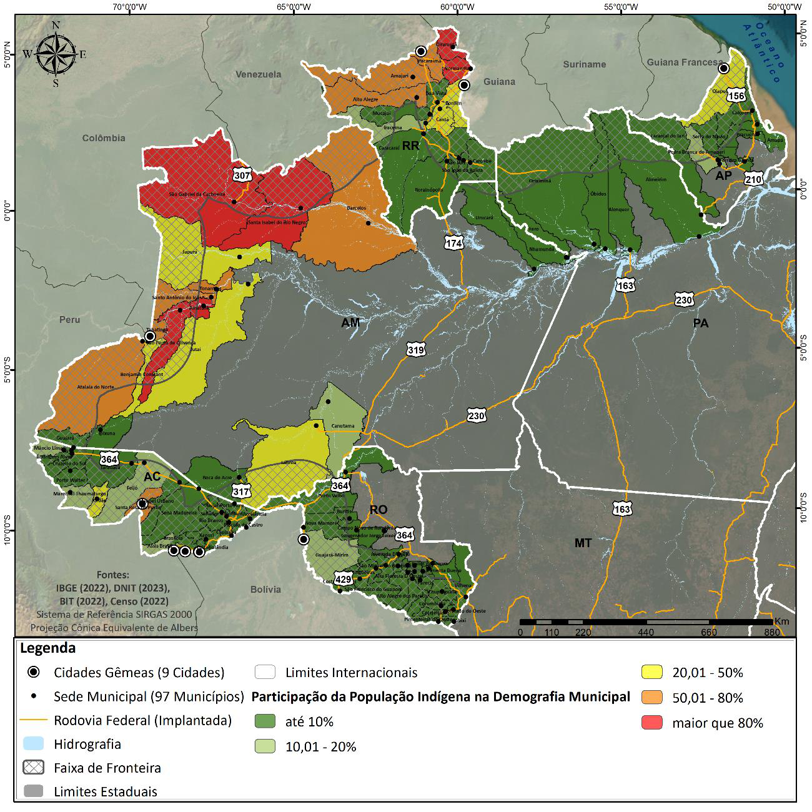

 
 Panorama Geral – Acre| 85 
 
Mapa 19 - Percentual de população indígena na Faixa de Fronteira do Arco Norte e Rondônia 
 
Fonte: Elaborado pelo IBAM, a partir de dados secundários 
 
A região do Alto Juruá no Acre, na linha de fronteira entre o Brasil e o Peru, é caracterizada 
por sua remota localização e baixa densidade populacional. Nessa região, destaca-se a o Rio 
Amônia, onde um trecho próximo à Foz do Breu, no município de Marechal Thaumaturgo, 
se projeta em direção ao território peruano. Esse espaço abriga a Terra Indígena (TI) Kampa 
do Rio Amônia, habitada pelos povos Ashaninka, e também outros territórios protegidos, 
como a Reserva Extrativista (Resex) Alto Juruá, e o Projeto de Assentamento (PA) Amônia na 
margem esquerda, evidenciando a coexistência de diferentes modos de vida. Há também a 
presença de povos isolados ou de recente contato. 
Nesta região do Alto Juruá, vale destacar as iniciativas comunitárias de articulação e troca de 
experiências sobre gestão territorial e ambiental entre comunidades indígenas na região de 
fronteira Acre-Peru que incluem intercâmbios que possibilitam a produção de informações 
sobre a situação das terras indígenas e comunidades nativas e sobre os problemas que os 

# PÁGINA 86
 
 Panorama Geral – Acre| 86 
 
povos indígenas estão enfrentando em seus territórios e os impactos  dos projetos de 
desenvolvimento econômico e infraestrutura na região, como construção de estradas e 
outras vias de conexão, e a exploração de madeira, petróleo, minérios e gás natural32. 
No final de 2021, foi criada a “Comissão Transfronteiriça Yurúa/AltoTamaya/Juruá”, que 
reúne lideranças indígenas e diversos parceiros dos dois lados da fronteira. A comissão 
realiza encontros periódicos, nos quais compartilham informações sobre o cenário 
fronteiriço, acompanham os projetos governamentais e as atividades ilegais, debatem 
estratégias conjuntas de luta para a preservação do meio ambiente e a garantia dos direitos 
indígenas33. 
Outra iniciativa da sociedade civil organizada na fronteira Brasil-Peru são as propostas de 
Corredores Territoriais para a Proteção de Povos Indígenas Isolados e de Recente Contato, 
liderada pelas principais federações e organizações indígenas do Peru e suas plataformas 
de coordenação em ambos os lados desta fronteira. A iniciativa tem como objetivo a 
proteção a longo prazo de dois corredores territoriais (Yavarí-Tapiche e Pano-Arawak), com 
25 milhões de hectares, que abrigam os maiores territórios contínuos do mundo de povos 
indígenas em isolamento34.  
Para além da promoção de justiça social, a proteção dos povos indígenas, assim como de 
outras comunidades tradicionais, consiste também em estratégia de sustentabilidade 
ambiental do bioma35. Entretanto, é sabido que os povos indígenas localizados na região 
estudada enfrentam ameaças diversas.  
Nas últimas décadas, o avanço de frentes madeireiras, frequentemente vinculado a 
corporações multinacionais e também a presença de facções criminosas e do narcotráfico 
tem intensificado os conflitos fundiários e ambientais na região. Esse cenário coloca em risco 
tanto a integridade dos territórios indígenas quanto a preservação dos ecossistemas locais, 
agravando a vulnerabilidade socioambiental da região. 
COMUNIDADES QUILOMBOLAS 
 
As comunidades quilombolas são parte fundamental da história do Brasil e desempenham 
um papel crucial na preservação de práticas culturais, ambientais e sociais que remontam 
ao período da escravidão. No contexto do território de fronteira do Arco Norte e Rondônia, 
essas comunidades enfrentam desafios específicos relacionados à titulação de terras, 
 
32 Ver mais em: https://cpiacre.org.br/articulacoes-binacionais/ 
33 Fonte: https://www.revistas.usp.br/ra/article/view/213671/213068. Ver mais em: 
https://cpiacre.org.br/a-fronteira/ 
34 Ver mais em: https://trabalhoindigenista.org.br/encontro-corredores-territoriais-povos-isolados/ 
35 Cabe destacar que a SUDAM – Superintendência do Desenvolvimento da Amazônia já vem 
elaborando o Plano de Desenvolvimento Sustentável do Vale do Javari, região com presença 
importante de população indígena. Paralelamente, desenvolve estudos relativos à Terra Indígena 
Yanomami e já planeja iniciar trabalho específico no Vale do Acre. São área sensíveis, que chegam à 
faixa de fronteira e, de fato, merecem ser objeto de trabalhos específicos para orientar priorização de 
ações na implementação das políticas públicas. 

# PÁGINA 87
 
 Panorama Geral – Acre| 87 
 
acesso a direitos e à preservação de suas tradições. Na região do Arco Norte e Rondônia, 
foram identificados 6 territórios que se localizam dentro da Faixa de Fronteira, a maioria 
deles localizado no município de São Miguel do Guaporé, em Rondônia. Outros 11 territórios 
quilombolas estão localizados nos municípios do Arco Norte e Rondônia, porém fora da 
faixa. No Acre não foram identificados territórios quilombolas.  
 
 
EIXO TEMÁTICO 5: INTEGRAÇÃO REGIONAL, MIGRAÇÕES E 
SEGURANÇA 
 
 
Processos de integração entre países fronteiriços facilitam os fluxos comerciais, políticos e 
culturais. No entanto, também trazem desafios, como o gerenciamento das migrações e 
questões de segurança. O deslocamento populacional, quando motivado por fatores 
econômicos e conflitos políticos, exige políticas coordenadas entre os Estados para garantia 
dos direitos humanos e inclusão social. Paralelamente, demanda estratégias conjuntas para 
combater crimes transnacionais, sem comprometer os princípios humanitários. Nesse 
contexto, a análise das dinâmicas migratórias e dos contextos de violência e criminalização 
é fundamental para compreender os desafios e oportunidades para a integração regional 
no contexto da fronteira amazônica.  
CONTEXTOS DAS MIGRAÇÕES NO ARCO NORTE E RONDÔNIA 
 
O crescimento da imigração venezuelana é um dos principais fenômenos de migração no 
Brasil, intensificado desde 2015 e tendo Roraima como principal porta de entrada. A 
migração haitiana, embora ainda expressiva, apresentou mudanças nos últimos anos, com 
muitos haitianos chegando via Chile e rotas terrestres. 
 A nova Lei de Migração (2017) facilitou a regularização e ampliou os direitos dos migrantes, 
resultando em maior controle sobre os fluxos migratórios. De acordo com relatórios anuais 
de migração (Oliveira 2017, 2018, 2019), a distribuição dos imigrantes no território brasileiro 
é desigual, com concentração no Sudeste, mas impactos significativos no Norte, 
especialmente em Roraima e Amazonas. Observa-se um crescimento na formalização da 
inserção dos imigrantes no mercado de trabalho, com maior absorção nos setores de 
serviços e construção civil. 
Em 2020, a pandemia impôs restrições às fronteiras, reduzindo significativamente a entrada 
e saída de migrantes. Ainda assim, estados como Roraima mantiveram-se como o principal 
ponto de entrada, devido à crise migratória venezuelana, que levou milhares de pessoas a 
buscarem refúgio e novas oportunidades no Brasil. Outros estados, como o Amapá, 
registraram uma grande proporção de entradas, especialmente de trabalhadores e turistas, 
com a maior disparidade de gênero, com 80,9% dos migrantes sendo do sexo masculino. 
Esse dado pode indicar um fluxo significativo de trabalhadores ou turistas que ingressam no 

# PÁGINA 88
 
 Panorama Geral – Acre| 88 
 
estado sem necessariamente retornar em grande escala. Enquanto isso, o Pará se 
consolidou como um centro regional de movimentação. Já o Amazonas e o Pará 
apresentaram um cenário oposto, com um número maior de saídas do que de entradas.  No 
caso do Acre, no auge da pandemia (2020-2021), houve uma redução na movimentação de 
migrantes. Vale lembrar que o estado do Acre passou por uma grande onda migratória 
haitiana entre 2010 e 2015, após o terremoto que causou uma crise humanitária no país. 
 
Com a reabertura das fronteiras e a retomada das atividades econômicas em 2021 e 2022, 
observou-se um movimentações expressivas nos registros migratórios.  Em 2021, ainda sob 
os efeitos da pandemia, a movimentação de migrações queda significativa em comparação 
com 2020. Porém em 2022, houve um aumento expressivo no fluxo migratório com 
destaque para a migração de venezuelanos em Roraima e o crescimento de entradas de 
pessoas vindas de países como Haiti, Filipinas, Bolívia e Peru. Além disso, a mobilidade 
interna também foi impactada pelo retorno de brasileiros que estavam no exterior e pela 
intensificação da circulação transfronteiriça, especialmente nas áreas de fronteira 
amazônica.  
 
No decorrer de 2023 e 2024, o fluxo migratório continuou a crescer, atingindo volumes 
significativos, com o Pará e o Amazonas consolidando-se como importantes corredores de 
passagem de migrantes e Roraima permanecendo o principal destino para refugiados 
venezuelanos. A diversificação das nacionalidades dos imigrantes também foi notável, 
refletindo a ampliação das rotas migratórias e a crescente relevância do Brasil como país de 
acolhimento. Em 2024, o fluxo migratório atingiu seu maior volume histórico (855.567 
registros) com Roraima ainda sendo o principal destino. 
 
CONTEXTOS DAS MIGRAÇÕES NO ACRE 
 
Conforme os dados mais recentes (2020-2024), no Acre o fluxo migratório foi relativamente 
estável ao longo dos anos, com um leve aumento nas entradas em relação às saídas. No 
auge da pandemia (2020-2021), houve uma redução na movimentação, mas a partir de 2022, 
a recuperação econômica favoreceu o crescimento do trânsito migratório.  
Nesses fluxos migratórios, a predominância masculina foi evidente, especialmente entre os 
migrantes em trânsito e trabalhadores fronteiriços. No entanto, houve um leve aumento da 
participação feminina ao longo do período, possivelmente devido à migração de famílias 
inteiras, especialmente haitianas e venezuelanas. 
A maioria dos migrantes registrados no Acre eram brasileiros retornando do exterior, 
turistas e trabalhadores em trânsito. A categoria de residentes temporários também 
cresceu, refletindo uma busca por regularização. O estado se consolidou como um ponto de 
passagem para migrantes. Observa-se atualmente não só de migrantes peruanos ou 
bolivianos, mas também de venezuelanos. Além desses, também foi notável a presença de 
migrantes asiáticos, como os Filipinos, especialmente entre os anos de 2022 e 2024. O 
estado conta com uma estrutura de casas de apoio aos migrantes em situação de 
vulnerabilidade. 

# PÁGINA 89
 
 Panorama Geral – Acre| 89 
 
Os principais municípios envolvidos na movimentação migratória foram as cidades gêmeas 
de Assis Brasil e Epitaciolândia, que funcionam como corredores fronteiriços. Plácido de 
Castro e Rio Branco também tiveram participação nos registros, mas em menor escala. Vale 
destacar que há casas de Apoio à imigrantes em Brasileia, Assis Brasil e Rio Branco.  
 
CONTEXTOS DE VIOLÊNCIA E DE CRIMINALIDADE NO ARCO NORTE E RONDÔNIA 
 
A região Norte do Brasil apresenta taxas historicamente elevadas de violência letal, com 
destaque para a interiorização dos homicídios, que passaram a se concentrar em municípios 
do interior a partir dos anos 2000. Entre 2018 e 2020, a região Norte registrou uma média 
de 28,7 homicídios por 100 mil habitantes 36, superando a média nacional de 20 homicídios 
por 100 mil habitantes.  
 
A compreensão das dinâmicas da violência requer um olhar atento para os processos 
históricos de ocupação e exploração econômica. Durante a ditadura militar, políticas de 
colonização e integração territorial, como a construção da Transamazônica, estimularam 
intensas migrações e resultaram em conflitos fundiários. A concentração fundiária, 
associada à grilagem de terras e ao deslocamento de populações tradicionais, configurou 
um cenário de tensão que se perpetua até os dias de hoje. Além disso, a exploração 
econômica da região, baseada em grandes empreendimentos como a Hidrelétrica de 
Tucuruí e a mineração em Serra Pelada, trouxe consigo deslocamentos populacionais, 
desigualdades socioeconômicas e degradação ambiental, alimentando conflitos locais 
(Santos, 2024). 
 
Outro fator que contribui para a escalada da violência é o garimpo ilegal, que cresceu 
significativamente nas últimas décadas. Entre 2010 e 2020, a exploração ilegal de ouro em 
terras indígenas aumentou 495%, afetando áreas como as dos povos Kayapó e Yanomami.  
 
Paralelamente, facções criminosas como o Primeiro Comando da Capital (PCC) e o Comando 
Vermelho (CV) expandiram suas operações para a região, disputando o controle de rotas de 
tráfico de drogas e outros mercados ilícitos. A proximidade com países como Colômbia, Peru 
 
36 A composição da taxa média de homicídios nos municípios analisados por Santos (2024) e adotados 
neste relatório baseia-se em dados do Sistema de Informações sobre Mortalidade (SIM) do Ministério 
da Saúde, considerando o número de óbitos causados por agressões (CID-10 X85-Y09 - refere-se a um 
conjunto de causas de morte relacionadas a agressões intencionais por terceiros. É comumente 
utilizada para categorizar óbitos resultantes de violência interpessoal) e intervenções legais (CID-10 
Y35-Y36 - códigos usados para categorizar óbitos resultantes de ações legítimas de força realizadas 
por agentes do Estado ou em contextos de conflito armado). Esses dados são organizados da seguinte 
forma: 1. Cálculo trienal: A taxa é calculada como a soma dos homicídios registrados nos anos de 2018, 
2019 e 2020, dividida por três (para obter a média anual), e posteriormente dividida pela população 
estimada de 2020. O resultado é multiplicado por 100 mil para obter a taxa por 100 mil habitantes. 2. 
População de referência: Utiliza-se a estimativa populacional para o ano de 2020, disponibilizada pelo 
TabNet (ferramenta do DATASUS). 3. Razão de uso de Taxas Médias: A escolha por taxas médias 
trienais visa minimizar grandes flutuações que podem ocorrer em municípios com populações 
pequenas, onde uma variação de poucos casos pode distorcer a percepção de violência letal ao longo 
dos anos. 

# PÁGINA 90
 
 Panorama Geral – Acre| 90 
 
e Bolívia, os maiores produtores de cocaína do mundo, torna o território estratégico para o 
tráfico internacional, intensificando os conflitos armados e elevando as taxas de homicídio 
(Santos, 2024). Dentre os estados do estudo, o Amazonas é que apresenta maiores taxas de 
homicídio, seguido de Amapá e Roraima, conforme pode ser observado no gráfico abaixo. 
 
Gráfico 16 - Taxas de homicídio dos estados do Arco Norte e Rondônia em 2022 
 
Fonte: Elaborado pelo Ibam com base nos dados de Santos (2024, p. 175). 
 
CONTEXTOS DE VIOLÊNCIA E DE CRIMINALIDADE NO ACRE 
 
A dinâmica da violência no Acre é marcada pela localização estratégica do estado, que faz 
fronteira com Peru e Bolívia, principais produtores mundiais de cocaína, e pela atuação de 
facções criminosas. Grupos como o Primeiro Comando da Capital (PCC), o Comando 
Vermelho (CV) e o Bonde dos 13 disputam o controle das rotas de tráfico de drogas e 
territórios urbanos, resultando em altos índices de homicídios e outros crimes violentos 
(Santos, 2024, p. 35-36). 
 
Municípios como Brasiléia, Feijó, Sena Madureira, Rio Branco, Xapuri e Tarauacá apresentam 
os maiores índices de violência no estado. Em Brasiléia, a taxa de homicídios está 
relacionada às disputas territoriais entre facções na faixa de fronteira. Feijó e Sena 
Madureira são pontos estratégicos para o narcotráfico, apresentando índices elevados de 
violência. Rio Branco é palco de guerras entre facções e de crimes ordenados de dentro de 
presídios, tanto locais quanto bolivianos. Em Tarauacá e Xapuri, a proximidade com a 
fronteira agrava a violência associada ao tráfico de drogas e disputas territoriais (Cerqueira; 
Bueno, 2024 a, p. 36-37). 
 
A região do Vale do Juruá, que inclui municípios como Feijó e Tarauacá, destaca-se como 
uma rota de escoamento do tráfico internacional. Essa dinâmica intensifica as disputas entre 
organizações criminosas, contribuindo para o aumento da violência letal.  
 
26,7
41,8
43,5
33,6
33,7
41,8
0
5
10
15
20
25
30
35
40
45
50
Acre
Amapá
Amazonas
Pará
Rondônia
Roraima

# PÁGINA 91

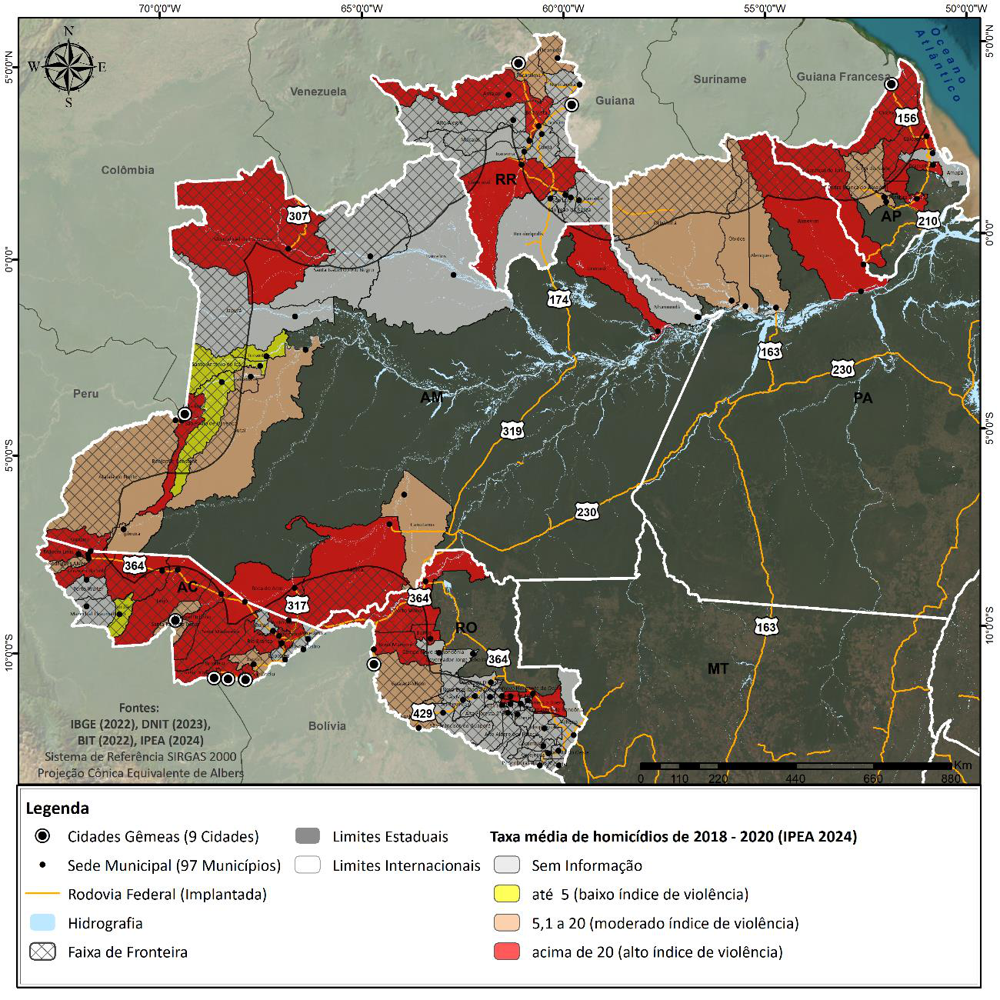

 
 Panorama Geral – Acre| 91 
 
Mapa 20 - Taxa média de homicídios dos municípios da Faixa de Fronteira do Arco Norte e 
Rondônia 
 
Fonte: Elaborado pelo IBAM, a partir de dados secundários. 
 
As instituições atuantes no combate à violência no Acre incluem a Polícia Militar, a Polícia 
Civil, a Polícia Federal e órgãos de justiça como o Ministério Público. A Polícia Federal 
desempenha papel essencial no monitoramento das rotas de tráfico e na repressão às 
atividades criminosas na faixa de fronteira. A Fundação Nacional dos Povos Indígenas 
(FUNAI) também tem atuação relevante, especialmente na proteção de terras indígenas 
frequentemente ameaçadas por atividades ilícitas, como o garimpo e o narcotráfico (Santos, 
2024, p. 38-39). 
 

# PÁGINA 92
 
 Panorama Geral – Acre| 92 
 
Gráfico 17 - Taxas médias de homicídio nos municípios do estado do Acre 
 
Fonte: Elaborado pelo IBAM, com informações de Santos (2024, p. 57). 
 
 
Quadro 6 - Síntese da dinâmica da violência e criminalidade no estado do Acre 
Principais tipos de 
violência 
Tráfico de drogas, violência armada entre facções criminosas, conflitos 
fundiários e violência urbana. 
Determinantes sociais 
da violência 
Localização estratégica em relação ao narcotráfico (fronteira com Peru 
e Bolívia), vulnerabilidade social, desigualdade econômica e presença 
limitada do Estado em áreas remotas. 
Regiões com maiores 
índices 
Municípios com altos índices de violência incluem Brasiléia, Feijó, Sena 
Madureira, Rio Branco, Tarauacá e Xapuri. 
Contexto dos 
municípios na faixa de 
fronteira 
Os municípios fronteiriços como Brasiléia, Epitaciolândia e Assis Brasil 
enfrentam intensas disputas por rotas de tráfico de drogas 
controladas por facções como PCC e Comando Vermelho. 
Instituições atuantes 
Polícia Militar, Polícia Federal, Ministério Público e Fundação Nacional 
dos Povos Indígenas (FUNAI) atuam no combate à violência e proteção 
das populações vulneráveis. 
Programas de 
prevenção 
Embora existam ações de segurança pública e iniciativas de proteção 
comunitária, os programas ainda são pontuais e carecem de 
integração com políticas socioeconômicas. 
Fonte: Elaborado pelo Ibam, com base nas informações de Santos (2024) 
 
 
0
4
8,4
10,2
13,8
19,4
20,4
21,7
24
28,2
30,4
31,6
31,7
31,9
35,5
36
36,8
38,9
42,6
44,9
45,5
49,8
0
10
20
30
40
50
60
Marechal Thaumaturgo
 Jordão
 Porto Walter
 Rosa do Purus
Xapuri
Rodrigues Alves
ena Madureira
Epitaciolândia
Acrelândia
 Manoel Urbano
Plácido de Castro
Mâncio Lima
Brasiléia
 Senador Guiomard
 Feijó
Porto Acre
Tarauacá
Cruzeiro do Sul
Capixaba
Assis Brasil
 Bujari
Rio Branco

# PÁGINA 93
 
 Panorama Geral – Acre| 93 
 
 
